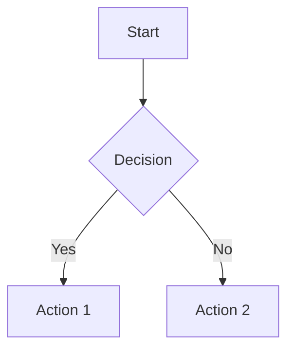

# Required Toolchain Specification

**Revision:** 1.3.0  
**Effective Date:** 2028-04-05  
**Document ID:** SPEC_Required-Toolchain

---

## 1.0 Purpose

This document specifies the required digital toolchain, CI/CD integration, and automated compliance checks for the AMPEL360 OPT-IN framework.

---

## 2.0 Development Environment

### 2.1 Version Control

**Git** - Distributed version control system

**Requirements:**
- Version: 2.30 or later
- Branching strategy: GitFlow
- Commit signing: Required for production branches
- Hooks: Pre-commit validation enabled

**Configuration:**
```bash
git config --global user.name "Your Name"
git config --global user.email "your.email@company.com"
git config --global commit.gpgsign true
```

### 2.2 Code Editors

**Recommended:**
- Visual Studio Code with extensions:
  - Markdown All in One
  - YAML Language Support
  - markdownlint
  - Code Spell Checker
  - GitLens

**Alternative:**
- Vim/Neovim with markdown plugins
- Emacs with org-mode
- IntelliJ IDEA with markdown support

---

## 3.0 Documentation Tools

### 3.1 Markdown Processing

**Pandoc** - Universal document converter

**Requirements:**
- Version: 2.19 or later
- Extensions: All markdown extensions enabled
- Output formats: PDF, HTML, DOCX

**Installation:**
```bash
# Ubuntu/Debian
sudo apt-get install pandoc

# macOS
brew install pandoc

# Windows
choco install pandoc
```

### 3.2 Diagram Generation

**Mermaid** - Markdown-based diagram tool

**Supported Diagram Types:**
- Flowcharts
- Sequence diagrams
- Gantt charts
- Class diagrams
- State diagrams

**Integration:**
```markdown

```

### 3.3 PDF Generation

**LaTeX** - Document preparation system

**Requirements:**
- TeX Live 2023 or later
- Required packages: geometry, hyperref, graphicx

**Alternative:**
- wkhtmltopdf for HTML-to-PDF conversion

---

## 4.0 Metadata and Validation

### 4.1 YAML Processing

**PyYAML** - YAML parser for Python

**Installation:**
```bash
pip install pyyaml
```

**Usage:**
```python
import yaml

with open('metadata.yaml', 'r') as f:
    data = yaml.safe_load(f)
```

### 4.2 JSON Schema Validation

**jsonschema** - JSON Schema validator

**Installation:**
```bash
pip install jsonschema
```

**Usage:**
```python
from jsonschema import validate, ValidationError

validate(instance=metadata, schema=schema)
```

### 4.3 Checksum Calculation

**sha256sum** - SHA-256 checksum utility

**Built-in on Linux/macOS:**
```bash
sha256sum filename
```

**Windows (PowerShell):**
```powershell
Get-FileHash filename -Algorithm SHA256
```

---

## 5.0 CI/CD Pipeline

### 5.1 Continuous Integration

**GitHub Actions** - CI/CD platform

**Required Workflows:**
- Naming convention validation
- Metadata schema validation
- Checksum verification
- Link integrity check
- Markdown linting

**Example Workflow:**
```yaml
name: Documentation Validation

on:
  pull_request:
    branches: [ main ]

jobs:
  validate:
    runs-on: ubuntu-latest
    steps:
      - uses: actions/checkout@v3
      - name: Validate Naming
        run: python ci/validate_naming.py .
      - name: Validate Metadata
        run: python ci/validate_meta.py . --schema ci/meta_v1_1.json
      - name: Lint Markdown
        uses: articulate/actions-markdownlint@v1
```

### 5.2 Automated Checks

**Pre-commit Hooks:**

**Installation:**
```bash
pip install pre-commit
pre-commit install
```

**Configuration (.pre-commit-config.yaml):**
```yaml
repos:
  - repo: https://github.com/pre-commit/pre-commit-hooks
    rev: v4.4.0
    hooks:
      - id: check-yaml
      - id: end-of-file-fixer
      - id: trailing-whitespace
      - id: check-added-large-files
  
  - repo: https://github.com/markdownlint/markdownlint
    rev: v0.12.0
    hooks:
      - id: markdownlint
```

---

## 6.0 Validation Scripts

### 6.1 Naming Convention Validator

**Script:** `ci/validate_naming.py`

**Purpose:** Validates filenames against naming conventions

**Usage:**
```bash
python ci/validate_naming.py <directory>
```

**Features:**
- Pattern matching for document types
- Exclusion of standard files (README, INDEX)
- Error reporting with line numbers

### 6.2 Metadata Validator

**Script:** `ci/validate_meta.py`

**Purpose:** Validates metadata sidecars against JSON schema

**Usage:**
```bash
python ci/validate_meta.py <directory> --schema <schema-file>
```

**Features:**
- JSON schema validation
- Checksum verification
- Cross-reference checking
- Detailed error reporting

### 6.3 Checksum Verifier

**Script:** `ci/verify_sigs.py`

**Purpose:** Verifies document checksums match metadata

**Usage:**
```bash
python ci/verify_sigs.py <directory>
```

**Features:**
- SHA-256 hash calculation
- Metadata checksum comparison
- Batch verification
- Error reporting

---

## 7.0 Collaboration Tools

### 7.1 Issue Tracking

**GitHub Issues** - Issue and task tracking

**Required Labels:**
- `documentation`: Documentation updates
- `governance`: Governance and policy changes
- `metadata`: Metadata schema changes
- `validation`: Validation script issues
- `enhancement`: New features or improvements
- `bug`: Bug fixes

### 7.2 Code Review

**GitHub Pull Requests** - Code review platform

**Review Checklist:**
- [ ] Naming convention followed
- [ ] Metadata sidecar present and valid
- [ ] Checksum calculated and recorded
- [ ] Cross-references updated
- [ ] CI checks passing
- [ ] Documentation updated

### 7.3 Communication

**Recommended Channels:**
- Slack/Teams for team communication
- Email for formal approvals
- Video conferencing for design reviews
- Documentation portal for published docs

---

## 8.0 Build and Publishing

### 8.1 Document Build System

**Make** - Build automation tool

**Makefile example:**
```makefile
.PHONY: all validate build clean

all: validate build

validate:
	python ci/validate_naming.py .
	python ci/validate_meta.py . --schema ci/meta_v1_1.json
	python ci/verify_sigs.py .

build:
	pandoc README.md -o README.pdf
	pandoc README.md -o README.html

clean:
	rm -f *.pdf *.html
```

### 8.2 Documentation Portal

**MkDocs** - Static site generator for documentation

**Installation:**
```bash
pip install mkdocs mkdocs-material
```

**Configuration (mkdocs.yml):**
```yaml
site_name: AMPEL360 Technical Documentation
theme:
  name: material
  features:
    - navigation.tabs
    - search.highlight
nav:
  - Home: index.md
  - O-Organization: O-ORGANIZATION/README.md
  - P-Program: P-PROGRAM/README.md
  - T-Technology: T-TECHNOLOGY/README.md
```

**Build and Serve:**
```bash
mkdocs build
mkdocs serve
```

---

## 9.0 Security Tools

### 9.1 Secret Scanning

**git-secrets** - Prevent committing secrets

**Installation:**
```bash
git clone https://github.com/awslabs/git-secrets
cd git-secrets
make install
```

**Setup:**
```bash
git secrets --install
git secrets --register-aws
```

### 9.2 Dependency Scanning

**Dependabot** - Automated dependency updates

**Configuration (.github/dependabot.yml):**
```yaml
version: 2
updates:
  - package-ecosystem: "pip"
    directory: "/"
    schedule:
      interval: "weekly"
```

---

## 10.0 Training and Support

### 10.1 Onboarding

**Required Training:**
- Git fundamentals
- Markdown authoring
- Metadata composition
- CI/CD workflow
- Document review process

**Resources:**
- Internal wiki
- Video tutorials
- Hands-on workshops
- Mentor program

### 10.2 Support Channels

**Documentation Team:**
- Email: docs@ampel360.com
- Slack: #documentation-support
- Office Hours: Monday/Wednesday 2-4 PM

**Escalation:**
- Level 1: Team lead
- Level 2: Documentation architect
- Level 3: Chief Engineering Office

---

## 11.0 Tool Version Matrix

| Tool | Minimum Version | Recommended Version | Platform |
| :--- | :--- | :--- | :--- |
| Git | 2.30 | 2.40+ | All |
| Python | 3.8 | 3.11+ | All |
| Pandoc | 2.19 | 3.0+ | All |
| PyYAML | 5.4 | 6.0+ | All |
| jsonschema | 4.0 | 4.17+ | All |
| Make | 4.0 | 4.3+ | Linux/macOS |
| VSCode | 1.70 | 1.80+ | All |
| MkDocs | 1.4 | 1.5+ | All |

---

## 12.0 References

- Git Documentation: https://git-scm.com/doc
- Pandoc Manual: https://pandoc.org/MANUAL.html
- JSON Schema: https://json-schema.org/
- Semantic Versioning: https://semver.org/
- GitHub Actions: https://docs.github.com/actions

---

**Document Control:**
- **Owner:** DevOps and Tooling Team
- **Approver:** Chief Engineering Office
- **Next Review:** 2029-04-05

---

*Part of the AMPEL360 ATA Chapter Mapping - OPT-IN Framework*

[← Back to ATA 00](../README.md)
