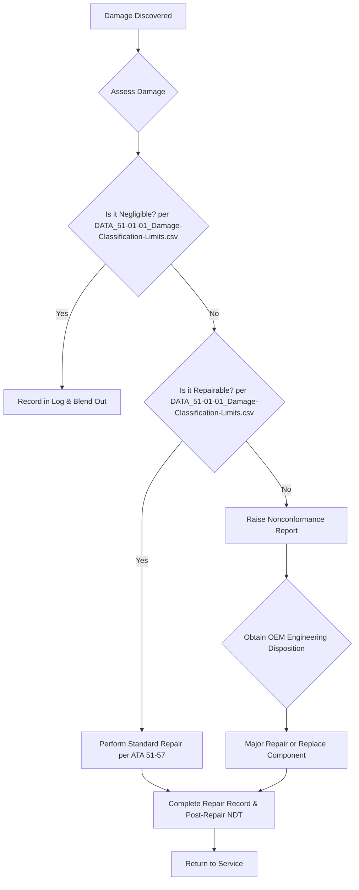

# ATA 51: Standard Practices and Structures - General (SRM Foundation)

**CRITICAL SAFETY WARNING:** This chapter contains procedures for the repair of primary and secondary aircraft structure. Incorrect assessment or repair can lead to catastrophic structural failure. These procedures must be performed by certified structural repair technicians.

## Scope & Governance
This chapter serves as the foundation for the Structural Repair Manual (SRM). It provides the general engineering principles, damage classification, and methodologies for all structural repairs.

- **Zero Deviation:** All repairs must follow the methodologies herein. Any deviation, or damage exceeding "repairable" limits, requires a formal Engineering Disposition.
- **Qualification:** All standard repairs are substantiated by coupon, element, or full-scale testing as defined in the Qualification Matrix.
- **Traceability:** Every repair requires a complete, auditable Repair Record, linking materials, processes, personnel, and NDT results.

## Damage Classification & Repair Workflow

## Key Cross-References
- **ATA 04:** Defines mandatory structural inspections (ALS) that may be initiated post-repair.
- **ATA 20:** Provides the basic workmanship standards (e.g., fastener torquing) used to execute repairs.
- **ATA 53-57:** Contain specific, pre-approved repair procedures for various locations, based on the methods defined in this chapter.

## Applicable Standards & Regulations

- AC 43.13-1B
- SAE AIR4844
- AITM Standards

## Navigation

[↑ A-AIRFRAME](../README.md)

### Related Sections

- [ATA 20 - STANDARD PRACTICES - AIRFRAME (INCL. WIRING DIAGRAM STANDARDS)](../ATA 20 - STANDARD PRACTICES - AIRFRAME (INCL. WIRING DIAGRAM STANDARDS)/README.md)
- [ATA 50 - CARGO & ACCESSORY COMPARTMENTS](../ATA 50 - CARGO & ACCESSORY COMPARTMENTS/README.md)
- [ATA 52 - DOORS](../ATA 52 - DOORS/README.md)
- [ATA 53 - FUSELAGE](../ATA 53 - FUSELAGE/README.md)
- [ATA 54 - NACELLES PYLONS](../ATA 54 - NACELLES PYLONS/README.md)
- [ATA 55 - STABILIZERS](../ATA 55 - STABILIZERS/README.md)
- [ATA 56 - WINDOWS](../ATA 56 - WINDOWS/README.md)
- [ATA 57 - WINGS](../ATA 57 - WINGS/README.md)

---

*Part of the AMPEL360 ATA Chapter Mapping - OPT-IN Framework*

[📚 Framework Documentation](../../README.md) | [🏠 Repository Root](../../../README.md)
