# ATA 21-00-00 SYSTEM DESCRIPTION
## Air Conditioning and Pressurization System

---

**Document Information**
- **ATA Chapter:** 21 - Air Conditioning
- **Document Number:** 21-00-00-001
- **Revision:** A
- **Date:** 2025-10-31
- **Status:** Released
- **Classification:** Technical Description

---

## 1. INTRODUCTION

### 1.1 Purpose
This document provides a comprehensive technical description of the Air Conditioning and Pressurization System (ATA Chapter 21) for the AMPEL360XWLRGA aircraft platform. It describes system architecture, operational principles, interfaces, and integration with other aircraft systems.

### 1.2 Scope
This document covers:
- System architecture and components
- Operational modes and control philosophy
- Performance characteristics
- System interfaces (mechanical, electrical, data)
- Safety features and redundancy
- Environmental control concepts
- Integration with AMPEL360XWLRGA systems

### 1.3 Applicable Documents
- **FAR 25.831** - Ventilation
- **FAR 25.841** - Pressurization Systems
- **FAR 25.1309** - Equipment, Systems, and Installations
- **CS-25** - EASA Certification Specifications
- **ARP-85** - Air Conditioning Systems for Subsonic Airplanes
- **ARP-1270** - Aircraft Cabin Ozone Concentrations
- **DO-178C** - Software Considerations in Airborne Systems
- **DO-254** - Design Assurance Guidance for Airborne Electronic Hardware

---

## 2. SYSTEM OVERVIEW

### 2.1 System Purpose
The Air Conditioning and Pressurization System (ECS - Environmental Control System) provides:

1. **Cabin Pressurization**
   - Maintain safe and comfortable cabin altitude
   - Control cabin pressure schedule throughout flight envelope
   - Protect against overpressure and underpressure conditions

2. **Temperature Control**
   - Regulate cabin temperature across all operational conditions
   - Support multiple temperature zones (cockpit, forward cabin, aft cabin)
   - Provide heating and cooling capabilities

3. **Ventilation**
   - Deliver fresh conditioned air to cabin and cockpit
   - Maintain air quality and oxygen concentration
   - Control air distribution and circulation

4. **Air Quality Management**
   - Filter particulates and contaminants
   - Control humidity levels
   - Monitor CO₂ and other gas concentrations
   - **[PROVISIONAL]** CO₂ capture and processing (ATA 21-80)

5. **Equipment Cooling**
   - Cool avionics and electrical equipment
   - **[AMPEL360XWLRGA]** Liquid cooling for power electronics (ATA 21-50-XX)

### 2.2 System Architecture

The ECS consists of the following major subsystems:

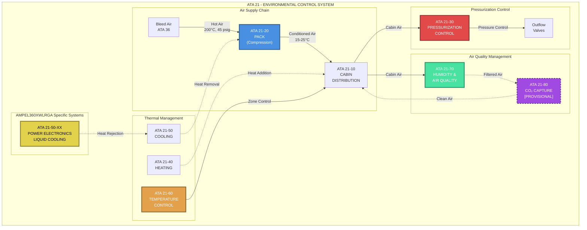

### 2.3 System Configuration
- **Type:** Bleed air system with air cycle machines (ACM)
- **Architecture:** Dual-pack configuration with cross-feed capability
- **Redundancy:** Fail-safe with single-channel failure tolerance
- **Control:** Dual-redundant digital controllers with analog backup
- **Power Source:** 115V AC, 400Hz (primary), 28V DC (backup)

---

## 3. SUBSYSTEM DESCRIPTIONS

### 3.1 ATA 21-10: CABIN AIR DISTRIBUTION

**Purpose:** Distribute conditioned air throughout the cabin and cockpit.

**Components:**
- Distribution ducts (aluminum and composite)
- Distribution valves (pneumatic and electric actuators)
- Cabin air outlets (gaspers, overhead outlets, sidewall outlets)
- Recirculation fans
- Air mixing chambers

**Operating Principles:**
- Conditioned air supplied from packs at ~10-15 lb/min per zone
- Mix of fresh air (50-70%) and recirculated air (30-50%)
- Flow distribution controlled by zone demand
- Individual passenger gaspers for localized control

**Performance:**
- Air change rate: 20-30 changes per hour
- Outlet velocity: 0.2-0.5 m/s (comfort range)
- Temperature stratification: <3°C vertical gradient
- Noise level: <65 dBA at passenger ear level

---

### 3.2 ATA 21-20: COMPRESSION (PACKS)

**Purpose:** Condition bleed air to suitable temperature and pressure for cabin use.

**Pack Configuration:**
- **Primary Heat Exchanger (PHX):** Precools hot bleed air using ram air
- **Air Cycle Machine (ACM):** 3-wheel bootstrap cycle
  - Compressor stage
  - Turbine stage  
  - Fan stage (ram air circulation)
- **Secondary Heat Exchanger (SHX):** Further cooling after compression
- **Reheater:** Temperature adjustment before distribution
- **Water Separator:** Remove condensed moisture
- **Pack Valves:** Flow control and shutoff

**Operating Cycle:**

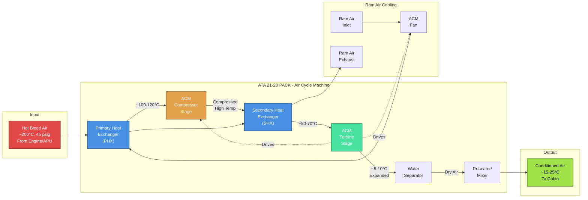

**Thermodynamic States:**

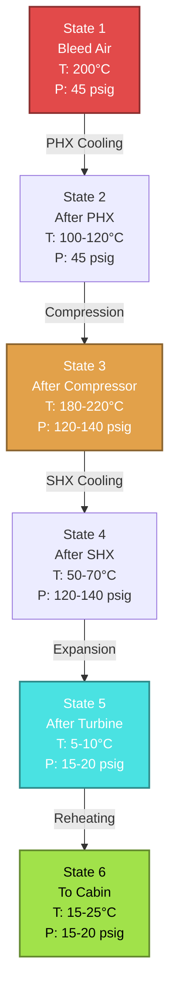

**Pack Performance:**
- Air flow rate: 40-80 lb/min per pack (variable)
- Supply temperature: -10°C to +50°C (controllable)
- Pressure ratio: 2.5-3.5:1 (ACM compressor)
- Expansion ratio: 1.8-2.2:1 (ACM turbine)
- Turbine speed: 40,000-60,000 RPM
- Cooling capacity: 15-25 kW per pack

**Pack Controller:**
- Dual-redundant digital controller (DO-178C Level A)
- Real-time temperature and flow regulation
- Built-in test (BIT) and fault isolation
- ARINC 429 interface to aircraft systems

---

### 3.3 ATA 21-30: PRESSURIZATION CONTROL

**Purpose:** Maintain cabin pressure within safe and comfortable limits throughout flight.

**Components:**
- Cabin Pressure Controller (CPC) - dual redundant
- Outflow Valves (2) - motor-actuated butterfly valves
- Safety Relief Valves (positive and negative pressure)
- Cabin pressure sensors (3)
- Differential pressure sensors (2)

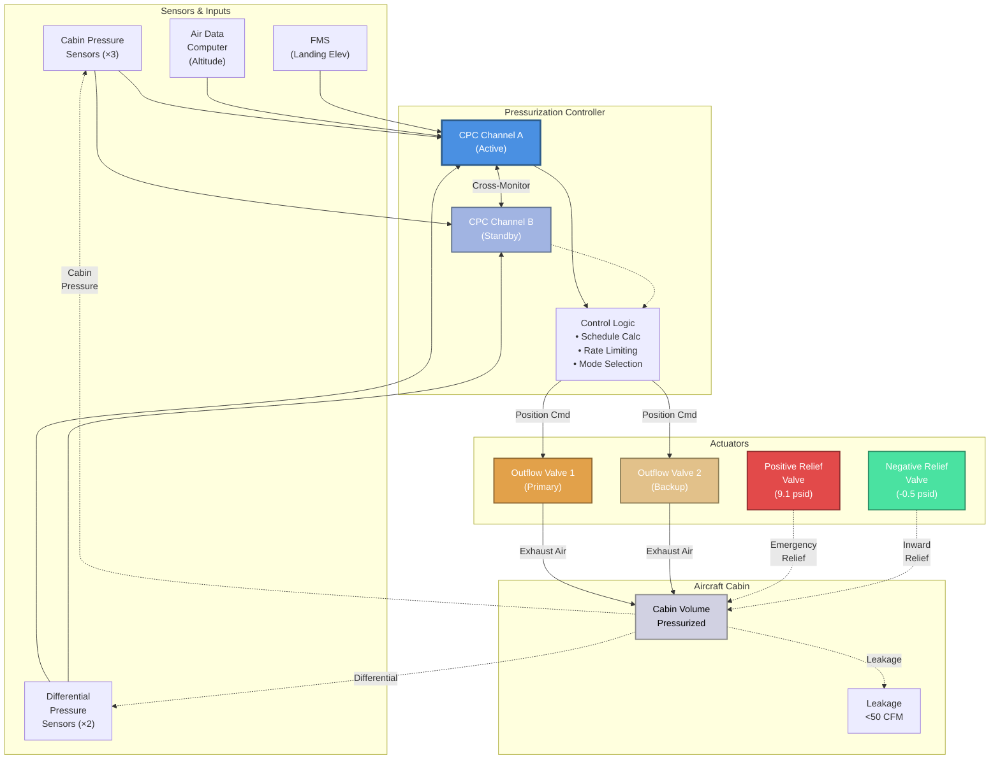

**Pressure Schedule:**

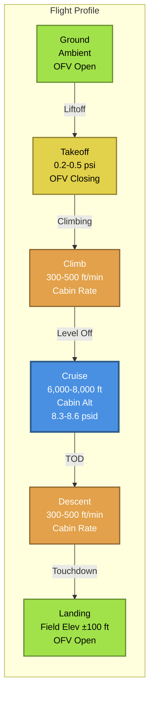

**Cabin Altitude vs Aircraft Altitude:**

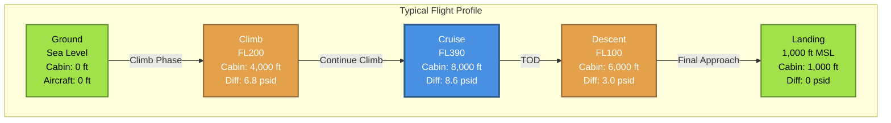

**Control Modes:**
- **Automatic Mode:** CPC controls based on flight plan data
- **Semi-Automatic Mode:** Manual cabin altitude setting
- **Manual Mode:** Direct outflow valve position control

**Pressure Rate Limits:**
- **Normal Climb:** 300-500 ft/min cabin rate
- **Normal Descent:** 300-500 ft/min cabin rate
- **Maximum Climb:** 800 ft/min
- **Maximum Descent:** 500 ft/min (comfort limit)

**Protection:**
- Maximum differential pressure: 9.1 psid (positive relief valve)
- Maximum negative pressure: -0.5 psid (negative relief valve)
- Overpressure warning: 8.8 psid
- Rapid decompression detection: >2,000 ft/min cabin altitude increase

**Cabin Leak Rate:**
- Design target: <50 CFM at maximum differential pressure
- Certification requirement: <100 CFM equivalent orifice

---

### 3.4 ATA 21-40: HEATING

**Purpose:** Provide supplemental heating when pack cooling capacity exceeds demand.

**Heating Sources:**
1. **Bleed Air Heating:**
   - Hot bleed air bypass from packs
   - Mixing valves modulate hot air addition
   - Primary heating method in flight

2. **Electric Heating:**
   - Electric heater elements (28V DC or 115V AC)
   - Ground operation and backup
   - Installed in distribution ducts

3. **Waste Heat Recovery:**
   - Heat exchangers on equipment cooling loops
   - Minimal contribution, opportunistic use

**Heating Capacity:**
- Bleed air heating: 20-40 kW (per pack)
- Electric heating: 5-10 kW (total)
- Combined capacity sized for cold day ground operation (-40°C OAT)

---

### 3.5 ATA 21-50: COOLING

**Purpose:** Remove heat from cabin and equipment under all operational conditions.

**Cooling Methods:**

#### 3.5.1 Pack Cooling (Primary)
- Air cycle machine provides bulk cooling
- Ram air heat rejection through heat exchangers
- Effective at all flight conditions

#### 3.5.2 Recirculation and Mixing
- Cabin air recirculation reduces cooling load
- Mixing of zones balances temperature distribution

#### 3.5.3 Vapor Cycle System (Optional/Future)
- Closed-loop refrigeration cycle
- Supplemental ground cooling
- R-134a or alternative refrigerant

#### 3.5.4 **[AMPEL360XWLRGA] Power Electronics Cooling (ATA 21-50-XX)**

**Purpose:** Dedicated liquid cooling for high-power electronics.

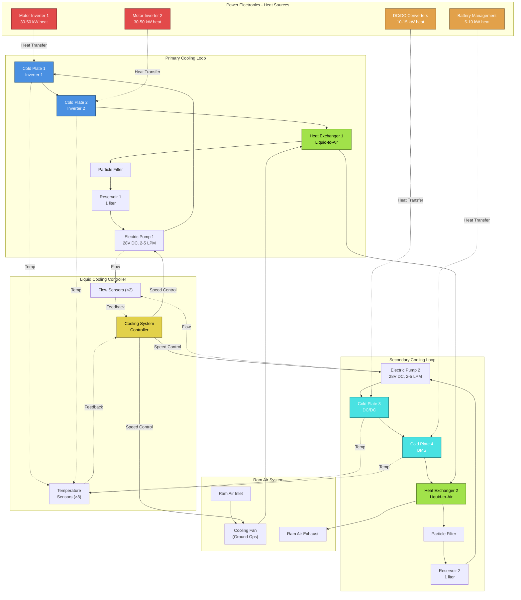

**Coolant Properties:**
- **Type:** 50/50 Ethylene Glycol / Water
- **Operating Range:** 30-70°C
- **Freezing Point:** -37°C
- **Boiling Point:** 107°C (at sea level)
- **Specific Heat:** 3.5 kJ/(kg·K)
- **Thermal Conductivity:** 0.4 W/(m·K)

**System Description:**
- **Coolant:** 50/50 ethylene glycol/water mixture
- **Architecture:** Dual-loop with redundancy
  - Primary loop: Motor inverters, DC/DC converters
  - Secondary loop: Battery management, auxiliary power electronics
- **Cold Plates:** Microchannel design, >5 kW/plate
- **Pumps:** Dual electric pumps (28V DC), 2-5 LPM per loop
- **Heat Exchangers:** Liquid-to-air, ram air or fan-forced
- **Reservoir:** 2-liter capacity with expansion volume

**Performance:**
- Heat rejection capacity: 50-100 kW (total)
- Coolant temperature range: 30-70°C
- Flow rate: 10-20 LPM (combined)
- Pressure drop: <30 psi

**Interface to Main ECS:**
- Heat exchangers reject heat to ram air stream
- Temperature sensors monitored by ECS controller
- Fault signals to aircraft CAS (Crew Alerting System)

**Advantages:**
- Direct cooling of high-density power electronics
- Reduced thermal stress on components
- Enables higher power density designs
- Lower noise than air-cooled alternatives

---

### 3.6 ATA 21-60: TEMPERATURE CONTROL

**Purpose:** Regulate temperature in multiple cabin zones to maintain passenger and crew comfort.

**Zone Configuration:**
- **Zone 1:** Cockpit
- **Zone 2:** Forward Cabin
- **Zone 3:** Aft Cabin
- **Zone 4 (Optional):** Cargo Compartment

**Control Method:**
- Proportional-Integral-Derivative (PID) control
- Zone temperature sensors (2 per zone, redundant)
- Trim air valves modulate hot/cold air mix
- Individual zone setpoints (crew-selectable)

**Temperature Ranges:**
- Setpoint range: 18-30°C (user selectable)
- Control accuracy: ±1.5°C
- Response time: <5 minutes to new setpoint

**Cockpit Controls:**
- Rotary selector for each zone
- Temperature display (digital LCD)
- Master temperature controller (flight deck)
- Passenger address (cabin attendant panel)

**Control Logic:**
- Predictive algorithms based on flight phase
- External temperature compensation
- Occupancy sensing (future enhancement)
- Energy optimization modes

---

### 3.7 ATA 21-70: HUMIDITY AND AIR QUALITY CONTROL

**Purpose:** Maintain acceptable humidity and air quality for passenger comfort and health.

**Humidity Control:**
- Passive control through water separator
- Typical cabin humidity: 10-20% RH (low due to bleed air)
- Future enhancement: Active humidification system

**Air Quality Features:**

#### 3.7.1 Filtration
- **HEPA Filters:** 99.97% efficiency for 0.3 µm particles
- **Activated Carbon:** VOC and odor removal
- **Pre-filters:** Large particle removal
- Filter location: Recirculation path

#### 3.7.2 Air Quality Sensors
- CO₂ sensors: Monitor cabin CO₂ concentration (target <1,000 ppm)
- Temperature sensors: Multi-point cabin monitoring
- Humidity sensors: Track cabin RH
- VOC sensors (future): Detect volatile organic compounds

#### 3.7.3 Recirculation Management
- Variable recirculation ratio (30-50%)
- Increased fresh air on demand
- Automatic adjustment based on CO₂ levels

**Air Change Rate:**
- Total air changes: 20-30 per hour
- Fresh air per passenger: 10-15 CFM (0.28-0.42 m³/min)
- Exceeds FAR 25.831 requirements

---

### 3.8 **[PROVISIONAL] ATA 21-80: CO₂ CAPTURE AND PROCESSING**

**Status:** Technology development phase - TRL 4-5

**Purpose:** Capture and process CO₂ from cabin air to reduce environmental impact and enable advanced cabin air management.

**System Concept:**

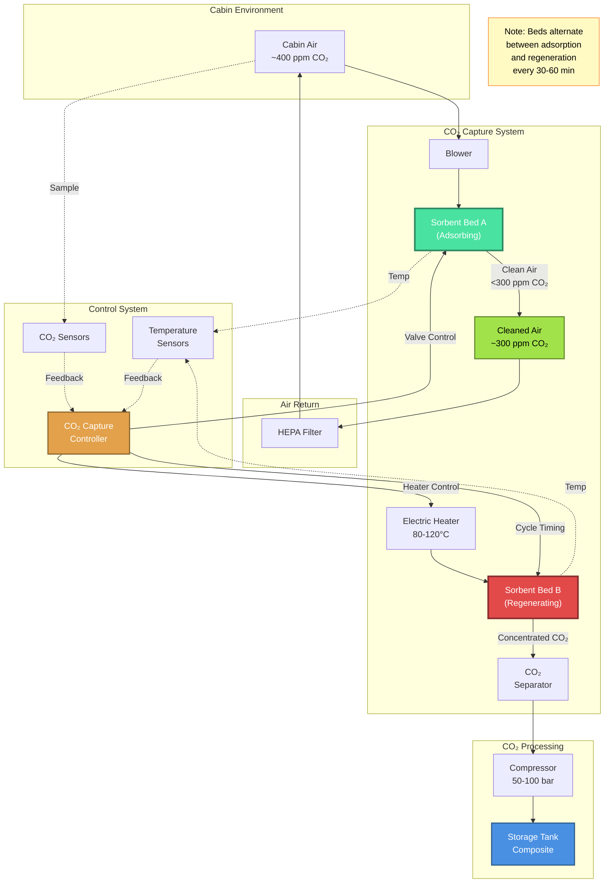

**Operating Cycle:**

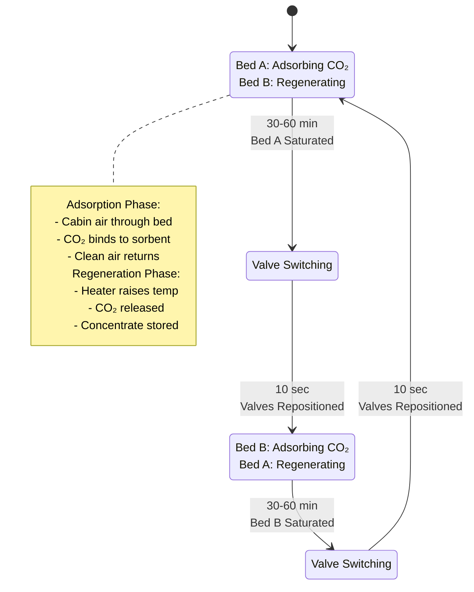

**Technology Options:**

#### 3.8.1 Sorbent-Based Capture
- Amine-functionalized materials (primary candidate)
- Metal-Organic Frameworks (MOFs) (alternative)
- Zeolite molecular sieves (backup)

**Capture Cycle:**
1. **Adsorption:** CO₂ binds to sorbent at cabin temperature
2. **Regeneration:** Heat sorbent (80-120°C) to release CO₂
3. **Recovery:** Collect concentrated CO₂ stream
4. **Storage:** Compress and store or convert

**Performance Targets:**
- CO₂ capture efficiency: >80%
- Cabin CO₂ reduction: 400 ppm → <300 ppm
- Sorbent capacity: 2-4 mmol CO₂/g
- Cycle time: 30-60 minutes
- Energy penalty: <5% of ECS total power

**System Components:**
- Sorbent beds (2, alternating adsorption/regeneration)
- Electric heaters (regeneration)
- Blowers (air circulation)
- CO₂ storage tank (composite, 50-100 bar)
- Control system (integrated with ECS)

**Benefits:**
- Reduced greenhouse gas emissions
- Improved cabin air quality
- Lower fresh air demand → reduced bleed air → fuel savings
- Sustainability leadership

**Challenges:**
- Weight and volume constraints
- Power consumption
- Sorbent lifespan and maintenance
- Regulatory approval pathway
- CO₂ storage and disposal

**Development Roadmap:**
- **Phase 1 (Current):** Lab-scale testing, material selection
- **Phase 2 (2026):** Benchtop prototype, performance validation
- **Phase 3 (2027):** Flight-weight prototype, environmental testing
- **Phase 4 (2028-2029):** Flight trials, certification basis development

---

## 4. SYSTEM INTERFACES

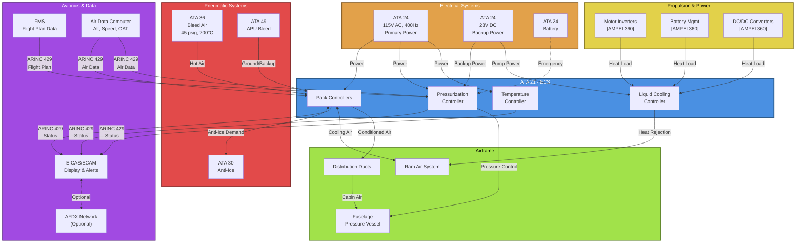

### 4.1 Pneumatic Interfaces

**Bleed Air Supply (ATA 36):**
- Source: Engine bleed (primary), APU bleed (ground/backup)
- Pressure: 45 psig nominal (30-50 psig range)
- Temperature: 200°C nominal (150-250°C range)
- Flow rate: 1.5-2.5 lb/s per pack

**Bleed Air Control:**
- Engine Bleed Valves (EBV)
- APU Bleed Valve
- Cross-bleed valve (pack isolation)
- Pressure regulating valves (PRV)

**Ram Air System:**
- Ram air inlet (fuselage side)
- Ram air scoop (variable geometry, optional)
- Ram air exhaust (pack bay)
- ACM fan supplements ram air at low speed

### 4.2 Electrical Interfaces

**Power Requirements:**
- **115V AC, 400Hz (Primary):**
  - Pack controllers: 50W each
  - Pressurization controller: 30W
  - Outflow valve motors: 200W each (intermittent)
  - Electric heaters: 5 kW (total)
  - Recirculation fans: 500W each

- **28V DC (Backup/Auxiliary):**
  - Pack controller backup: 30W each
  - Emergency pressurization: 100W
  - Liquid cooling pumps (AMPEL360XWLRGA): 200W each
  - Sensors and instrumentation: 50W total

**Total Electrical Load:**
- Normal operation: 2-3 kW
- Maximum (all heaters, ground): 8-10 kW

**Circuit Breakers:**
- Pack 1 controller: 5A
- Pack 2 controller: 5A
- Pressurization system: 10A
- Electric heaters: 50A
- Recirculation fans: 10A
- Liquid cooling system: 15A

### 4.3 Data Interfaces

**ARINC 429 Buses:**
- ECS Controller → FMS: Bleed demand, pack status
- ECS Controller → EICAS: System status, warnings, cautions
- FMS → ECS Controller: Flight plan, cruise altitude, landing elevation
- ADC → ECS Controller: Altitude, airspeed, outside air temperature

**Discrete Signals:**
- Pack switches (on/off)
- Temperature selectors (zone setpoints)
- Pressurization mode selector
- Master caution/warning lights

**Analog Signals:**
- Temperature sensors: 4-20 mA or RTD (Pt100)
- Pressure sensors: 0-5V or 4-20 mA
- Flow sensors: Pulse frequency (0-1 kHz)

**CAN Bus (Internal ECS):**
- Pack controller ↔ Valve actuators
- Pressurization controller ↔ Outflow valve motors
- Temperature controller ↔ Zone sensors
- Liquid cooling controller ↔ Pumps, sensors

### 4.4 Mechanical Interfaces

**Structural Mounting:**
- Pack units: Fuselage frame stations (vibration isolated)
- Outflow valves: Aft fuselage pressure bulkhead
- Distribution ducts: Ceiling and sidewall supports
- Equipment cooling heat exchangers: Pack bay or wing root

**Duct Connections:**
- Bleed air supply: Flanged joints, V-band clamps
- Distribution ducts: Quick-disconnect couplings
- Ram air ducts: Riveted or bonded joints

**Access Panels:**
- Pack service doors (external)
- Valve access panels (internal)
- Filter access panels (cabin ceiling)

---

## 5. OPERATIONAL MODES

### 5.1 Ground Operations

**Pre-Flight:**
- Packs off or single-pack operation
- APU bleed or ground cart supply
- Electric heaters active (cold weather)
- Pressurization system in ground mode (valves open)

**Engine Start:**
- Packs off during start (bleed demand)
- APU bleed maintains cabin conditioning

**Post-Start:**
- Transition to engine bleed
- Both packs operating
- Pressurization controller armed

### 5.2 Takeoff and Climb

**Takeoff:**
- Packs on or automatic (crew selectable)
- "Pack off" if takeoff performance critical
- Pressurization begins after liftoff

**Climb:**
- Both packs operating (normal)
- Cabin climb rate 300-500 ft/min
- Pack flow modulates with cabin demand
- Temperature control active

### 5.3 Cruise

**Normal Cruise:**
- Cabin altitude stabilized (6,000-8,000 ft)
- Pack flow at minimum required
- Zone temperatures maintained
- Recirculation fans operating

**Single Pack Operation:**
- One pack off (maintenance, failure, or fuel savings)
- Remaining pack at increased flow
- Cabin altitude may increase slightly
- Temperature control less precise

### 5.4 Descent and Landing

**Descent:**
- Cabin descent rate 300-500 ft/min
- Pack cooling demand increases (compression heating)
- Pressurization controller targets landing elevation

**Approach and Landing:**
- Cabin at landing field elevation (±100 ft)
- Packs operating (normal)
- Pressurization completes equalization before touchdown

**Post-Landing:**
- Packs remain on until APU started or ground cart connected
- Transition to ground cooling
- Pressurization system to ground mode

### 5.5 Emergency Modes

**Rapid Decompression:**
- Pressurization controller detects >2,000 ft/min cabin rate
- Outflow valves close (futile, but attempt containment)
- Crew alerted (master warning)
- Emergency descent procedure initiated

**Smoke or Fumes:**
- Smoke evacuation mode available
- Packs to maximum flow
- Recirculation fans off
- Outflow valves open
- Rapid cabin air purge

**Pack Failure:**
- Single pack operation automatically
- Cross-bleed if required
- Cabin altitude may increase
- Flight level restriction may apply

**Electrical Failure:**
- Pressurization controller to backup power (28V DC)
- Outflow valves fail to last commanded position (some designs) or spring-open (others)
- Manual pressurization mode available

---

## 6. SYSTEM PERFORMANCE

### 6.1 Thermal Performance

**Cooling Capacity:**
- Sea level, hot day (+40°C OAT): 30 kW per pack
- Cruise (FL390, -56°C OAT): 20 kW per pack
- Ground, hot day, APU bleed: 15 kW (single pack)

**Heating Capacity:**
- Cold day (-40°C OAT), ground: 40 kW (combined)
- Cold day, cruise: 25 kW (combined)

**Temperature Control:**
- Cockpit: 18-30°C (selectable)
- Cabin zones: 18-30°C (selectable)
- Control accuracy: ±1.5°C
- Zone independence: <2°C interaction

### 6.2 Pressurization Performance

**Maximum Operating Altitude:**
- Certified: FL430 (43,000 ft)
- Service ceiling: FL410 (typical)
- Emergency descent capability: FL250 in <4 minutes

**Cabin Altitude Limits:**
- Normal maximum: 8,000 ft
- Regulatory maximum: 8,000 ft (per FAR 25.841)
- Warning threshold: 10,000 ft
- Emergency oxygen required: >10,000 ft

**Differential Pressure:**
- Maximum: 9.1 psid
- Normal cruise: 8.3-8.6 psid
- Safety relief: 9.1 psid (positive), -0.5 psid (negative)

### 6.3 Airflow Performance

**Pack Airflow:**
- Minimum: 40 lb/min per pack
- Maximum: 80 lb/min per pack
- Normal cruise: 50-60 lb/min per pack

**Cabin Airflow:**
- Fresh air per passenger: 10-15 CFM
- Total cabin air changes: 20-30 per hour
- Recirculation ratio: 30-50%

### 6.4 Power Consumption

**Electrical Power:**
- Pack controllers: 100W (both)
- Pressurization system: 30-230W (average-peak)
- Recirculation fans: 1 kW
- Electric heaters: 0-5 kW (demand dependent)
- Liquid cooling pumps: 400W (AMPEL360XWLRGA)
- **Total:** 1.5-6.7 kW (typical range)

**Pneumatic Power (Bleed Air):**
- Pack operation: 200-300 kW equivalent (both packs)
- Represents 1-2% engine power extraction
- Fuel penalty: ~2-3% (cruise)

---

## 7. REDUNDANCY AND SAFETY FEATURES

### 7.1 Redundancy Architecture

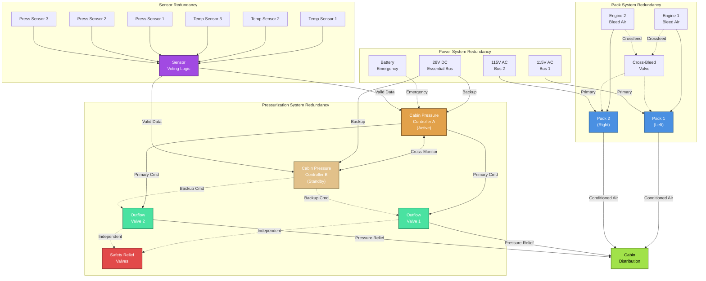

**Redundancy Levels:**

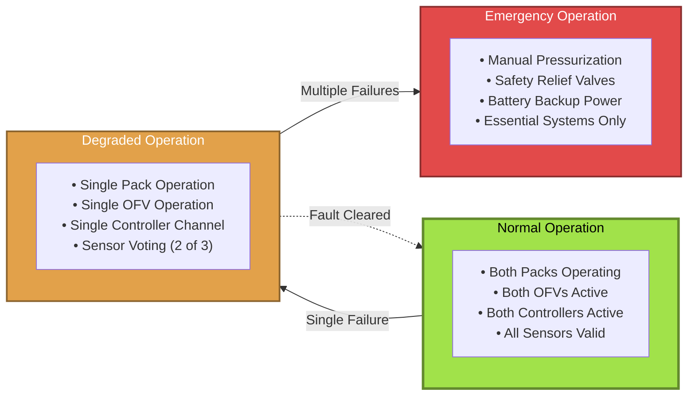

**Dual Pack Configuration:**
- Each pack capable of supporting full cabin load (reduced performance)
- Cross-bleed capability allows single bleed source to supply both packs
- Automatic pack isolation on failure

**Dual Outflow Valves:**
- Two independent valves in parallel
- Either valve can maintain pressurization
- Automatic transition on valve failure

**Dual Controllers:**
- Pack controllers: Dual-channel with cross-monitoring
- Pressurization controller: Dual-channel with voting
- Automatic switchover on failure

**Sensor Redundancy:**
- Temperature sensors: 2-3 per zone
- Pressure sensors: 3 (cabin), 2 (differential)
- Sensor voting and fault detection

### 7.2 Failure Modes and Effects

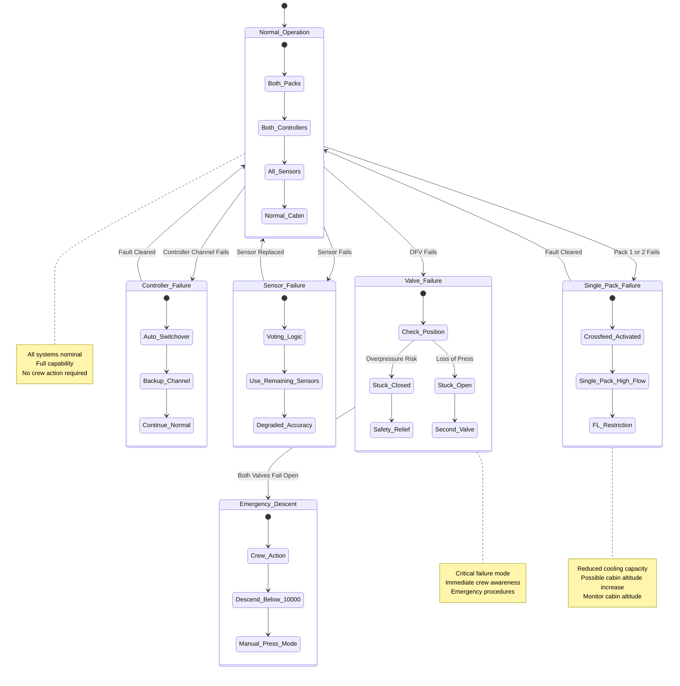

**Single Pack Failure:**
- **Effect:** Reduced cooling capacity, possible cabin altitude increase
- **Crew Action:** Monitor cabin altitude, consider FL restriction
- **System Response:** Automatic crossfeed, remaining pack to high flow

**Outflow Valve Failure:**
- **Failure Mode 1:** Valve stuck closed
  - **Effect:** Cabin overpressure
  - **Protection:** Safety relief valve opens at 9.1 psid
- **Failure Mode 2:** Valve stuck open
  - **Effect:** Loss of pressurization
  - **Crew Action:** Descend to safe altitude (<10,000 ft)
  - **System Response:** Second valve attempts compensation (limited)

**Pack Controller Failure:**
- **Effect:** Pack shuts down or operates in degraded mode
- **System Response:** Automatic failover to backup channel
- **Crew Action:** Monitor pack status, consider single-pack operation

**Pressurization Controller Failure:**
- **Effect:** Loss of automatic pressurization control
- **System Response:** Automatic failover to backup channel
- **Crew Action:** Select manual pressurization mode if both channels fail

**Sensor Failure:**
- **Effect:** Erroneous readings
- **System Response:** Sensor voting, fault annunciation
- **Degradation:** Graceful degradation with remaining sensors

### 7.3 Safety Features

**Overpressure Protection:**
- Positive pressure relief valve: 9.1 psid
- Outflow valve failsafe: Spring-biased open (some designs)
- Pressure warning: 8.8 psid

**Negative Pressure Protection:**
- Negative pressure relief valve: -0.5 psid
- Inward-opening valve prevents excessive negative pressure

**Fire Protection:**
- Pack fire detection (overheat sensors)
- Pack fire extinguishing (optional, halon or dry chemical)
- Automatic pack shutdown on fire

**Contamination Protection:**
- Bleed air contamination detection (future)
- Automatic pack shutdown on contamination
- HEPA filtration for particulates

---

## 8. MAINTENANCE AND RELIABILITY

### 8.1 Scheduled Maintenance

**A-Check (500 FH):**
- Visual inspection of packs, ducts, valves
- Filter replacement (if dirty)
- Leak checks

**C-Check (3,000 FH):**
- Pack performance test
- Outflow valve rigging and leak check
- Pressurization system functional test
- Sensor calibration verification

**D-Check (20,000 FH):**
- Pack overhaul or replacement
- Outflow valve overhaul
- Full system functional test
- Duct pressure test

### 8.2 Reliability Targets

**Mean Time Between Failure (MTBF):**
- Pack assembly: 10,000 FH
- Outflow valve: 15,000 FH
- Pressurization controller: 25,000 FH
- Temperature controller: 25,000 FH

**Dispatch Reliability:**
- System availability: >99.5%
- No-fault-found rate: <10%

**Life Limits:**
- Pack ACM: 20,000 FH or 15 years
- Outflow valve motor: 30,000 cycles or 20 years
- Electronic controllers: 30,000 FH or 20 years

### 8.3 Built-In Test (BIT)

**Continuous Monitoring:**
- Sensor health checks
- Valve position feedback
- Controller watchdog timers
- Communication link integrity

**Initiated Tests:**
- Pack performance test (ground)
- Pressurization leak test (ground)
- Valve actuation test (ground)

**Fault Codes:**
- Stored in non-volatile memory
- Retrievable via maintenance panel or ARINC 429
- Facilitate troubleshooting

---

## 9. HUMAN-MACHINE INTERFACE

### 9.1 Flight Deck Controls

**Overhead Panel:**
- Pack 1 switch: AUTO / OFF
- Pack 2 switch: AUTO / OFF
- Cabin temperature selector (rotary knob)
- Cockpit temperature selector (rotary knob)

**Pressurization Panel:**
- Mode selector: AUTO / SEMI-AUTO / MANUAL
- Landing elevation selector (5-digit)
- Cabin altitude indicator (analog or digital)
- Cabin rate indicator (±2,000 ft/min scale)

**EICAS/ECAM Display:**
- Pack status (flow, temperature, pressure)
- Cabin altitude and rate
- Zone temperatures
- System warnings and cautions

### 9.2 Cabin Attendant Panel

**Functions:**
- Zone temperature adjustment (limited range)
- Recirculation fan control
- Pack status monitoring
- Communication with flight deck

### 9.3 Passenger Interface

**Individual Controls:**
- Overhead gasper (on/off, direction)
- Reading light (impacts thermal load)

**Cabin Environment:**
- Temperature: Comfortable (22-24°C typical)
- Air velocity: Low, draft-free (<0.3 m/s)
- Noise: Low (<65 dBA)
- Air quality: Fresh, clean (HEPA filtered)

---

## 10. AMPEL360XWLRGA SPECIFIC FEATURES

### 10.1 Power Electronics Cooling (ATA 21-50-XX)

As described in Section 3.5.4, the AMPEL360XWLRGA platform includes a dedicated liquid cooling system for high-power electronics. This is a unique feature enabling:

- Higher power density in electric propulsion systems
- Improved reliability of power electronics
- Reduced noise compared to air-cooled systems
- Integration with aircraft thermal management

**Key Design Drivers:**
- Electric motor inverters: 30-50 kW heat rejection each
- Battery management system: 5-10 kW
- DC/DC converters: 10-15 kW
- **Total heat load:** 50-100 kW

### 10.2 CO₂ Capture System (ATA 21-80, Provisional)

The provisional CO₂ capture system represents AMPEL360XWLRGA's commitment to sustainability. While still in development (TRL 4-5), this system could:

- Reduce net CO₂ emissions
- Enable lower fresh air requirements
- Improve cabin air quality
- Provide a competitive advantage

**Integration Challenges:**
- Weight and volume in constrained airframe
- Power consumption (5% of ECS budget target)
- Thermal management (regeneration heating)
- Certification pathway (no existing standards)

**Development Priority:**
- Medium-term goal (2027-2029 timeframe)
- Pathfinder for sustainable aviation technologies
- Potential retrofit to existing fleet

---

## 11. CERTIFICATION AND COMPLIANCE

### 11.1 Regulatory Basis

**FAR 25.831 - Ventilation:**
- Minimum fresh air: 10 CFM/passenger (met)
- Air distribution: Even, no stagnant zones (met)
- Ventilation materials: Fire-resistant (met)

**FAR 25.841 - Pressurization:**
- Maximum cabin altitude: 8,000 ft (met)
- Pressure relief: Positive and negative (met)
- Decompression protection: Rapid descent capability (met)

**FAR 25.1309 - Systems:**
- Failure probability: <10⁻⁹ per FH (catastrophic)
- Single failure tolerance: Demonstrated (dual packs, dual valves)
- Crew alerting: EICAS integration (met)

**CS-25 (EASA):**
- Equivalent to FAR 25 with minor differences
- Harmonization achieved

### 11.2 Environmental Compliance

**Ozone:**
- ARP-1270 compliance: <0.1 ppm sea level equivalent
- Catalytic converters in packs (if required for high-altitude cruise)

**Emissions:**
- No direct emissions from ECS (uses bleed air)
- Indirect emissions from fuel burn penalty (~2-3%)

**Noise:**
- Pack noise: <85 dBA at 1 meter (ground operation)
- Cabin noise contribution: <5 dBA

### 11.3 Software Certification

**DO-178C Compliance:**
- Pack controller: Level A (most critical)
- Pressurization controller: Level A
- Temperature controller: Level B
- BIT software: Level C

**Verification Methods:**
- Requirements-based testing
- Structural coverage analysis
- Hardware/software integration testing
- Formal methods (for critical algorithms)

---

## 12. FUTURE ENHANCEMENTS

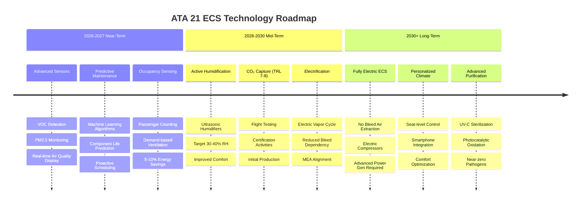

### 12.1 Near-Term (2026-2027)

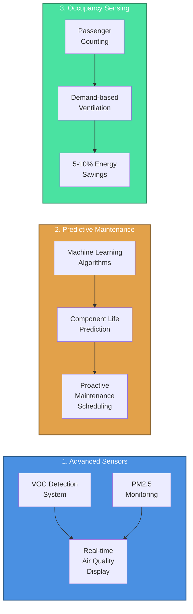

1. **Advanced Sensors:**
   - VOC detection
   - Particulate monitoring (PM2.5)
   - Real-time air quality display

2. **Predictive Maintenance:**
   - Machine learning algorithms
   - Component life prediction
   - Proactive maintenance scheduling

3. **Occupancy Sensing:**
   - Passenger counting (infrared, weight sensors)
   - Demand-based ventilation
   - Energy savings (5-10%)

### 12.2 Mid-Term (2028-2030)

1. **Active Humidification:**
   - Ultrasonic humidifiers
   - Target: 30-40% RH
   - Improved passenger comfort

2. **CO₂ Capture System:**
   - Transition from TRL 5 to TRL 7-8
   - Flight testing and certification
   - Initial production units

3. **Electrification:**
   - Electric vapor cycle system (EVC)
   - Reduced bleed air dependency
   - More-electric aircraft (MEA) alignment

### 12.3 Long-Term (2030+)

1. **Fully Electric ECS:**
   - No bleed air extraction
   - Electrically-driven compressors
   - Requires advanced power generation

2. **Personalized Climate Control:**
   - Individual seat-level temperature control
   - Smartphone app integration
   - Passenger comfort optimization

3. **Advanced Air Purification:**
   - UV-C sterilization
   - Photocatalytic oxidation
   - Near-zero pathogen transmission

---

## 13. CONCLUSION

The ATA 21 Air Conditioning and Pressurization System is a critical subsystem ensuring passenger and crew safety, comfort, and health throughout all phases of flight. The AMPEL360XWLRGA platform incorporates state-of-the-art ECS technology with unique features such as:

- Dual-pack architecture with comprehensive redundancy
- Advanced digital controls (DO-178C Level A)
- Dedicated power electronics cooling (liquid-cooled)
- Provisional CO₂ capture system (sustainability focus)
- HEPA filtration and air quality monitoring
- Multi-zone temperature control

The system meets or exceeds all regulatory requirements (FAR 25.831, 25.841, CS-25) and incorporates lessons learned from decades of aviation experience. Future enhancements will focus on:

- Improved passenger comfort (humidification, air quality)
- Sustainability (CO₂ capture, energy efficiency)
- Reliability (predictive maintenance, advanced diagnostics)
- Electrification (MEA alignment, reduced bleed dependency)

This system description serves as the foundation for detailed design, analysis, testing, and certification activities across all ATA 21 subsystems.

---

## REVISION HISTORY

| Revision | Date       | Author          | Description                        |
|----------|------------|-----------------|------------------------------------|
| A        | 2025-10-31 | ECS Team        | Initial release                    |
| -        | -          | -               | -                                  |

---

## APPROVALS

| Role                     | Name              | Signature | Date       |
|--------------------------|-------------------|-----------|------------|
| Chief Engineer, ECS      | [Name]            | _______   | 2025-10-31 |
| Systems Integration Lead | [Name]            | _______   | 2025-10-31 |
| Certification Manager    | [Name]            | _______   | 2025-10-31 |
| Program Manager          | [Name]            | _______   | 2025-10-31 |

---

**END OF DOCUMENT**
