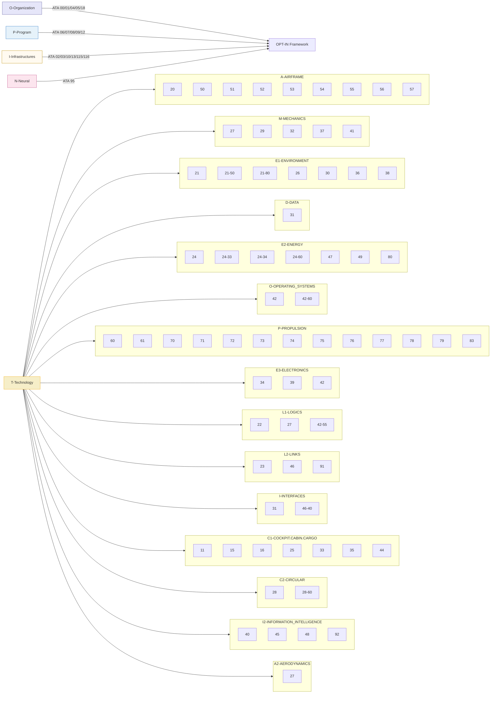

# OPT-IN
Amedeo Pelliccia's development and documentation methodology

**OPT-IN methodology** is described as a **structured framework for development and documentation** used across aerospace systems projects, including AQUA OS and AMPEL360.

### Core structure

OPT-IN is organized into four principal axes—**Organization, Program, Technology, Infrastructure, Neural**—each decomposed into subdomains that mirror ATA chapter logic for traceability and certification alignment.

* **O (Organization):** governance, compliance, airworthiness, and maintenance policies.
* **P (Program):** aircraft-level configuration control, servicing, and dimensional data.
* **T (Technology):** the on-board systems tree that maps airframe, propulsion, energy, OS, and avionics to ATA codes for documentation uniformity.
* **I (Infrastructure):** ground, airport, and supply-chain assets; flight simulators.
* **N (Neural):** data lineage, user traceability, and AI/ML models for digital passporting.

### Methodological principles

1. **ATA-anchored documentation:** every technical artifact—requirement, code module, subsystem—is indexed by ATA chapter.section.subject to ensure interoperability with iSpec 2200 and S1000D deliverables.
2. **Cross-referenced traceability:** logical, thermal, and energy interfaces are documented through secondary ATA references inside each branch.
3. **Reduction of provisional subjects:** new technologies (e.g., quantum scheduling, CO₂ batteries) are introduced under provisional codes until validated by standards review.
4. **Bidirectional linking:** development repositories and technical manuals share identifiers so that commits, verification steps, and documentation updates remain synchronized.
5. **Audit readiness:** every addition must be traceable to a requirement and classification entry, guaranteeing certification evidence continuity .

### Outcome

This framework yields a **single-source-of-truth architecture** where engineering design, certification data, and maintenance documentation remain coherent across aircraft life-cycle phases, making OPT-IN both a configuration-management scheme and a documentation ontology.

The following framework ensures the critical interfaces between systems are formally documented.

---

### **Locked-Down and Final AMPEL360 ATA Chapter Mapping**
---

## Hyperlinked index

* **O-ORGANIZATION**

  * [`ATA-00_GENERAL/`](O-ORGANIZATION/ATA-00_GENERAL/)
  * [`ATA-01_MAINTENANCE_POLICY/`](O-ORGANIZATION/ATA-01_MAINTENANCE_POLICY/)
  * [`ATA-04_AIRWORTHINESS_LIMITATIONS/`](O-ORGANIZATION/ATA-04_AIRWORTHINESS_LIMITATIONS/)
  * [`ATA-05_TIME_LIMITS_MAINT_CHECKS/`](O-ORGANIZATION/ATA-05_TIME_LIMITS_MAINT_CHECKS/)
  * [`ATA-18_VIBRATION_NOISE/`](O-ORGANIZATION/ATA-18_VIBRATION_NOISE/)

* **P-PROGRAM**

  * [`ATA-06_DIMENSIONS_AREAS/`](P-PROGRAM/ATA-06_DIMENSIONS_AREAS/)
  * [`ATA-07_LIFTING_SHORING/`](P-PROGRAM/ATA-07_LIFTING_SHORING/)
  * [`ATA-08_LEVELING_WEIGHING/`](P-PROGRAM/ATA-08_LEVELING_WEIGHING/)
  * [`ATA-09_TOWING_TAXIING/`](P-PROGRAM/ATA-09_TOWING_TAXIING/)
  * [`ATA-12_SERVICING/`](P-PROGRAM/ATA-12_SERVICING/)

* **I-INFRASTRUCTURES**

  * [`ATA-02_OPS_INFO/`](I-INFRASTRUCTURES/ATA-02_OPS_INFO/)
  * [`ATA-03_SUPPORT_INFO/`](I-INFRASTRUCTURES/ATA-03_SUPPORT_INFO/)
  * [`ATA-10_PARKING_STORAGE_RTS/`](I-INFRASTRUCTURES/ATA-10_PARKING_STORAGE_RTS/)
  * [`ATA-13_TOOLS/`](I-INFRASTRUCTURES/ATA-13_TOOLS/)
  * [`ATA-115_FLIGHT_SIM_SYSTEMS/`](I-INFRASTRUCTURES/ATA-115_FLIGHT_SIM_SYSTEMS/)
  * [`ATA-116_FLIGHT_SIM_CUING/`](I-INFRASTRUCTURES/ATA-116_FLIGHT_SIM_CUING/)

* **N-NEURAL_NETWORKS**

  * [`ATA-95_DIGITAL_PRODUCT_PASSPORT/`](N-NEURAL_NETWORKS/ATA-95_DIGITAL_PRODUCT_PASSPORT/)

* **T-TECHNOLOGY**

  * `A-AIRFRAME`

    * [`20-STANDARD_PRACTICES_AIRFRAME/`](T-TECHNOLOGY/A-AIRFRAME/20-STANDARD_PRACTICES_AIRFRAME/)
    * [`50-CARGO_ACCESSORY_COMPARTMENTS/`](T-TECHNOLOGY/A-AIRFRAME/50-CARGO_ACCESSORY_COMPARTMENTS/)
    * [`51_STANDARD_STRUCTURES/`](T-TECHNOLOGY/A-AIRFRAME/51_STANDARD_STRUCTURES/)
    * [`52_DOORS/`](T-TECHNOLOGY/A-AIRFRAME/52_DOORS/)
    * [`53_FUSELAGE/`](T-TECHNOLOGY/A-AIRFRAME/53_FUSELAGE/)
    * [`54_NACELLES_PYLONS/`](T-TECHNOLOGY/A-AIRFRAME/54_NACELLES_PYLONS/)
    * [`55_STABILIZERS/`](T-TECHNOLOGY/A-AIRFRAME/55_STABILIZERS/)
    * [`56_WINDOWS/`](T-TECHNOLOGY/A-AIRFRAME/56_WINDOWS/)
    * [`57_WINGS/`](T-TECHNOLOGY/A-AIRFRAME/57_WINGS/)
  * `M-MECHANICS`

    * [`27-FLIGHT_CONTROLS/`](T-TECHNOLOGY/M-MECHANICS/27-FLIGHT_CONTROLS/)
    * [`29-HYDRAULIC_POWER/`](T-TECHNOLOGY/M-MECHANICS/29-HYDRAULIC_POWER/)
    * [`32-LANDING_GEAR/`](T-TECHNOLOGY/M-MECHANICS/32-LANDING_GEAR/)
    * [`37-VACUUM/`](T-TECHNOLOGY/M-MECHANICS/37-VACUUM/)
    * [`41-WATER_BALLAST/`](T-TECHNOLOGY/M-MECHANICS/41-WATER_BALLAST/)
  * `E1-ENVIRONMENT`

    * [`21-AIR_CONDITIONING_PRESSURIZATION/`](T-TECHNOLOGY/E1-ENVIRONMENT/21-AIR_CONDITIONING_PRESSURIZATION/)
    * [`21-50-XX_POWER_ELECTRONICS_COOLING/`](T-TECHNOLOGY/E1-ENVIRONMENT/21-50-XX_POWER_ELECTRONICS_COOLING/)
    * [`21-80-00_CO2_CAPTURE_PROCESSING_PROV/`](T-TECHNOLOGY/E1-ENVIRONMENT/21-80-00_CO2_CAPTURE_PROCESSING_PROV/)
    * [`26-FIRE_PROTECTION/`](T-TECHNOLOGY/E1-ENVIRONMENT/26-FIRE_PROTECTION/)
    * [`30-ICE_RAIN_PROTECTION/`](T-TECHNOLOGY/E1-ENVIRONMENT/30-ICE_RAIN_PROTECTION/)
    * [`36-PNEUMATIC/`](T-TECHNOLOGY/E1-ENVIRONMENT/36-PNEUMATIC/)
    * [`38-WATER_WASTE/`](T-TECHNOLOGY/E1-ENVIRONMENT/38-WATER_WASTE/)
  * `D-DATA`

    * [`31-INDICATING_RECORDING_SYSTEMS_RECORDING/`](T-TECHNOLOGY/D-DATA/31-INDICATING_RECORDING_SYSTEMS_RECORDING/)
  * `E2-ENERGY`

    * [`24-ELECTRICAL_POWER/`](T-TECHNOLOGY/E2-ENERGY/24-ELECTRICAL_POWER/)
    * [`24-33-00_SOLID_CO2_BATTERY_MODULES_PROV/`](T-TECHNOLOGY/E2-ENERGY/24-33-00_SOLID_CO2_BATTERY_MODULES_PROV/)
    * [`24-34-00_ENDOCIRCULAR_RECHARGE_LOOPS_PROV/`](T-TECHNOLOGY/E2-ENERGY/24-34-00_ENDOCIRCULAR_RECHARGE_LOOPS_PROV/)
    * [`24-60-00_FUEL_CELL_STACKS_DC_OUTPUT/`](T-TECHNOLOGY/E2-ENERGY/24-60-00_FUEL_CELL_STACKS_DC_OUTPUT/)
    * [`47-INERT_GAS_SYSTEM/`](T-TECHNOLOGY/E2-ENERGY/47-INERT_GAS_SYSTEM/)
    * [`49-AIRBORNE_AUXILIARY_POWER/`](T-TECHNOLOGY/E2-ENERGY/49-AIRBORNE_AUXILIARY_POWER/)
    * [`80-STARTING/`](T-TECHNOLOGY/E2-ENERGY/80-STARTING/)
  * `O-OPERATING_SYSTEMS`

    * [`42-INTEGRATED_MODULAR_AVIONICS_CORE_SW/`](T-TECHNOLOGY/O-OPERATING_SYSTEMS/42-INTEGRATED_MODULAR_AVIONICS_CORE_SW/)
    * [`42-60-00_QUANTUM_INSPIRED_SCHEDULER_PROV/`](T-TECHNOLOGY/O-OPERATING_SYSTEMS/42-60-00_QUANTUM_INSPIRED_SCHEDULER_PROV/)
  * `P-PROPULSION`

    * [`60-STANDARD_PRACTICES_PROP_ROTOR/`](T-TECHNOLOGY/P-PROPULSION/60-STANDARD_PRACTICES_PROP_ROTOR/)
    * [`61-PROPELLERS_PROPULSORS/`](T-TECHNOLOGY/P-PROPULSION/61-PROPELLERS_PROPULSORS/)
    * [`70-STANDARD_PRACTICES_ENGINE/`](T-TECHNOLOGY/P-PROPULSION/70-STANDARD_PRACTICES_ENGINE/)
    * [`71-POWER_PLANT/`](T-TECHNOLOGY/P-PROPULSION/71-POWER_PLANT/)
    * [`72-ENGINE/`](T-TECHNOLOGY/P-PROPULSION/72-ENGINE/)
    * [`73-ENGINE_FUEL_CONTROL/`](T-TECHNOLOGY/P-PROPULSION/73-ENGINE_FUEL_CONTROL/)
    * [`74-IGNITION/`](T-TECHNOLOGY/P-PROPULSION/74-IGNITION/)
    * [`75-AIR/`](T-TECHNOLOGY/P-PROPULSION/75-AIR/)
    * [`76-ENGINE_CONTROLS/`](T-TECHNOLOGY/P-PROPULSION/76-ENGINE_CONTROLS/)
    * [`77-ENGINE_INDICATING/`](T-TECHNOLOGY/P-PROPULSION/77-ENGINE_INDICATING/)
    * [`78-EXHAUST/`](T-TECHNOLOGY/P-PROPULSION/78-EXHAUST/)
    * [`79-OIL/`](T-TECHNOLOGY/P-PROPULSION/79-OIL/)
    * [`83-ACCESSORY_GEARBOXES/`](T-TECHNOLOGY/P-PROPULSION/83-ACCESSORY_GEARBOXES/)
  * `E3-ELECTRONICS`

    * [`34-NAVIGATION/`](T-TECHNOLOGY/E3-ELECTRONICS/34-NAVIGATION/)
    * [`39-ELECTRICAL_ELECTRONIC_PANELS/`](T-TECHNOLOGY/E3-ELECTRONICS/39-ELECTRICAL_ELECTRONIC_PANELS/)
    * [`42-INTEGRATED_MODULAR_AVIONICS_HARDWARE/`](T-TECHNOLOGY/E3-ELECTRONICS/42-INTEGRATED_MODULAR_AVIONICS_HARDWARE/)
  * `L1-LOGICS`

    * [`22-AUTOFLIGHT/`](T-TECHNOLOGY/L1-LOGICS/22-AUTOFLIGHT/)
    * [`27-FLIGHT_CONTROLS_SW/`](T-TECHNOLOGY/L1-LOGICS/27-FLIGHT_CONTROLS_SW/)
    * [`42-55-00_POWERTRAIN_ENERGY_ORCHESTRATION_PROV/`](T-TECHNOLOGY/L1-LOGICS/42-55-00_POWERTRAIN_ENERGY_ORCHESTRATION_PROV/)
  * `L2-LINKS`

    * [`23-COMMUNICATIONS/`](T-TECHNOLOGY/L2-LINKS/23-COMMUNICATIONS/)
    * [`46-INFORMATION_SYSTEMS/`](T-TECHNOLOGY/L2-LINKS/46-INFORMATION_SYSTEMS/)
    * [`91-CHARTS/`](T-TECHNOLOGY/L2-LINKS/91-CHARTS/)
  * `I-INTERFACES`

    * [`31-INDICATING_RECORDING_SYSTEMS_INDICATING/`](T-TECHNOLOGY/I-INTERFACES/31-INDICATING_RECORDING_SYSTEMS_INDICATING/)
    * [`46-40-XX_DATA_LOADING_CONFIGURATION/`](T-TECHNOLOGY/I-INTERFACES/46-40-XX_DATA_LOADING_CONFIGURATION/)
  * `C1-COCKPIT.CABIN.CARGO`

    * [`11-PLACARDS_MARKINGS/`](T-TECHNOLOGY/C1-COCKPIT.CABIN.CARGO/11-PLACARDS_MARKINGS/)
    * [`15-AIRCREW_INFORMATION/`](T-TECHNOLOGY/C1-COCKPIT.CABIN.CARGO/15-AIRCREW_INFORMATION/)
    * [`16-CHANGE_OF_ROLE/`](T-TECHNOLOGY/C1-COCKPIT.CABIN.CARGO/16-CHANGE_OF_ROLE/)
    * [`25-EQUIPMENT_FURNISHINGS/`](T-TECHNOLOGY/C1-COCKPIT.CABIN.CARGO/25-EQUIPMENT_FURNISHINGS/)
    * [`33-LIGHTS/`](T-TECHNOLOGY/C1-COCKPIT.CABIN.CARGO/33-LIGHTS/)
    * [`35-OXYGEN/`](T-TECHNOLOGY/C1-COCKPIT.CABIN.CARGO/35-OXYGEN/)
    * [`44-CABIN_SYSTEMS/`](T-TECHNOLOGY/C1-COCKPIT.CABIN.CARGO/44-CABIN_SYSTEMS/)
  * `C2-CIRCULAR`

    * [`28-FUEL_SYSTEMS/`](T-TECHNOLOGY/C2-CIRCULAR/28-FUEL_SYSTEMS/)
    * [`28-60-00_CRYOGENIC_H2_STORAGE_DISTRIBUTION_PROV/`](T-TECHNOLOGY/C2-CIRCULAR/28-60-00_CRYOGENIC_H2_STORAGE_DISTRIBUTION_PROV/)
  * `I2-INFORMATION_INTELLIGENCE`

    * [`40-MULTISYSTEM_INTEGRATION_LOGIC/`](T-TECHNOLOGY/I2-INFORMATION_INTELLIGENCE/40-MULTISYSTEM_INTEGRATION_LOGIC/)
    * [`45-ONBOARD_MAINTENANCE_SYSTEMS/`](T-TECHNOLOGY/I2-INFORMATION_INTELLIGENCE/45-ONBOARD_MAINTENANCE_SYSTEMS/)
    * [`48-IN_FLIGHT_MAINTENANCE_PROV/`](T-TECHNOLOGY/I2-INFORMATION_INTELLIGENCE/48-IN_FLIGHT_MAINTENANCE_PROV/)
    * [`92-MODEL_BASED_MAINTENANCE_PROV/`](T-TECHNOLOGY/I2-INFORMATION_INTELLIGENCE/92-MODEL_BASED_MAINTENANCE_PROV/)
  * `A2-AERODYNAMICS`

    * [`27-FLIGHT_CONTROLS_AERO_SYSTEM/`](T-TECHNOLOGY/A2-AERODYNAMICS/27-FLIGHT_CONTROLS_AERO_SYSTEM/)

---

## Mermaid overview (compact)




```
OPT-IN FRAMEWORK/
├── O-ORGANIZATION/ 
│   ├── ATA 00: GENERAL
│   ├── ATA 01: MAINTENANCE POLICY INFORMATION
│   ├── ATA 04: AIRWORTHINESS LIMITATIONS
│   ├── ATA 05: TIME LIMITS / MAINTENANCE CHECKS
│   └── ATA 18: VIBRATION AND NOISE ANALYSIS
├── P-PROGRAM/
│   ├── ATA 06: DIMENSIONS AND AREAS
│   ├── ATA 07: LIFTING AND SHORING
│   ├── ATA 08: LEVELING AND WEIGHING
│   ├── ATA 09: TOWING AND TAXIING
│   └── ATA 12: SERVICING
├── T-TECHNOLOGY (AMEDEOPELLICCIA - ON BOARD SYS)
│   ├── A-AIRFRAME/
│   │   ├── ATA 20: STANDARD PRACTICES - AIRFRAME (INCL. WIRING DIAGRAM STANDARDS)
│   │   ├── ATA 50: CARGO & ACCESSORY COMPARTMENTS
│   │   ├── ATA 51: STANDARD PRACTICES AND STRUCTURES - GENERAL
│   │   ├── ATA 52: DOORS
│   │   ├── ATA 53: FUSELAGE
│   │   ├── ATA 54: NACELLES/PYLONS
│   │   ├── ATA 55: STABILIZERS
│   │   ├── ATA 56: WINDOWS
│   │   └── ATA 57: WINGS
│   ├── M-MECHANICS/
│   │   ├── ATA 27: FLIGHT CONTROLS (ACTUATION SYSTEMS)
│   │   ├── ATA 29: HYDRAULIC POWER
│   │   ├── ATA 32: LANDING GEAR
│   │   ├── ATA 37: VACUUM / WASTE DISPOSAL
│   │   └── ATA 41: WATER BALLAST
│   ├── E1-ENVIRONMENT/
│   │   ├── ATA 21: AIR CONDITIONING & PRESSURIZATION
│   │   ├── ATA 21-50-xx: Power Electronics Cooling
│   │   ├── ATA 21-80-00 (Prov): CO₂ Capture & Processing (Sec: 36-xx Pneumatics, 28-80/85 Fuel Byproduct)
│   │   ├── ATA 26: FIRE PROTECTION
│   │   ├── ATA 30: ICE AND RAIN PROTECTION
│   │   ├── ATA 36: PNEUMATIC
│   │   └── ATA 38: WATER/WASTE
│   ├── D-DATA/
│   │   └── ATA 31: INDICATING / RECORDING SYSTEMS (RECORDING FUNCTION)
│   ├── E2-ENERGY/
│   │   ├── ATA 24: ELECTRICAL POWER (INCL. 24-45-xx EWIS MONITORING)
│   │   ├── ATA 24-33-00 (Prov): Solid-CO₂ Battery Modules (Sec: 26-30-xx Fire Detect/Suppress)
│   │   ├── ATA 24-34-00 (Prov): Endocircular Recharge Loops (Sec: 26-30-xx Fire Detect/Suppress)
│   │   ├── ATA 24-60-00: Fuel Cell Stacks & DC Output (Sec: 26-40-xx H₂ Leak/Fire Detection)
│   │   ├── ATA 47: INERTING SYSTEM
│   │   ├── ATA 49: AIRBORNE AUXILIARY POWER
│   │   └── ATA 80: STARTING
│   ├── O-OPERATING_SYSTEMS/
│   │   ├── ATA 42: INTEGRATED MODULAR AVIONICS (CORE SOFTWARE)
│   │   └── ATA 42-60-00 (Prov): Quantum-Inspired Scheduler & Resource Orchestration (Sec: 31-60-xx Perf. Recording)
│   ├── P-PROPULSION/
│   │   ├── ATA 60: STANDARD PRACTICES - PROP./ROTOR
│   │   ├── ATA 61: PROPELLERS / PROPULSORS
│   │   ├── ATA 70: STANDARD PRACTICES - ENGINE
│   │   ├── ATA 71: POWER PLANT
│   │   ├── ATA 72: ENGINE
│   │   ├── ATA 73: ENGINE FUEL AND CONTROL
│   │   ├── ATA 74: IGNITION
│   │   ├── ATA 75: AIR
│   │   ├── ATA 76: ENGINE CONTROLS
│   │   ├── ATA 77: ENGINE INDICATING
│   │   ├── ATA 78: EXHAUST
│   │   ├── ATA 79: OIL (INCL. 79-30-xx OPEN-FAN GEARBOX OIL SYSTEM; Sec: 21-52-xx Cooling Air)
│   │   └── ATA 83: ACCESSORY GEAR BOXES
│   ├── E3-ELECTRONICS/
│   │   ├── ATA 34: NAVIGATION
│   │   ├── ATA 39: ELECTRICAL - ELECTRONIC PANELS AND MULTIPURPOSE COMPONENTS
│   │   └── ATA 42: INTEGRATED MODULAR AVIONICS (HARDWARE PLATFORM)
│   ├── L1-LOGICS/
│   │   ├── ATA 22: AUTOFLIGHT
│   │   ├── ATA 27: FLIGHT CONTROLS (CONTROL LAW COMPUTERS/SOFTWARE)
│   │   └── ATA 42-55-00 (Prov): Powertrain/Energy Orchestration Framework (Sec: 31-60-xx Perf. Recording)
│   ├── L2-LINKS/
│   │   ├── ATA 23: COMMUNICATIONS
│   │   ├── ATA 46: INFORMATION SYSTEMS
│   │   └── ATA 91: CHARTS (FLIGHT OPERATIONS)
│   ├── I-INTERFACES/
│   │   ├── ATA 31: INDICATING / RECORDING SYSTEMS (INDICATING FUNCTION)
│   │   └── ATA 46-40-xx: Data Loading & Configuration (Sec: 31 Recording, 45 CMS)
│   ├── C1-COCKPIT.CABIN,CARGO/
│   │   ├── ATA 11: PLACARDS AND MARKINGS
│   │   ├── ATA 15: AIRCREW INFORMATION
│   │   ├── ATA 16: CHANGE OF ROLE
│   │   ├── ATA 25: EQUIPMENT / FURNISHINGS
│   │   ├── ATA 33: LIGHTS
│   │   ├── ATA 35: OXYGEN
│   │   └── ATA 44: CABIN SYSTEMS (INCL. IFE/IFX; Sec: 46-2x/3x Data Services)
│   ├── C2-CIRCULAR (FUEL LIFECYCLE)/
│   │   ├── ATA 28: FUEL (SAF - INCL. 28-40-xx SAF CONDITIONING & QUALITY MGMT)
│   │   └── ATA 28-60-00 (Prov): Cryogenic H₂ Storage & Distribution (Sec: 26-40-xx H₂ Leak/Fire Detection)
│   ├── I2-INFORMATION&INTELLIGENCE/
│   │   ├── ATA 40: MULTISYSTEM (INTEGRATION LOGIC)
│   │   ├── ATA 45: ONBOARD MAINTENANCE SYSTEMS (OMS)
│   │   ├── ATA 48 (Reserved): IN-FLIGHT MAINTENANCE (AI-ENABLED)
│   │   └── ATA 92 (Prov): MODEL BASED MAINTENANCE
│   └── A2-AERODYNAMICS/
│       └── ATA 27: FLIGHT CONTROLS (SYSTEM FOR AERODYNAMIC MANIPULATION)
├── I-INFRASTRUCTURES/
│   ├── ATA 02: OPERATIONS INFORMATION (GROUND-BASED OPS)
│   ├── ATA 03: SUPPORT INFORMATION (GROUND SUPPORT EQUIPMENT - GSE)
│   │   └── **ATA_03-SUPPORT_INFORMATION**: Comprehensive GSE lifecycle management
│   │       ├── Automated CI governance (checksums, signatures, schema validation)
│   │       ├── Interface Control Documents (ICDs) for GSE-aircraft interfaces
│   │       ├── Ground Operations Manuals (GOMs) with metadata sidecars
│   │       ├── Training records, calibration schedules, defect tracking
│   │       └── Live GSE fleet registry and availability status
│   ├── ATA 10: PARKING, MOORING, STORAGE & RETURN TO SERVICE
│   ├── **ATA_13-HARDWARE_AND_GENERAL_TOOLS**: Catalog and management system for hardware and tools
│   │   ├── Hardware catalogs (fasteners, structural, electrical, fluid fittings)
│   │   ├── Consumables catalog (adhesives, lubricants, cleaning agents)
│   │   ├── General tools catalog (hand tools, pneumatic tools, torque wrenches)
│   │   ├── Inventory control (interchangeability data, shelf life, tool control)
│   │   └── Safety data sheets for hazardous materials
│   ├── ATA 85-90 (Reserved): (INFRASTRUCTURE INTERFACE STANDARDS)
│   ├── ATA 115: FLIGHT SIMULATOR SYSTEMS
│   └── ATA 116: FLIGHT SIMULATOR CUING SYSTEM
└── N-NEURAL NETWORKS, USERS, TREACEABILITY/
    └── ATA 95 (Prov): DIGITAL PRODUCT PASSPORT & TRACEABILITY
```

---

### Hyperlinkable Index — `I-INFRASTRUCTURES/ATA_13-HARDWARE_AND_GENERAL_TOOLS`

* [`00_README.md`](OPT-IN%20FRAMEWORK/I-INFRASTRUCTURES/ATA_13-HARDWARE_AND_GENERAL_TOOLS/00_README.md)
* [`INDEX.meta.yaml`](OPT-IN%20FRAMEWORK/I-INFRASTRUCTURES/ATA_13-HARDWARE_AND_GENERAL_TOOLS/INDEX.meta.yaml)

## 01 — Hardware Catalogs

* **01 — Fasteners**

  * [`CAT_Standard-Bolts-MS-NAS.md`](OPT-IN%20FRAMEWORK/I-INFRASTRUCTURES/ATA_13-HARDWARE_AND_GENERAL_TOOLS/01-HARDWARE_CATALOGS/01-FASTENERS/CAT_Standard-Bolts-MS-NAS.md)
  * [`CAT_Standard-Screws-AN-NAS.md`](OPT-IN%20FRAMEWORK/I-INFRASTRUCTURES/ATA_13-HARDWARE_AND_GENERAL_TOOLS/01-HARDWARE_CATALOGS/01-FASTENERS/CAT_Standard-Screws-AN-NAS.md)
  * [`CAT_Hi-Lok-Fasteners.md`](OPT-IN%20FRAMEWORK/I-INFRASTRUCTURES/ATA_13-HARDWARE_AND_GENERAL_TOOLS/01-HARDWARE_CATALOGS/01-FASTENERS/CAT_Hi-Lok-Fasteners.md)
* **02 — Structural Components**

  * [`CAT_Standard-Rivets.md`](OPT-IN%20FRAMEWORK/I-INFRASTRUCTURES/ATA_13-HARDWARE_AND_GENERAL_TOOLS/01-HARDWARE_CATALOGS/02-STRUCTURAL_COMPONENTS/CAT_Standard-Rivets.md)
  * [`CAT_Standard-Bearings.md`](OPT-IN%20FRAMEWORK/I-INFRASTRUCTURES/ATA_13-HARDWARE_AND_GENERAL_TOOLS/01-HARDWARE_CATALOGS/02-STRUCTURAL_COMPONENTS/CAT_Standard-Bearings.md)
* **03 — Electrical Components**

  * [`CAT_Standard-Connectors-MIL-DTL-38999.md`](OPT-IN%20FRAMEWORK/I-INFRASTRUCTURES/ATA_13-HARDWARE_AND_GENERAL_TOOLS/01-HARDWARE_CATALOGS/03-ELECTRICAL_COMPONENTS/CAT_Standard-Connectors-MIL-DTL-38999.md)
  * [`CAT_Standard-Wire-And-Cable.md`](OPT-IN%20FRAMEWORK/I-INFRASTRUCTURES/ATA_13-HARDWARE_AND_GENERAL_TOOLS/01-HARDWARE_CATALOGS/03-ELECTRICAL_COMPONENTS/CAT_Standard-Wire-And-Cable.md)
  * [`CAT_Standard-Circuit-Breakers.md`](OPT-IN%20FRAMEWORK/I-INFRASTRUCTURES/ATA_13-HARDWARE_AND_GENERAL_TOOLS/01-HARDWARE_CATALOGS/03-ELECTRICAL_COMPONENTS/CAT_Standard-Circuit-Breakers.md)
* **04 — Fluid Fittings**

  * [`CAT_Standard-AN-MS-Fittings.md`](OPT-IN%20FRAMEWORK/I-INFRASTRUCTURES/ATA_13-HARDWARE_AND_GENERAL_TOOLS/01-HARDWARE_CATALOGS/04-FLUID_FITTINGS/CAT_Standard-AN-MS-Fittings.md)

## 02 — Consumables Catalog

* [`CAT_Adhesives-And-Sealants.md`](OPT-IN%20FRAMEWORK/I-INFRASTRUCTURES/ATA_13-HARDWARE_AND_GENERAL_TOOLS/02-CONSUMABLES_CATALOG/CAT_Adhesives-And-Sealants.md)
* [`CAT_Lubricants-Greases-And-Oils.md`](OPT-IN%20FRAMEWORK/I-INFRASTRUCTURES/ATA_13-HARDWARE_AND_GENERAL_TOOLS/02-CONSUMABLES_CATALOG/CAT_Lubricants-Greases-And-Oils.md)
* [`CAT_Cleaning-Agents-And-Solvents.md`](OPT-IN%20FRAMEWORK/I-INFRASTRUCTURES/ATA_13-HARDWARE_AND_GENERAL_TOOLS/02-CONSUMABLES_CATALOG/CAT_Cleaning-Agents-And-Solvents.md)

## 03 — General Tools Catalog

* [`CAT_Hand-Tools-Standard.md`](OPT-IN%20FRAMEWORK/I-INFRASTRUCTURES/ATA_13-HARDWARE_AND_GENERAL_TOOLS/03-GENERAL_TOOLS_CATALOG/CAT_Hand-Tools-Standard.md)
* [`CAT_Pneumatic-Tools.md`](OPT-IN%20FRAMEWORK/I-INFRASTRUCTURES/ATA_13-HARDWARE_AND_GENERAL_TOOLS/03-GENERAL_TOOLS_CATALOG/CAT_Pneumatic-Tools.md)
* [`CAT_Torque-Wrenches-General-Use.md`](OPT-IN%20FRAMEWORK/I-INFRASTRUCTURES/ATA_13-HARDWARE_AND_GENERAL_TOOLS/03-GENERAL_TOOLS_CATALOG/CAT_Torque-Wrenches-General-Use.md)

## 04 — Inventory and Control

* **01 — Interchangeability Data**

  * [`DATA_Part-Number-Cross-Reference-Table.csv`](OPT-IN%20FRAMEWORK/I-INFRASTRUCTURES/ATA_13-HARDWARE_AND_GENERAL_TOOLS/04-INVENTORY_AND_CONTROL/01-INTERCHANGEABILITY_DATA/DATA_Part-Number-Cross-Reference-Table.csv)
* **02 — Shelf Life Program**

  * [`PROC_Shelf-Life-Control-Procedure.md`](OPT-IN%20FRAMEWORK/I-INFRASTRUCTURES/ATA_13-HARDWARE_AND_GENERAL_TOOLS/04-INVENTORY_AND_CONTROL/02-SHELF_LIFE_PROGRAM/PROC_Shelf-Life-Control-Procedure.md)
* **03 — Tool Control Program**

  * [`PROC_Tool-Control-And-FOD-Prevention.md`](OPT-IN%20FRAMEWORK/I-INFRASTRUCTURES/ATA_13-HARDWARE_AND_GENERAL_TOOLS/04-INVENTORY_AND_CONTROL/03-TOOL_CONTROL_PROGRAM/PROC_Tool-Control-And-FOD-Prevention.md)
  * **calibration**

    * [`schedule.csv`](OPT-IN%20FRAMEWORK/I-INFRASTRUCTURES/ATA_13-HARDWARE_AND_GENERAL_TOOLS/04-INVENTORY_AND_CONTROL/03-TOOL_CONTROL_PROGRAM/calibration/schedule.csv)

## 05 — Safety Data

* **safety_data_sheets**

  * [`SDS_MIL-PRF-23377_Primer.md`](OPT-IN%20FRAMEWORK/I-INFRASTRUCTURES/ATA_13-HARDWARE_AND_GENERAL_TOOLS/05-SAFETY_DATA/safety_data_sheets/SDS_MIL-PRF-23377_Primer.md)
  * [`SDS_BMS-3-26_Grease.md`](OPT-IN%20FRAMEWORK/I-INFRASTRUCTURES/ATA_13-HARDWARE_AND_GENERAL_TOOLS/05-SAFETY_DATA/safety_data_sheets/SDS_BMS-3-26_Grease.md)
