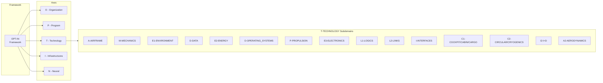
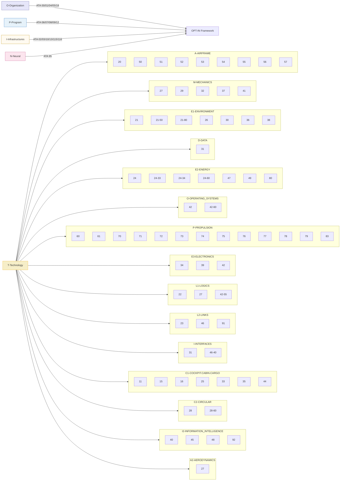

# OPT-IN
Amedeo Pelliccia's development and documentation methodology

**OPT-IN** is a structured framework for development and documentation used across aerospace systems projects, including AQUA OS and the AMPEL360 aircraft.

## Core Structure
OPT-IN is organized into five axes—**Organization, Program, Technology, Infrastructure, Neural**—each decomposed into subdomains that mirror ATA chapter logic for traceability and certification alignment.

-   **O (Organization):** Governance, compliance, airworthiness, and maintenance policies.
-   **P (Program):** Aircraft-level configuration control, servicing, and dimensional data.
-   **T (Technology):** The on-board systems tree organized by functional domains that map to ATA codes.
-   **I (Infrastructure):** Ground, airport, and supply-chain assets; flight simulators.
-   **N (Neural):** Data lineage, user traceability, and AI/ML for the digital passport.

## Methodological Principles
1.  **ATA-Anchored Documentation:** Every artifact is indexed by ATA chapter.section.subject (iSpec 2200 / S1000D compatible).
2.  **Cross-Referenced Traceability:** Logical, thermal, and energy interfaces are captured via secondary ATA references.
3.  **Provisional Subjects:** Emerging technologies live under provisional codes until standards review.
4.  **Bidirectional Linking:** Repositories and manuals share identifiers for synchronized commits and verifications.
5.  **Audit Readiness:** Every addition traces to a requirement and classification entry.

---

## Framework Overview



---

## Master Directory Structure

```
OPT-IN_FRAMEWORK/
├── O-ORGANIZATION/
│   ├── ATA_00-GENERAL
│   ├── ATA_01-MAINTENANCE_POLICY_INFORMATION
│   ├── ATA_04-AIRWORTHINESS_LIMITATIONS
│   ├── ATA_05-TIME_LIMITS_MAINTENANCE_CHECKS
│   └── ATA_18-VIBRATION_AND_NOISE_ANALYSIS
├── P-PROGRAM/
│   ├── ATA_06-DIMENSIONS_AND_AREAS
│   ├── ATA_07-LIFTING_AND_SHORING
│   ├── ATA_08-LEVELING_AND_WEIGHING
│   ├── ATA_09-TOWING_AND_TAXIING
│   └── ATA_12-SERVICING
├── T-TECHNOLOGY_AMPEDEOPELLICCIA-ON_BOARD_SYSTEMS/
│   ├── A-AIRFRAME/
│   ├── M-MECHANICS/
│   ├── E1-ENVIRONMENT/
│   ├── D-DATA/
│   ├── E2-ENERGY/
│   ├── O-OPERATING_SYSTEMS/
│   ├── P-PROPULSION/
│   ├── E3-ELECTRONICS/
│   ├── L1-LOGICS/
│   ├── L2-LINKS/
│   ├── I-INFORMATION_INTELLIGENCE_INTERFACES/
│   ├── C1-COCKPIT_CABIN_CARGO/
│   ├── C2-CIRCULAR_CRYOGENIC_SYSTEMS/
│   ├── I2-I+D/
│   └── A2-AERODYNAMICS/
├── I-INFRASTRUCTURES/
│   ├── ATA_02-OPERATIONS_INFORMATION
│   ├── ATA_03-SUPPORT_INFORMATION_GSE
│   ├── ATA_10-PARKING_MOORING_STORAGE_RTS
│   ├── ATA_13-HARDWARE_AND_GENERAL_TOOLS
│   ├── ATA_85-90-INFRASTRUCTURE_INTERFACE_STANDARDS
│   ├── ATA_115-FLIGHT_SIMULATOR_SYSTEMS
│   └── ATA_116-FLIGHT_SIMULATOR_CUING_SYSTEM
└── N-NEURAL_NETWORKS_USERS_TRACEABILITY/
    └── ATA_95-DIGITAL_PRODUCT_PASSPORT_AND_TRACEABILITY
```

---

## Hyperlinked Index

### O - ORGANIZATION
-   [`ATA 00 - GENERAL`](./O-ORGANIZATION/ATA_00-GENERAL/)
-   [`ATA 01 - MAINTENANCE POLICY INFORMATION`](./O-ORGANIZATION/ATA_01-MAINTENANCE_POLICY_INFORMATION/)
-   [`ATA 04 - AIRWORTHINESS LIMITATIONS`](./O-ORGANIZATION/ATA_04-AIRWORTHINESS_LIMITATIONS/)
-   [`ATA 05 - TIME LIMITS / MAINTENANCE CHECKS`](./O-ORGANIZATION/ATA_05-TIME_LIMITS_MAINTENANCE_CHECKS/)
-   [`ATA 18 - VIBRATION AND NOISE ANALYSIS`](./O-ORGANIZATION/ATA_18-VIBRATION_AND_NOISE_ANALYSIS/)

### P - PROGRAM
-   [`ATA 06 - DIMENSIONS AND AREAS`](./P-PROGRAM/ATA_06-DIMENSIONS_AND_AREAS/)
-   [`ATA 07 - LIFTING AND SHORING`](./P-PROGRAM/ATA_07-LIFTING_AND_SHORING/)
-   [`ATA 08 - LEVELING AND WEIGHING`](./P-PROGRAM/ATA_08-LEVELING_AND_WEIGHING/)
-   [`ATA 09 - TOWING AND TAXIING`](./P-PROGRAM/ATA_09-TOWING_AND_TAXIING/)
-   [`ATA 12 - SERVICING`](./P-PROGRAM/ATA_12-SERVICING/)

### T - TECHNOLOGY (ON BOARD SYSTEMS)

#### A - AIRFRAME
-   [`ATA 20 - STANDARD PRACTICES - AIRFRAME`](./T-TECHNOLOGY_AMPEDEOPELLICCIA-ON_BOARD_SYSTEMS/A-AIRFRAME/ATA_20-STANDARD_PRACTICES-AIRFRAME/)
-   [`ATA 50 - CARGO & ACCESSORY COMPARTMENTS`](./T-TECHNOLOGY_AMPEDEOPELLICCIA-ON_BOARD_SYSTEMS/A-AIRFRAME/ATA_50-CARGO_AND_ACCESSORY_COMPARTMENTS/)
-   [`ATA 51 - STANDARD PRACTICES AND STRUCTURES - GENERAL`](./T-TECHNOLOGY_AMPEDEOPELLICCIA-ON_BOARD_SYSTEMS/A-AIRFRAME/ATA_51-STANDARD_PRACTICES_AND_STRUCTURES-GENERAL/)
-   [`ATA 52 - DOORS`](./T-TECHNOLOGY_AMPEDEOPELLICCIA-ON_BOARD_SYSTEMS/A-AIRFRAME/ATA_52-DOORS/)
-   [`ATA 53 - FUSELAGE`](./T-TECHNOLOGY_AMPEDEOPELLICCIA-ON_BOARD_SYSTEMS/A-AIRFRAME/ATA_53-FUSELAGE/)
-   [`ATA 54 - NACELLES & PYLONS`](./T-TECHNOLOGY_AMPEDEOPELLICCIA-ON_BOARD_SYSTEMS/A-AIRFRAME/ATA_54-NACELLES_PYLONS/)
-   [`ATA 55 - STABILIZERS`](./T-TECHNOLOGY_AMPEDEOPELLICCIA-ON_BOARD_SYSTEMS/A-AIRFRAME/ATA_55-STABILIZERS/)
-   [`ATA 56 - WINDOWS`](./T-TECHNOLOGY_AMPEDEOPELLICCIA-ON_BOARD_SYSTEMS/A-AIRFRAME/ATA_56-WINDOWS/)
-   [`ATA 57 - WINGS`](./T-TECHNOLOGY_AMPEDEOPELLICCIA-ON_BOARD_SYSTEMS/A-AIRFRAME/ATA_57-WINGS/)

#### M - MECHANICS
-   [`ATA 27 - FLIGHT CONTROLS (ACTUATION SYSTEMS)`](./T-TECHNOLOGY_AMPEDEOPELLICCIA-ON_BOARD_SYSTEMS/M-MECHANICS/ATA_27-FLIGHT_CONTROLS_ACTUATION_SYSTEMS/)
-   [`ATA 29 - HYDRAULIC POWER`](./T-TECHNOLOGY_AMPEDEOPELLICCIA-ON_BOARD_SYSTEMS/M-MECHANICS/ATA_29-HYDRAULIC_POWER/)
-   [`ATA 32 - LANDING GEAR`](./T-TECHNOLOGY_AMPEDEOPELLICCIA-ON_BOARD_SYSTEMS/M-MECHANICS/ATA_32-LANDING_GEAR/)
-   [`ATA 37 - VACUUM / WASTE DISPOSAL`](./T-TECHNOLOGY_AMPEDEOPELLICCIA-ON_BOARD_SYSTEMS/M-MECHANICS/ATA_37-VACUUM_WASTE_DISPOSAL/)
-   [`ATA 41 - WATER BALLAST`](./T-TECHNOLOGY_AMPEDEOPELLICCIA-ON_BOARD_SYSTEMS/M-MECHANICS/ATA_41-WATER_BALLAST/)

#### E1 - ENVIRONMENT
-   [`ATA 21 - AIR CONDITIONING & PRESSURIZATION`](./T-TECHNOLOGY_AMPEDEOPELLICCIA-ON_BOARD_SYSTEMS/E1-ENVIRONMENT/ATA_21-AIR_CONDITIONING_AND_PRESSURIZATION/)
-   [`ATA 26 - FIRE PROTECTION`](./T-TECHNOLOGY_AMPEDEOPELLICCIA-ON_BOARD_SYSTEMS/E1-ENVIRONMENT/ATA_26-FIRE_PROTECTION/)
-   [`ATA 30 - ICE AND RAIN PROTECTION`](./T-TECHNOLOGY_AMPEDEOPELLICCIA-ON_BOARD_SYSTEMS/E1-ENVIRONMENT/ATA_30-ICE_AND_RAIN_PROTECTION/)
-   [`ATA 36 - PNEUMATIC`](./T-TECHNOLOGY_AMPEDEOPELLICCIA-ON_BOARD_SYSTEMS/E1-ENVIRONMENT/ATA_36-PNEUMATIC/)
-   [`ATA 38 - WATER/WASTE`](./T-TECHNOLOGY_AMPEDEOPELLICCIA-ON_BOARD_SYSTEMS/E1-ENVIRONMENT/ATA_38-WATER_WASTE/)

#### D - DATA
-   [`ATA 31 - RECORDING (FDR/CVR)`](./T-TECHNOLOGY_AMPEDEOPELLICCIA-ON_BOARD_SYSTEMS/D-DATA/ATA_31-INDICATING_RECORDING_SYSTEMS_RECORDING_FUNCTION-FDR_CVR/)

#### E2 - ENERGY
-   [`ATA 24 - ELECTRICAL POWER`](./T-TECHNOLOGY_AMPEDEOPELLICCIA-ON_BOARD_SYSTEMS/E2-ENERGY/ATA_24-ELECTRICAL_POWER/)
-   [`ATA 47 - INERTING SYSTEM`](./T-TECHNOLOGY_AMPEDEOPELLICCIA-ON_BOARD_SYSTEMS/E2-ENERGY/ATA_47-INERTING_SYSTEM/)
-   [`ATA 49 - AIRBORNE AUXILIARY POWER`](./T-TECHNOLOGY_AMPEDEOPELLICCIA-ON_BOARD_SYSTEMS/E2-ENERGY/ATA_49-AIRBORNE_AUXILIARY_POWER/)
-   [`ATA 80 - STARTING`](./T-TECHNOLOGY_AMPEDEOPELLICCIA-ON_BOARD_SYSTEMS/E2-ENERGY/ATA_80-STARTING/)

#### O - OPERATING SYSTEMS
-   [`ATA 42 - IMA (ARCHITECTURAL GOVERNANCE)`](./T-TECHNOLOGY_AMPEDEOPELLICCIA-ON_BOARD_SYSTEMS/O-OPERATING_SYSTEMS/ATA_42-INTEGRATED_MODULAR_AVIONICS_ARCHITECTURAL_GOVERNANCE_AND_STANDARDS/)

#### P - PROPULSION
-   `ATA 60` - STANDARD PRACTICES - PROP./ROTOR
-   `ATA 61` - PROPELLERS / PROPULSORS
-   `ATA 70` - STANDARD PRACTICES - ENGINE
-   `ATA 71` - POWER PLANT
-   `ATA 72` - ENGINE
-   `ATA 73` - ENGINE FUEL AND CONTROL
-   `ATA 74` - IGNITION
-   `ATA 75` - AIR
-   `ATA 76` - ENGINE CONTROLS
-   `ATA 78` - EXHAUST
-   `ATA 79` - OIL

#### E3 - ELECTRONICS
-   [`ATA 34 - NAVIGATION`](./T-TECHNOLOGY_AMPEDEOPELLICCIA-ON_BOARD_SYSTEMS/E3-ELECTRONICS/ATA_34-NAVIGATION/)
-   [`ATA 39 - ELECTRONIC PANELS & COMPONENTS`](./T-TECHNOLOGY_AMPEDEOPELLICCIA-ON_BOARD_SYSTEMS/E3-ELECTRONICS/ATA_39-ELECTRICAL-ELECTRONIC_PANELS_AND_MULTIPURPOSE_COMPONENTS/)
-   [`ATA 42 - IMA (HARDWARE MODULES)`](./T-TECHNOLOGY_AMPEDEOPELLICCIA-ON_BOARD_SYSTEMS/E3-ELECTRONICS/ATA_42-INTEGRATED_MODULAR_AVIONICS_HARDWARE_MODULES-CPM_IOM/)

#### L1 - LOGICS
-   [`ATA 22 - AUTOFLIGHT`](./T-TECHNOLOGY_AMPEDEOPELLICCIA-ON_BOARD_SYSTEMS/L1-LOGICS/ATA_22-AUTOFLIGHT/)
-   [`ATA 27 - FLIGHT CONTROLS (SOFTWARE)`](./T-TECHNOLOGY_AMPEDEOPELLICCIA-ON_BOARD_SYSTEMS/L1-LOGICS/ATA_27-FLIGHT_CONTROLS_CONTROL_LAW_COMPUTERS_SOFTWARE/)
-   [`ATA 42 - IMA (HOSTED APPLICATIONS)`](./T-TECHNOLOGY_AMPEDEOPELLICCIA-ON_BOARD_SYSTEMS/L1-LOGICS/ATA_42-INTEGRATED_MODULAR_AVIONICS_HOSTED_APPLICATION_PARTITIONS/)

#### L2 - LINKS
-   [`ATA 23 - COMMUNICATIONS`](./T-TECHNOLOGY_AMPEDEOPELLICCIA-ON_BOARD_SYSTEMS/L2-LINKS/ATA_23-COMMUNICATIONS/)
-   [`ATA 42 - IMA (NETWORK FABRIC)`](./T-TECHNOLOGY_AMPEDEOPELLICCIA-ON_BOARD_SYSTEMS/L2-LINKS/ATA_42-INTEGRATED_MODULAR_AVIONICS_NETWORK_FABRIC-AFDX/)
-   [`ATA 91 - CHARTS (FLIGHT OPERATIONS)`](./T-TECHNOLOGY_AMPEDEOPELLICCIA-ON_BOARD_SYSTEMS/L2-LINKS/ATA_91-CHARTS_FLIGHT_OPERATIONS/)

#### I - INFORMATION, INTELLIGENCE, INTERFACES
-   [`ATA 31 - INDICATING`](./T-TECHNOLOGY_AMPEDEOPELLICCIA-ON_BOARD_SYSTEMS/I-INFORMATION_INTELLIGENCE_INTERFACES/ATA_31-INDICATING_RECORDING_SYSTEMS_INDICATING_FUNCTION/)
-   [`ATA 42 - IMA (CORE OS SERVICES)`](./T-TECHNOLOGY_AMPEDEOPELLICCIA-ON_BOARD_SYSTEMS/I-INFORMATION_INTELLIGENCE_INTERFACES/ATA_42-INTEGRATED_MODULAR_AVIONICS_CORE_OS_SERVICES_APIS_AND_HEALTH_MONITORING/)
-   [`ATA 45 - ONBOARD MAINTENANCE SYSTEMS (OMS/CMS)`](./T-TECHNOLOGY_AMPEDEOPELLICCIA-ON_BOARD_SYSTEMS/I-INFORMATION_INTELLIGENCE_INTERFACES/ATA_45-ONBOARD_MAINTENANCE_SYSTEMS_OMS_CMS/)
-   [`ATA 46 - INFORMATION SYSTEMS (ACARS/DATALINK)`](./T-TECHNOLOGY_AMPEDEOPELLICCIA-ON_BOARD_SYSTEMS/I-INFORMATION_INTELLIGENCE_INTERFACES/ATA_46-INFORMATION_SYSTEMS_ACARS_DATALINK/)
-   `ATA 77` - ENGINE INDICATING
-   `ATA 93` (Reserved) - ONBOARD DATA LOAD AND CONFIGURATION

#### C1 - COCKPIT, CABIN, CARGO
-   `ATA 11` - PLACARDS AND MARKINGS
-   `ATA 15` - AIRCREW INFORMATION
-   `ATA 16` - CHANGE OF ROLE
-   `ATA 25` - EQUIPMENT / FURNISHINGS
-   `ATA 33` - LIGHTS
-   `ATA 35` - OXYGEN
-   `ATA 44` - CABIN SYSTEMS

#### C2 - CIRCULAR, CRYOGENIC SYSTEMS
-   [`ATA 28 - FUEL (SAF & CRYOGENIC H₂)`](./T-TECHNOLOGY_AMPEDEOPELLICCIA-ON_BOARD_SYSTEMS/C2-CIRCULAR_CRYOGENIC_SYSTEMS/ATA_28-FUEL_SAF_AND_CRYOGENIC_H2/)
-   `ATA 21-80-00` (Prov) - CO₂ Capture & Processing

#### I2 - I+D (Research & Development)
-   `ATA 40` (Reserved) - MULTISYSTEM (FOR AI INTEGRATION)
-   `ATA 42-55-00` (Prov) - Powertrain/Energy Orchestration
-   `ATA 42-60-00` (Prov) - Quantum-Inspired Scheduler
-   `ATA 48` (Reserved) - IN-FLIGHT MAINTENANCE
-   `ATA 92` (Prov) - MODEL BASED MAINTENANCE

#### A2 - AERODYNAMICS
-   [`ATA 27 - FLIGHT CONTROLS (AERODYNAMIC MANIPULATION)`](./T-TECHNOLOGY_AMPEDEOPELLICCIA-ON_BOARD_SYSTEMS/A2-AERODYNAMICS/ATA_27-FLIGHT_CONTROLS_SYSTEM_FOR_AERODYNAMIC_MANIPULATION/)

### I - INFRASTRUCTURES
-   [`ATA 02 - OPERATIONS INFORMATION`](./I-INFRASTRUCTURES/ATA_02-OPERATIONS_INFORMATION/)
-   [`ATA 03 - SUPPORT INFORMATION (GSE)`](./I-INFRASTRUCTURES/ATA_03-SUPPORT_INFORMATION_GSE/)
-   [`ATA 10 - PARKING, MOORING, STORAGE & RTS`](./I-INFRASTRUCTURES/ATA_10-PARKING_MOORING_STORAGE_RTS/)
-   [`ATA 13 - HARDWARE AND GENERAL TOOLS`](./I-INFRASTRUCTURES/ATA_13-HARDWARE_AND_GENERAL_TOOLS/)
-   [`ATA 85-90 - INFRASTRUCTURE INTERFACE STANDARDS`](./I-INFRASTRUCTURES/ATA_85-90-INFRASTRUCTURE_INTERFACE_STANDARDS/)
-   [`ATA 115 - FLIGHT SIMULATOR SYSTEMS`](./I-INFRASTRUCTURES/ATA_115-FLIGHT_SIMULATOR_SYSTEMS/)
-   [`ATA 116 - FLIGHT SIMULATOR CUING SYSTEM`](./I-INFRASTRUCTURES/ATA_116-FLIGHT_SIMULATOR_CUING_SYSTEM/)

### N - NEURAL NETWORKS, USERS, TRACEABILITY
-   [`ATA 95 - DIGITAL PRODUCT PASSPORT & TRACEABILITY`](./N-NEURAL_NETWORKS_USERS_TRACEABILITY/ATA_95-DIGITAL_PRODUCT_PASSPORT_AND_TRACEABILITY/)

---

## Mermaid overview (compact)




```
OPT-IN_FRAMEWORK/
├── O-ORGANIZATION/ 
│   ├── ATA_00-GENERAL
│   ├── ATA_01-MAINTENANCE_POLICY_INFORMATION
│   ├── ATA_04-AIRWORTHINESS_LIMITATIONS
│   ├── ATA_05-TIME_LIMITS_MAINTENANCE_CHECKS
│   └── ATA_18-VIBRATION_AND_NOISE_ANALYSIS
├── P-PROGRAM/
│   ├── ATA_06-DIMENSIONS_AND_AREAS
│   ├── ATA_07-LIFTING_AND_SHORING
│   ├── ATA_08-LEVELING_AND_WEIGHING
│   ├── ATA_09-TOWING_AND_TAXIING
│   └── ATA_12-SERVICING
├── T-TECHNOLOGY_AMPEDEOPELLICCIA-ON_BOARD_SYSTEMS/
│   ├── A-AIRFRAME/
│   │   ├── ATA_20-STANDARD_PRACTICES_-_AIRFRAME
│   │   ├── ATA_50-CARGO_AND_ACCESSORY_COMPARTMENTS
│   │   ├── ATA_51-STANDARD_PRACTICES_AND_STRUCTURES_-_GENERAL
│   │   ├── ATA_52-DOORS
│   │   ├── ATA_53-FUSELAGE
│   │   ├── ATA_54-NACELLES/PYLONS
│   │   ├── ATA_55-STABILIZERS
│   │   ├── ATA_56-WINDOWS
│   │   └── ATA_57-WINGS
│   ├── M-MECHANICS/
│   │   ├── ATA_27-FLIGHT_CONTROLS_(ACTUATION_SYSTEMS)
│   │   ├── ATA_29-HYDRAULIC_POWER
│   │   ├── ATA_32-LANDING_GEAR
│   │   ├── ATA_37-VACUUM_WASTE_DISPOSAL
│   │   └── ATA_41-WATER_BALLAST
│   ├── E1-ENVIRONMENT/
│   │   ├── ATA_21-AIR_CONDITIONING_AND_PRESSURIZATION
│   │   ├── ATA_26-FIRE_PROTECTION
│   │   ├── ATA_30-ICE_AND_RAIN_PROTECTION
│   │   ├── ATA_36-PNEUMATIC
│   │   └── ATA_38-WATER/WASTE
│   ├── D-DATA/
│   │   └── ATA_31-INDICATING_RECORDING_SYSTEMS_(RECORDING_FUNCTION_-_FDR/CVR)
│   ├── E2-ENERGY/
│   │   ├── ATA_24-ELECTRICAL_POWER
│   │   ├── ATA_47-INERTING_SYSTEM
│   │   ├── ATA_49-AIRBORNE_AUXILIARY_POWER
│   │   └── ATA_80-STARTING
│   ├── O-OPERATING_SYSTEMS/
│   │   └── ATA_42-INTEGRATED_MODULAR_AVIONICS_(ARCHITECTURAL_GOVERNANCE_AND_STANDARDS)
│   ├── P-PROPULSION/
│   │   ├── ATA_60-STANDARD_PRACTICES_-_PROP./ROTOR
│   │   ├── ATA_61-PROPELLERS_PROPULSORS
│   │   ├── ATA_70-STANDARD_PRACTICES_-_ENGINE
│   │   ├── ATA_71-POWER_PLANT
│   │   ├── ATA_72-ENGINE
│   │   ├── ATA_73-ENGINE_FUEL_AND_CONTROL
│   │   ├── ATA_74-IGNITION
│   │   ├── ATA_75-AIR
│   │   ├── ATA_76-ENGINE_CONTROLS
│   │   ├── ATA_78-EXHAUST
│   │   └── ATA_79-OIL
│   ├── E3-ELECTRONICS/
│   │   ├── ATA_34-NAVIGATION
│   │   ├── ATA_39-ELECTRICAL_-_ELECTRONIC_PANELS_AND_MULTIPURPOSE_COMPONENTS
│   │   └── ATA_42-INTEGRATED_MODULAR_AVIONICS_(HARDWARE_MODULES_-_CPM/IOM)
│   ├── L1-LOGICS/
│   │   ├── ATA_22-AUTOFLIGHT
│   │   ├── ATA_27-FLIGHT_CONTROLS_(CONTROL_LAW_COMPUTERS/SOFTWARE)
│   │   └── ATA_42-INTEGRATED_MODULAR_AVIONICS_(HOSTED_APPLICATION_PARTITIONS)
│   ├── L2-LINKS/
│   │   ├── ATA_23-COMMUNICATIONS
│   │   ├── ATA_42-INTEGRATED_MODULAR_AVIONICS_(NETWORK_FABRIC_-_e.g.,_AFDX)
│   │   └── ATA_91-CHARTS_(FLIGHT_OPERATIONS)
│   ├── I-INFORMATION_INTELLIGENCE_INTERFACES/
│   │   ├── ATA_31-INDICATING_RECORDING_SYSTEMS_(INDICATING_FUNCTION)
│   │   ├── ATA_42-INTEGRATED_MODULAR_AVIONICS_(CORE_OS_SERVICES,_APIS_AND_HEALTH_MONITORING)
│   │   ├── ATA_45-ONBOARD_MAINTENANCE_SYSTEMS_(OMS/CMS)
│   │   ├── ATA_46-INFORMATION_SYSTEMS_(ACARS,_DATALINK)
│   │   ├── ATA_77-ENGINE_INDICATING
│   │   └── ATA 93 (Reserved): ONBOARD DATA LOAD AND CONFIGURATION
│   ├── C1-COCKPIT_CABIN_CARGO/
│   │   ├── ATA_11-PLACARDS_AND_MARKINGS
│   │   ├── ATA_15-AIRCREW_INFORMATION
│   │   ├── ATA_16-CHANGE_OF_ROLE
│   │   ├── ATA_25-EQUIPMENT_FURNISHINGS
│   │   ├── ATA_33-LIGHTS
│   │   ├── ATA_35-OXYGEN
│   │   └── ATA_44-CABIN_SYSTEMS
│   ├── C2-CIRCULAR_CRYOGENIC_SYSTEMS/
│   │   ├── ATA_28-FUEL_(SAF_AND_CRYOGENIC_H₂)
│   │   └── ATA 21-80-00 (Prov): CO₂ Capture & Processing
│   ├── I2-I+D/
│   │   ├── ATA_40-MULTISYSTEM_(RESERVED_FOR_AI_INTEGRATION)
│   │   ├── ATA 42-55-00 (Prov): Powertrain/Energy Orchestration Framework
│   │   ├── ATA 42-60-00 (Prov): Quantum-Inspired Scheduler & Resource Orchestration
│   │   ├── ATA 48 (Reserved): IN-FLIGHT MAINTENANCE (AI-ENABLED)
│   │   └── ATA 92 (Prov): MODEL BASED MAINTENANCE
│   └── A2-AERODYNAMICS/
│       └── ATA_27-FLIGHT_CONTROLS_(SYSTEM_FOR_AERODYNAMIC_MANIPULATION)
├── I-INFRASTRUCTURES/
│   ├── ATA_02-OPERATIONS_INFORMATION
│   ├── ATA_03-SUPPORT_INFORMATION_GSE
│   ├── ATA_10-PARKING_MOORING_STORAGE_RTS
│   ├── ATA_13-HARDWARE_AND_GENERAL_TOOLS
│   ├── ATA_85-90-INFRASTRUCTURE_INTERFACE_STANDARDS
│   ├── ATA_115-FLIGHT_SIMULATOR_SYSTEMS
│   └── ATA_116-FLIGHT_SIMULATOR_CUING_SYSTEM
└── N-NEURAL_NETWORKS_USERS_TRACEABILITY/
    └── ATA_95-DIGITAL_PRODUCT_PASSPORT_AND_TRACEABILITY
```

---


## AMPEL360 BWB H2 Hy-E: OPT-IN Framework Architecture

Based on the specifications for **AMPEL360 BWB H2 Hy-E Q100 INTEGRA SAF**, this is a next-generation hydrogen-electric hybrid aircraft with **blended-wing-body (BWB)** architecture, **open-rotor propulsion**, **hydrogen fuel cells**, **CO₂ solid batteries**, and **sustainable aviation fuel (SAF)** integration. Here is the OPT‑IN Framework mapping tailored to this hybrid powertrain and aerodynamic configuration:

---

### Core Aircraft Characteristics

| Attribute | Specification |
|-----------|---------------|
| **Configuration** | Blended-Wing-Body (integrated fuselage-wing) |
| **Passengers** | 100–150 (Q100 class) |
| **Primary Propulsion** | Hydrogen fuel cells + open rotor fans |
| **Secondary Propulsion** | SAF-capable auxiliary turboshaft (for emergency / range extension) |
| **Energy Storage** | CO₂ solid batteries (endocircular recharge loops) |
| **Range** | Long-range (intercontinental capable) |
| **Fuel Systems** | Cryogenic H₂ storage (ATA 28-60) + SAF reserves |

---

### OPT‑IN Layer Mapping for AMPEL360

#### **O — ORGANIZATION** (Governance & Airworthiness)
Maps to **ATA 00–05, 18** with H₂-specific compliance:
- **Airworthiness Authority**: FAA H₂-Roadmap, EASA Special Conditions for hydrogen propulsion
- **Regulatory Framework**: CS-E Gap Analysis for Hydrogen, DO-311A (fuel cell systems)
- **Maintenance Policy**: H₂ system handling, fuel cell stack replacement intervals, cryogenic storage inspection

---

#### **P — PROGRAM** (Operational Definition)
Maps to **ATA 06–12**:
- **Servicing Procedures**: H₂ refueling (high-pressure, cryogenic), battery charge cycles
- **Ground Operations**: H₂ leak detection before flight, battery state-of-charge verification
- **Mission Planning**: H₂ consumption profiles, SAF fallback routes, fuel cell thermal management

---

#### **T — TECHNOLOGY (AMEDEOPELLICCIA On-Board Systems)**

##### **A — AIRFRAME (BWB Integration)** | **ATA 20, 50–57**
- **Fuselage sections**: Forward (pilot cabin, nose LG), Center (passenger cabin, cooling systems, LH₂ tanks), Aft (non-pressurized, cooling loops, electrical distribution)
- **Wing integration**: Fuel cell stack cooling ducts, electrical cabling, H₂ distribution lines
- **Material compliance**: Composite structures (hydrogen-compatible resins), pressure vessel certifications for H₂ tanks

##### **M — MECHANICS (Open Rotor Actuation)** | **ATA 27, 29, 32, 37, 41**
- **Flight Controls**: Aerodynamic surfaces controlled by fuel-cell-powered electric actuators (no hydraulic backup)
- **Open Rotor Gearbox**: High-speed electric motor driving open fan via gearbox (ATA 83 Accessory Gear Boxes)
- **Hydraulic System**: Minimal (emergency control only, pneumatic-driven); replaced by electric power

##### **E1 — ENVIRONMENT (Thermal & Cryogenic)** | **ATA 21, 26, 30, 36, 38**
- **H₂ Cryogenic Cooling**: Active boil-off management via heat exchangers; dual-phase H₂/liquid cooling circuits (ATA 21-50-xx provision)
- **Fire Detection**: Hydrogen-specific leak sensors (ATA 26-40-xx H₂ detection section); CO₂ suppression for fuel cell stacks
- **Pneumatic System**: Minimal; primarily for emergency bleed air (ATA 36 compressed to secondary role)
- **ECS**: Low-pressure air conditioning fed by fuel cell waste heat recovery

##### **D — DATA (Flight Records & Fuel Cell Monitoring)** | **ATA 31**
- **FDR/CVR**: Standard recording + fuel cell stack health, H₂ pressure, battery state-of-charge, thermal dynamics
- **Data Link**: Real-time performance upload to ground for predictive maintenance (ATA 46)

##### **E2 — ENERGY (Fuel Cells & Batteries)** | **ATA 24, 47, 49, 80**
- **Primary**: Hydrogen Fuel Cell Stacks (500–1000 kW per stack)
  - Solid Oxide Fuel Cells (SOFC) or Proton Exchange Membrane (PEM)
  - Output: DC power directly; DC-AC conversion via onboard inverters
  - Thermal waste recovery: Heat for cabin ECS
- **Secondary Storage**: CO₂ Solid Batteries (endocircular recharge loops)
  - Discharge: Provides peak load buffering during climb/acceleration
  - Recharge: Regenerative energy from descent, thermal recovery, or ground charging
  - Integration point: ATA 24-34-00 Provisional (Endocircular Recharge Loops section)
- **Tertiary**: SAF Reserve Tank
  - Turboshaft APU (ATA 49) for range extension or emergency power
  - Fuel cell efficiency drops at very high altitude → APU as auxiliary at cruise ceiling

##### **O — OPERATING SYSTEMS (Quantum-Inspired Orchestration)** | **ATA 42**
- **IMA Core**: Integrated Modular Avionics managing:
  - Fuel cell stack power distribution
  - Battery state-of-charge optimization (ATA 42-55-00 Prov: Powertrain/Energy Orchestration)
  - Open rotor speed scheduling (ATA 42-60-00 Prov: Quantum-Inspired Scheduler)
  - Thermal load management across cryogenic, cabin, and electrical domains

##### **P — PROPULSION (Fuel Cell + Open Rotor)** | **ATA 60–83**
- **ATA 71 Power Plant**: Fuel cell stack assembly
- **ATA 72 Engine**: Open rotor configuration (unducted fans driven by electric motor)
- **ATA 73 Fuel & Control**: H₂ supply line management, pressure regulation, fuel cell control logic
- **ATA 75 Air**: High-bypass intake geometry optimized for open rotor; H₂ fuel cell products (water vapor) exhaust
- **ATA 76 Engine Controls**: Electric motor speed control, fuel cell voltage regulation
- **ATA 77 Engine Indicating**: Fuel cell stack voltage, current, thermal state; rotor RPM, thrust
- **ATA 78 Exhaust**: Water vapor condensation management; thermal energy recovery
- **ATA 79 Oil**: Replaced by thermal cooling fluid (perfluorocarbon or silicone); circulates through fuel cell stack and motor windings
- **ATA 83 Accessory Gear Boxes**: Electric motor to open rotor gearbox (1:5–1:8 reduction)

##### **E3 — ELECTRONICS (Fuel Cell Controllers & Power Distribution)** | **ATA 34, 39, 42**
- **ATA 42 (Hardware)**: Fuel cell stack power management units (DC/DC converters, inverters)
- **ATA 39 Electrical Panels**: Battery charge controllers, DC distribution busses
- **Redundancy**: Dual fuel cell stacks with seamless switchover; dual battery packs

##### **L1 — LOGICS (Control Laws & Energy Management)** | **ATA 22, 27, 42**
- **Flight Control Law**: Fly-by-wire with electric actuation only; no hydraulic feedback
- **Energy Management Algorithm**: Quantum-inspired resource orchestration (ATA 42-60-00)
  - Objective: Minimize H₂ consumption while maintaining thrust, thermal, and electrical load balance
  - Inputs: Altitude, Mach, weight, battery state-of-charge, fuel cell efficiency curve
  - Outputs: Optimal fuel cell setpoint, battery discharge rate, APU engagement threshold
- **Thermal Balancing**: Active heat pump coupling fuel cell waste heat to cabin ECS and cryogenic tank warming

##### **L2 — LINKS (Communications & Data Network)** | **ATA 23, 46, 42**
- **Network Fabric**: AFDX (Avionics Full-Duplex Switched Ethernet) linking fuel cell controllers, battery management, flight controls
- **Datalink**: ACARS continuous upload of health parameters (fuel cell stack degradation, battery cycle life prediction)
- **AI Anomaly Detection**: Real-time monitoring for hydrogen leaks, fuel cell flooding, battery thermal runaway

##### **I — INFORMATION, INTELLIGENCE, INTERFACES** | **ATA 31, 42, 45, 46, 77, 93**
- **OMS (Onboard Maintenance System)**: Fuel cell stack cycle counting, remaining useful life (RUL) prediction
- **In-Flight Maintenance (ATA 48 Prov)**: AI-driven detection of fuel cell voltage degradation; automatic safeguard mode
- **Model-Based Maintenance (ATA 92 Prov)**: Digital twin of fuel cell stack performance, battery aging models
- **Data Loading (ATA 93 Prov)**: Configuration of fuel cell operating limits, battery charge profiles, thermal limits by mission type

##### **C1 — COCKPIT.CABIN.CARGO** | **ATA 11, 15, 25, 33, 35, 44**
- **Crew Information**: Real-time fuel cell status, battery remaining, cryogenic H₂ pressure display
- **Cabin Furnishings (ATA 25)**: Lightweight composite seating, no hydraulic systems → lighter weight
- **IFE (ATA 44)**: Powered by onboard electrical generation from fuel cells (no APU noise advantage)
- **Oxygen System (ATA 35)**: Integrated with fuel cell water vapor exhaust (potential emergency breathing air generation)

##### **C2 — CIRCULAR, CRYOGENICS** | **ATA 28, 21-80**
- **H₂ Storage & Distribution (ATA 28-60-00 Prov)**: Cryogenic tank (20–100 kg H₂ capacity), insulation, boil-off management
- **SAF Conditioning (ATA 28-40-xx)**: Secondary fuel system for APU, gravity feed, temperature control
- **CO₂ Capture & Processing (ATA 21-80-00 Prov)**: Integrated with fuel cell exhaust; separation of CO₂ for battery regeneration loops
- **Closed-Loop Endocircular Recharge**: CO₂ captured from fuel cell exhaust → compressed → used in solid battery discharge/recharge cycle

##### **I2 — I + D (Intelligence & Data Integration)** | **ATA 40, 42-55, 42-60, 48, 92**
- **Powertrain Orchestration Framework (ATA 42-55-00 Prov)**: Integrated controller managing fuel cell, battery, and thermal systems
- **Quantum-Inspired Scheduler (ATA 42-60-00 Prov)**: Multi-objective optimization of power demand across propulsion, environmental control, and avionics
- **AI-Enabled Maintenance (ATA 48)**: Continuous learning model predicting fuel cell degradation, battery state-of-health
- **Model-Based Maintenance (ATA 92)**: Digital twins of fuel cell electrochemistry, battery impedance evolution

##### **A2 — AERODYNAMICS** | **ATA 27**
- **BWB Lift Distribution**: Integrated wing-fuselage control surfaces; open rotor placement optimized for spanwise thrust distribution
- **Laminar Flow Control**: Active boundary layer suction (electric-powered) for drag reduction

---

#### **I — INFRASTRUCTURES (H₂ Value Chain & Operations)** | **ATA 02, 03, 10, 13, 85–116**
- **Airport H₂ Supply Chain**: Cryogenic refueling stations, high-pressure cart connections, boil-off capture
- **Ground Support Equipment (ATA 03)**: H₂ leak detector, cryogenic hoses, DC charging dock (battery recharge)
- **Hangar Systems**: Hydrogen ventilation, thermal conditioning for fuel cell stack pre-flight warm-up
- **Flight Simulator**: Full-envelope fuel cell and battery model, cryogenic tank dynamics, emergency fuel cell shutdown scenarios

---

#### **N — NEURAL NETWORKS, USERS, TRACEABILITY** | **ATA 95**
- **Digital Product Passport (H₂ Configuration)**: Lifetime H₂ consumption, fuel cell stack cycle history, battery capacity fade tracking
- **Blockchain Ledger**: Immutable record of SAF + H₂ fuel sourcing (lifecycle carbon intensity)
- **Stakeholder Access**: Airline fleet manager, fuel supplier, air traffic control (real-time air-quality data from water-vapor exhaust)

---

### Critical ATA Provisional Sections for AMPEL360

| ATA Provisional | Traditional Domain | New Application | Certification Status |
|-----------------|-------------------|-----------------|----------------------|
| **ATA 24-33-00** | Electrical | Solid-CO₂ Battery Modules | Under EASA/FAA review |
| **ATA 24-34-00** | Electrical | Endocircular Recharge Loops | Special Condition required |
| **ATA 24-60-00** | Electrical | Fuel Cell Stacks & DC Output | DO-311A, SAE AS8034 |
| **ATA 26-40-xx** | Fire | H₂ Leak/Fire Detection | DO-254 DO-178C |
| **ATA 28-60-00** | Fuel | Cryogenic H₂ Storage | CS-23.AFGAS/H2, ISO 21029 |
| **ATA 21-80-00** | ECS | CO₂ Capture & Processing | CS-25 Thermal Management |
| **ATA 42-55-00** | Avionics | Powertrain Orchestration | ARP 4754A MBSE |
| **ATA 42-60-00** | Avionics | Quantum Scheduler | DO-178C Level A |
| **ATA 48** | Maintenance | In-Flight AI Diagnostics | DO-387 (AI Exploration) |
| **ATA 92** | Maintenance | Model-Based Maintenance | ED-215 (AI Assurance) |
| **ATA 95** | Traceability | Digital Product Passport | ISO 23247 Digital Twin |

---

### Certification and Approval Pathway

1. **Type Certification Authority**: EASA (with FAA reciprocity via TIP)
2. **Special Conditions**: Hydrogen fuel system, open rotor structural dynamics, fuel cell thermal runaway containment
3. **Equivalent Level of Safety (ELOS)**: Electric flight control without hydraulic backup vs. conventional architecture
4. **Provisional Standards**: ATA chapters marked "Prov" require industry consensus via RTCA/EUROCAE taskgroups before full certification

This **AMPEL360 OPT-IN mapping** integrates next-generation propulsion, energy storage, and digital intelligence within the established ATA framework, positioning it for near-term certification and operations.

---

### References

1. [GAIA-AIR Ampel360XWLRGA Repository](https://github.com/Robbbo-T/GAIA-AIR-Ampel360XWLRGA)
2. [Blended Wing Body - Wikipedia](https://en.wikipedia.org/wiki/Blended_wing_body)
3. [Hydrogen Aircraft Research - ScienceDirect](https://www.sciencedirect.com/science/article/pii/S0360319924043295)
4. [BWB Design Considerations - Scribd](https://www.scribd.com/document/760380200/Blended-Wing-Design-Considerations-for-A-Next-Generation-Commerci)
5. [FAA Hydrogen-Fueled Aircraft Roadmap](https://www.faa.gov/aircraft/air_cert/step/disciplines/propulsion_systems/hydrogen-fueled_aircraft_roadmap)
6. [CAA Hydrogen Aircraft Publications](https://www.caa.co.uk/publication/download/25268)
7. [ATI Hydrogen Report](https://www.ati.org.uk/wp-content/uploads/2021/08/aci-ati-hydrogen-report-1.pdf)
8. [NASA BWB Research](https://ntrs.nasa.gov/api/citations/20040033924/downloads/20040033924.pdf)
9. [Propfan Technology - Wikipedia](https://en.wikipedia.org/wiki/Propfan)
10. [CO₂ Battery Research - ScienceDirect](https://www.sciencedirect.com/science/article/pii/S0306261925010864)
11. [Electric Aircraft Research](https://escholarship.org/content/qt51c5r1nx/qt51c5r1nx.pdf)
12. [Open Rotor Engine - Clean Sky](https://www.rotator-cleansky.com/open-rotor-engine)
13. [Carbon Dioxide Battery Technology](https://blog.upsbatterycenter.com/carbon-dioxide-battery-turns-the-tables/)
14. [AIAA Aircraft Design Paper](https://arc.aiaa.org/doi/10.2514/6.2024-3664)
15. [Open Rotor Technology Analysis](https://leehamnews.com/2024/05/17/bjorns-corner-new-engine-development-part-8-open-rotor-technology/)
16. [SAF and Hydrogen Propulsion](https://www.afsenergy.nl/blog-post/the-future-of-aviation-with-saf-and-hydrogen-propulsion)
17. [Hydrogen and Electric Propulsion](https://www.leadventgrp.com/blog/hydrogen-and-electric-propulsion-complementing-saf-for-a-sustainable-future)
18. [Sustainable Aviation Fuel Overview](https://afdc.energy.gov/fuels/sustainable-aviation-fuel)

---

