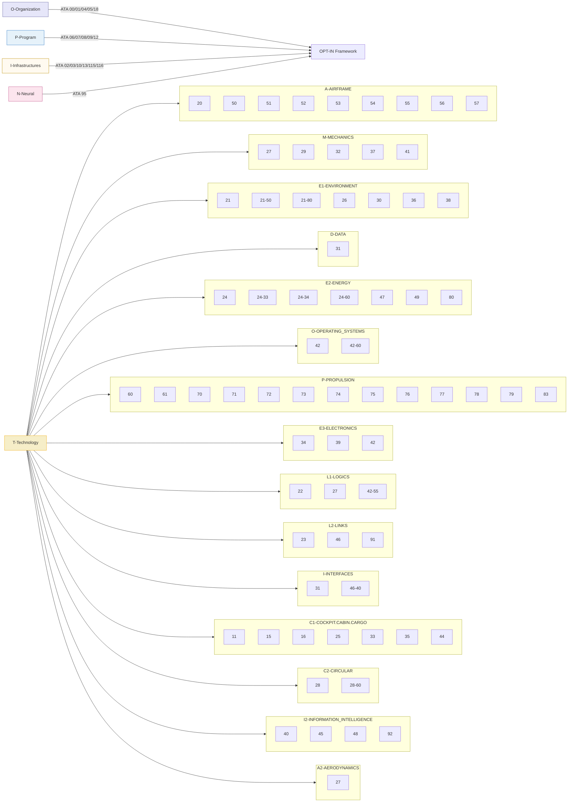

# OPT-IN
Amedeo Pelliccia's development and documentation methodology

**OPT-IN methodology** is described as a **structured framework for development and documentation** used across aerospace systems projects, including AQUA OS and AMPEL360.

### Core structure

OPT-IN is organized into four principal axes—**Organization, Program, Technology, Infrastructure, Neural**—each decomposed into subdomains that mirror ATA chapter logic for traceability and certification alignment.

* **O (Organization):** governance, compliance, airworthiness, and maintenance policies.
* **P (Program):** aircraft-level configuration control, servicing, and dimensional data.
* **T (Technology):** the on-board systems tree organized into functional domains that map to ATA codes for documentation uniformity (see T-TECHNOLOGY section below for complete subdomain breakdown).
* **I (Infrastructure):** ground, airport, and supply-chain assets; flight simulators.
* **N (Neural):** data lineage, user traceability, and AI/ML models for digital passporting.

### Methodological principles

1. **ATA-anchored documentation:** every technical artifact—requirement, code module, subsystem—is indexed by ATA chapter.section.subject to ensure interoperability with iSpec 2200 and S1000D deliverables.
2. **Cross-referenced traceability:** logical, thermal, and energy interfaces are documented through secondary ATA references inside each branch.
3. **Reduction of provisional subjects:** new technologies (e.g., quantum scheduling, CO₂ batteries) are introduced under provisional codes until validated by standards review.
4. **Bidirectional linking:** development repositories and technical manuals share identifiers so that commits, verification steps, and documentation updates remain synchronized.
5. **Audit readiness:** every addition must be traceable to a requirement and classification entry, guaranteeing certification evidence continuity .

### Outcome

This framework yields a **single-source-of-truth architecture** where engineering design, certification data, and maintenance documentation remain coherent across aircraft life-cycle phases, making OPT-IN both a configuration-management scheme and a documentation ontology.

The following framework ensures the critical interfaces between systems are formally documented.

---

### **Locked-Down and Final AMPEL360 ATA Chapter Mapping**
---

## Hyperlinked index

* **O-ORGANIZATION**

  * [`ATA_00-GENERAL/`](OPT-IN_FRAMEWORK/O-ORGANIZATION/ATA_00-GENERAL/) - Comprehensive governance framework with detailed subdirectories
  * [`ATA_01-MAINTENANCE_POLICY_INFORMATION/`](OPT-IN_FRAMEWORK/O-ORGANIZATION/ATA_01-MAINTENANCE_POLICY_INFORMATION/)
  * [`ATA-04_AIRWORTHINESS_LIMITATIONS/`](O-ORGANIZATION/ATA-04_AIRWORTHINESS_LIMITATIONS/)
  * [`ATA_05-TIME_LIMITS_MAINTENANCE_CHECKS/`](OPT-IN_FRAMEWORK/O-ORGANIZATION/ATA_05-TIME_LIMITS_MAINTENANCE_CHECKS/)
  * [`ATA-18_VIBRATION_NOISE/`](O-ORGANIZATION/ATA-18_VIBRATION_NOISE/)

* **P-PROGRAM**

  * [`ATA-06_DIMENSIONS_AREAS/`](P-PROGRAM/ATA-06_DIMENSIONS_AREAS/)
  * [`ATA-07_LIFTING_SHORING/`](P-PROGRAM/ATA-07_LIFTING_SHORING/)
  * [`ATA-08_LEVELING_WEIGHING/`](P-PROGRAM/ATA-08_LEVELING_WEIGHING/)
  * [`ATA-09_TOWING_TAXIING/`](P-PROGRAM/ATA-09_TOWING_TAXIING/)
  * [`ATA-12_SERVICING/`](P-PROGRAM/ATA-12_SERVICING/)

* **I-INFRASTRUCTURES**

  * [`ATA-02_OPS_INFO/`](I-INFRASTRUCTURES/ATA-02_OPS_INFO/)
  * [`ATA-03_SUPPORT_INFO/`](I-INFRASTRUCTURES/ATA-03_SUPPORT_INFO/)
  * [`ATA_10-PARKING_MOORING_STORAGE_RTS/`](OPT-IN_FRAMEWORK/I-INFRASTRUCTURES/ATA_10-PARKING_MOORING_STORAGE_RTS/)
  * [`ATA-13_TOOLS/`](I-INFRASTRUCTURES/ATA-13_TOOLS/)
  * [`ATA-115_FLIGHT_SIM_SYSTEMS/`](I-INFRASTRUCTURES/ATA-115_FLIGHT_SIM_SYSTEMS/)
  * [`ATA-116_FLIGHT_SIM_CUING/`](I-INFRASTRUCTURES/ATA-116_FLIGHT_SIM_CUING/)

* **N-NEURAL_NETWORKS_USERS_TRACEABILITY**

  * [`00_README.md`](OPT-IN_FRAMEWORK/N-NEURAL_NETWORKS_USERS_TREACEABILITY/00_README.md)
  * [`ATA_95-DIGITAL_PRODUCT_PASSPORT/`](OPT-IN_FRAMEWORK/N-NEURAL_NETWORKS_USERS_TREACEABILITY/ATA_95-DIGITAL_PRODUCT_PASSPORT/)

* **T-TECHNOLOGY_AMPEDEOPELLICCIA-ON_BOARD_SYSTEMS**

  * `A-AIRFRAME`

    * ATA_20-STANDARD_PRACTICES_-_AIRFRAME
    * ATA_50-CARGO_AND_ACCESSORY_COMPARTMENTS
    * ATA_51-STANDARD_PRACTICES_AND_STRUCTURES_-_GENERAL
    * ATA_52-DOORS
    * ATA_53-FUSELAGE
    * ATA_54-NACELLES/PYLONS
    * ATA_55-STABILIZERS
    * ATA_56-WINDOWS
    * ATA_57-WINGS
  * `M-MECHANICS`

    * ATA_27-FLIGHT_CONTROLS_(ACTUATION_SYSTEMS)
    * ATA_29-HYDRAULIC_POWER
    * ATA_32-LANDING_GEAR
    * ATA_37-VACUUM_WASTE_DISPOSAL
    * ATA_41-WATER_BALLAST
  * `E1-ENVIRONMENT`

    * ATA_21-AIR_CONDITIONING_AND_PRESSURIZATION
    * ATA_26-FIRE_PROTECTION
    * ATA_30-ICE_AND_RAIN_PROTECTION
    * ATA_36-PNEUMATIC
    * ATA_38-WATER/WASTE
  * `D-DATA`

    * ATA_31-INDICATING_RECORDING_SYSTEMS_(RECORDING_FUNCTION_-_FDR/CVR)
  * `E2-ENERGY`

    * ATA_24-ELECTRICAL_POWER
    * ATA_47-INERTING_SYSTEM
    * ATA_49-AIRBORNE_AUXILIARY_POWER
    * ATA_80-STARTING
  * `O-OPERATING_SYSTEMS`

    * ATA_42-INTEGRATED_MODULAR_AVIONICS_(ARCHITECTURAL_GOVERNANCE_AND_STANDARDS)
  * `P-PROPULSION`

    * ATA_60-STANDARD_PRACTICES_-_PROP./ROTOR
    * ATA_61-PROPELLERS_PROPULSORS
    * ATA_70-STANDARD_PRACTICES_-_ENGINE
    * ATA_71-POWER_PLANT
    * ATA_72-ENGINE
    * ATA_73-ENGINE_FUEL_AND_CONTROL
    * ATA_74-IGNITION
    * ATA_75-AIR
    * ATA_76-ENGINE_CONTROLS
    * ATA_78-EXHAUST
    * ATA_79-OIL
  * `E3-ELECTRONICS`

    * ATA_34-NAVIGATION
    * ATA_39-ELECTRICAL_-_ELECTRONIC_PANELS_AND_MULTIPURPOSE_COMPONENTS
    * ATA_42-INTEGRATED_MODULAR_AVIONICS_(HARDWARE_MODULES_-_CPM/IOM)
  * `L1-LOGICS`

    * ATA_22-AUTOFLIGHT
    * ATA_27-FLIGHT_CONTROLS_(CONTROL_LAW_COMPUTERS/SOFTWARE)
    * ATA_42-INTEGRATED_MODULAR_AVIONICS_(HOSTED_APPLICATION_PARTITIONS)
  * `L2-LINKS`

    * ATA_23-COMMUNICATIONS
    * ATA_42-INTEGRATED_MODULAR_AVIONICS_(NETWORK_FABRIC_-_e.g.,_AFDX)
    * ATA_91-CHARTS_(FLIGHT_OPERATIONS)
  * `I-INFORMATION_INTELLIGENCE_INTERFACES`

    * ATA_31-INDICATING_RECORDING_SYSTEMS_(INDICATING_FUNCTION)
    * ATA_42-INTEGRATED_MODULAR_AVIONICS_(CORE_OS_SERVICES,_APIS_AND_HEALTH_MONITORING)
    * ATA_45-ONBOARD_MAINTENANCE_SYSTEMS_(OMS/CMS)
    * ATA_46-INFORMATION_SYSTEMS_(ACARS,_DATALINK)
    * ATA_77-ENGINE_INDICATING
    * ATA 93 (Reserved): ONBOARD DATA LOAD AND CONFIGURATION
  * `C1-COCKPIT_CABIN_CARGO`

    * ATA_11-PLACARDS_AND_MARKINGS
    * ATA_15-AIRCREW_INFORMATION
    * ATA_16-CHANGE_OF_ROLE
    * ATA_25-EQUIPMENT_FURNISHINGS
    * ATA_33-LIGHTS
    * ATA_35-OXYGEN
    * ATA_44-CABIN_SYSTEMS
  * `C2-CIRCULAR_CRYOGENIC_SYSTEMS`

    * ATA_28-FUEL_(SAF_AND_CRYOGENIC_H₂)
    * ATA 21-80-00 (Prov): CO₂ Capture & Processing
  * `I2-I+D`

    * ATA_40-MULTISYSTEM_(RESERVED_FOR_AI_INTEGRATION)
    * ATA 42-55-00 (Prov): Powertrain/Energy Orchestration Framework
    * ATA 42-60-00 (Prov): Quantum-Inspired Scheduler & Resource Orchestration
    * ATA 48 (Reserved): IN-FLIGHT MAINTENANCE (AI-ENABLED)
    * ATA 92 (Prov): MODEL BASED MAINTENANCE
  * `A2-AERODYNAMICS`

    * ATA_27-FLIGHT_CONTROLS_(SYSTEM_FOR_AERODYNAMIC_MANIPULATION)

---

## Mermaid overview (compact)




```
OPT-IN_FRAMEWORK/
├── O-ORGANIZATION/ 
│   ├── ATA_00-GENERAL
│   ├── ATA_01-MAINTENANCE_POLICY_INFORMATION
│   ├── ATA_04-AIRWORTHINESS_LIMITATIONS
│   ├── ATA_05-TIME_LIMITS_MAINTENANCE_CHECKS
│   └── ATA_18-VIBRATION_AND_NOISE_ANALYSIS
├── P-PROGRAM/
│   ├── ATA_06-DIMENSIONS_AND_AREAS
│   ├── ATA_07-LIFTING_AND_SHORING
│   ├── ATA_08-LEVELING_AND_WEIGHING
│   ├── ATA_09-TOWING_AND_TAXIING
│   └── ATA_12-SERVICING
├── T-TECHNOLOGY_AMPEDEOPELLICCIA-ON_BOARD_SYSTEMS/
│   ├── A-AIRFRAME/
│   │   ├── ATA_20-STANDARD_PRACTICES_-_AIRFRAME
│   │   ├── ATA_50-CARGO_AND_ACCESSORY_COMPARTMENTS
│   │   ├── ATA_51-STANDARD_PRACTICES_AND_STRUCTURES_-_GENERAL
│   │   ├── ATA_52-DOORS
│   │   ├── ATA_53-FUSELAGE
│   │   ├── ATA_54-NACELLES/PYLONS
│   │   ├── ATA_55-STABILIZERS
│   │   ├── ATA_56-WINDOWS
│   │   └── ATA_57-WINGS
│   ├── M-MECHANICS/
│   │   ├── ATA_27-FLIGHT_CONTROLS_(ACTUATION_SYSTEMS)
│   │   ├── ATA_29-HYDRAULIC_POWER
│   │   ├── ATA_32-LANDING_GEAR
│   │   ├── ATA_37-VACUUM_WASTE_DISPOSAL
│   │   └── ATA_41-WATER_BALLAST
│   ├── E1-ENVIRONMENT/
│   │   ├── ATA_21-AIR_CONDITIONING_AND_PRESSURIZATION
│   │   ├── ATA_26-FIRE_PROTECTION
│   │   ├── ATA_30-ICE_AND_RAIN_PROTECTION
│   │   ├── ATA_36-PNEUMATIC
│   │   └── ATA_38-WATER/WASTE
│   ├── D-DATA/
│   │   └── ATA_31-INDICATING_RECORDING_SYSTEMS_(RECORDING_FUNCTION_-_FDR/CVR)
│   ├── E2-ENERGY/
│   │   ├── ATA_24-ELECTRICAL_POWER
│   │   ├── ATA_47-INERTING_SYSTEM
│   │   ├── ATA_49-AIRBORNE_AUXILIARY_POWER
│   │   └── ATA_80-STARTING
│   ├── O-OPERATING_SYSTEMS/
│   │   └── ATA_42-INTEGRATED_MODULAR_AVIONICS_(ARCHITECTURAL_GOVERNANCE_AND_STANDARDS)
│   ├── P-PROPULSION/
│   │   ├── ATA_60-STANDARD_PRACTICES_-_PROP./ROTOR
│   │   ├── ATA_61-PROPELLERS_PROPULSORS
│   │   ├── ATA_70-STANDARD_PRACTICES_-_ENGINE
│   │   ├── ATA_71-POWER_PLANT
│   │   ├── ATA_72-ENGINE
│   │   ├── ATA_73-ENGINE_FUEL_AND_CONTROL
│   │   ├── ATA_74-IGNITION
│   │   ├── ATA_75-AIR
│   │   ├── ATA_76-ENGINE_CONTROLS
│   │   ├── ATA_78-EXHAUST
│   │   └── ATA_79-OIL
│   ├── E3-ELECTRONICS/
│   │   ├── ATA_34-NAVIGATION
│   │   ├── ATA_39-ELECTRICAL_-_ELECTRONIC_PANELS_AND_MULTIPURPOSE_COMPONENTS
│   │   └── ATA_42-INTEGRATED_MODULAR_AVIONICS_(HARDWARE_MODULES_-_CPM/IOM)
│   ├── L1-LOGICS/
│   │   ├── ATA_22-AUTOFLIGHT
│   │   ├── ATA_27-FLIGHT_CONTROLS_(CONTROL_LAW_COMPUTERS/SOFTWARE)
│   │   └── ATA_42-INTEGRATED_MODULAR_AVIONICS_(HOSTED_APPLICATION_PARTITIONS)
│   ├── L2-LINKS/
│   │   ├── ATA_23-COMMUNICATIONS
│   │   ├── ATA_42-INTEGRATED_MODULAR_AVIONICS_(NETWORK_FABRIC_-_e.g.,_AFDX)
│   │   └── ATA_91-CHARTS_(FLIGHT_OPERATIONS)
│   ├── I-INFORMATION_INTELLIGENCE_INTERFACES/
│   │   ├── ATA_31-INDICATING_RECORDING_SYSTEMS_(INDICATING_FUNCTION)
│   │   ├── ATA_42-INTEGRATED_MODULAR_AVIONICS_(CORE_OS_SERVICES,_APIS_AND_HEALTH_MONITORING)
│   │   ├── ATA_45-ONBOARD_MAINTENANCE_SYSTEMS_(OMS/CMS)
│   │   ├── ATA_46-INFORMATION_SYSTEMS_(ACARS,_DATALINK)
│   │   ├── ATA_77-ENGINE_INDICATING
│   │   └── ATA 93 (Reserved): ONBOARD DATA LOAD AND CONFIGURATION
│   ├── C1-COCKPIT_CABIN_CARGO/
│   │   ├── ATA_11-PLACARDS_AND_MARKINGS
│   │   ├── ATA_15-AIRCREW_INFORMATION
│   │   ├── ATA_16-CHANGE_OF_ROLE
│   │   ├── ATA_25-EQUIPMENT_FURNISHINGS
│   │   ├── ATA_33-LIGHTS
│   │   ├── ATA_35-OXYGEN
│   │   └── ATA_44-CABIN_SYSTEMS
│   ├── C2-CIRCULAR_CRYOGENIC_SYSTEMS/
│   │   ├── ATA_28-FUEL_(SAF_AND_CRYOGENIC_H₂)
│   │   └── ATA 21-80-00 (Prov): CO₂ Capture & Processing
│   ├── I2-I+D/
│   │   ├── ATA_40-MULTISYSTEM_(RESERVED_FOR_AI_INTEGRATION)
│   │   ├── ATA 42-55-00 (Prov): Powertrain/Energy Orchestration Framework
│   │   ├── ATA 42-60-00 (Prov): Quantum-Inspired Scheduler & Resource Orchestration
│   │   ├── ATA 48 (Reserved): IN-FLIGHT MAINTENANCE (AI-ENABLED)
│   │   └── ATA 92 (Prov): MODEL BASED MAINTENANCE
│   └── A2-AERODYNAMICS/
│       └── ATA_27-FLIGHT_CONTROLS_(SYSTEM_FOR_AERODYNAMIC_MANIPULATION)
├── I-INFRASTRUCTURES/
│   ├── ATA_02-OPERATIONS_INFORMATION
│   ├── ATA_03-SUPPORT_INFORMATION_GSE
│   ├── ATA_10-PARKING_MOORING_STORAGE_RTS
│   ├── ATA_13-HARDWARE_AND_GENERAL_TOOLS
│   ├── ATA_85-90-INFRASTRUCTURE_INTERFACE_STANDARDS
│   ├── ATA_115-FLIGHT_SIMULATOR_SYSTEMS
│   └── ATA_116-FLIGHT_SIMULATOR_CUING_SYSTEM
└── N-NEURAL_NETWORKS_USERS_TRACEABILITY/
    └── ATA_95-DIGITAL_PRODUCT_PASSPORT_AND_TRACEABILITY
```

---

### Hyperlinkable Index — `O-ORGANIZATION/ATA_05-TIME_LIMITS_MAINTENANCE_CHECKS`

# ATA_05-TIME_LIMITS_MAINTENANCE_CHECKS

Operator-approved scheduled maintenance program. Consolidates MPD (ATA_01) and ALS (ATA_04) into executable work packages (A/C/S checks) with full traceability.

- [`00_README.md`](OPT-IN_FRAMEWORK/O-ORGANIZATION/ATA_05-TIME_LIMITS_MAINTENANCE_CHECKS/00_README.md)
- [`INDEX.meta.yaml`](OPT-IN_FRAMEWORK/O-ORGANIZATION/ATA_05-TIME_LIMITS_MAINTENANCE_CHECKS/INDEX.meta.yaml)

## 01 — Maintenance Program Manual (MPM)
- [`MPM_Master-Document_rev1.0.0_20280701.md`](OPT-IN_FRAMEWORK/O-ORGANIZATION/ATA_05-TIME_LIMITS_MAINTENANCE_CHECKS/01-MAINTENANCE_PROGRAM_MANUAL/MPM_MASTER-DOCUMENT_REV100_20280701.md)
- **01-A-CHECKS**
  - [`A-CHECK_Program-Definition.md`](OPT-IN_FRAMEWORK/O-ORGANIZATION/ATA_05-TIME_LIMITS_MAINTENANCE_CHECKS/01-MAINTENANCE_PROGRAM_MANUAL/01-A-CHECKS/A-CHECK_PROGRAM-DEFINITION.md)
  - [`A-CHECK_Work-Package-A01.md`](OPT-IN_FRAMEWORK/O-ORGANIZATION/ATA_05-TIME_LIMITS_MAINTENANCE_CHECKS/01-MAINTENANCE_PROGRAM_MANUAL/01-A-CHECKS/A-CHECK_WORK-PACKAGE-A01.md)
  - [`A-CHECK_Work-Package-A02.md`](OPT-IN_FRAMEWORK/O-ORGANIZATION/ATA_05-TIME_LIMITS_MAINTENANCE_CHECKS/01-MAINTENANCE_PROGRAM_MANUAL/01-A-CHECKS/A-CHECK_WORK-PACKAGE-A02.md)
- **02-C-CHECKS**
  - [`C-CHECK_Program-Definition.md`](OPT-IN_FRAMEWORK/O-ORGANIZATION/ATA_05-TIME_LIMITS_MAINTENANCE_CHECKS/01-MAINTENANCE_PROGRAM_MANUAL/02-C-CHECKS/C-CHECK_PROGRAM-DEFINITION.md)
  - [`C-CHECK_Work-Package-C01.md`](OPT-IN_FRAMEWORK/O-ORGANIZATION/ATA_05-TIME_LIMITS_MAINTENANCE_CHECKS/01-MAINTENANCE_PROGRAM_MANUAL/02-C-CHECKS/C-CHECK_WORK-PACKAGE-C01.md)
- **03-STRUCTURAL_CHECKS_S-CHECKS**
  - [`S-CHECK_Program-Definition.md`](OPT-IN_FRAMEWORK/O-ORGANIZATION/ATA_05-TIME_LIMITS_MAINTENANCE_CHECKS/01-MAINTENANCE_PROGRAM_MANUAL/03-STRUCTURAL_CHECKS_S-CHECKS/S-CHECK_PROGRAM-DEFINITION.md)

## 02 — Traceability and Compliance
- [`TRACE_Matrix-MPD-ALS-to-Checks.csv`](OPT-IN_FRAMEWORK/O-ORGANIZATION/ATA_05-TIME_LIMITS_MAINTENANCE_CHECKS/02-TRACEABILITY_AND_COMPLIANCE/TRACE_MATRIX-MPD-ALS-TO-CHECKS.csv)

## 03 — Program Customization and Deviations
- [`PROC_Program-Deviation-Request.md`](OPT-IN_FRAMEWORK/O-ORGANIZATION/ATA_05-TIME_LIMITS_MAINTENANCE_CHECKS/03-PROGRAM_CUSTOMIZATION_AND_DEVIATIONS/PROC_PROGRAM-DEVIATION-REQUEST.md)
- [`LOG_Approved-Deviations.csv`](OPT-IN_FRAMEWORK/O-ORGANIZATION/ATA_05-TIME_LIMITS_MAINTENANCE_CHECKS/03-PROGRAM_CUSTOMIZATION_AND_DEVIATIONS/LOG_APPROVED-DEVIATIONS.csv)

---

## Governance (minimal, enforceable)
- **Regulatory basis:** NAA-approved program. ALS items are non-escalable.
- **Intervals:** Defined per package; tolerance explicit:
  ```yaml
  interval: { basis: FH|FC|CAL, value: <int>, tolerance: { plus: <int>, minus: <int> } }
  ```

---

### Hyperlinkable Index — `I-INFRASTRUCTURES/ATA_13-HARDWARE_AND_GENERAL_TOOLS`

* [`00_README.md`](OPT-IN_FRAMEWORK/I-INFRASTRUCTURES/ATA_13-HARDWARE_AND_GENERAL_TOOLS/00_README.md)
* [`INDEX.meta.yaml`](OPT-IN_FRAMEWORK/I-INFRASTRUCTURES/ATA_13-HARDWARE_AND_GENERAL_TOOLS/INDEX.meta.yaml)

## 01 — Hardware Catalogs

* **01 — Fasteners**

  * [`CAT_Standard-Bolts-MS-NAS.md`](OPT-IN_FRAMEWORK/I-INFRASTRUCTURES/ATA_13-HARDWARE_AND_GENERAL_TOOLS/01-HARDWARE_CATALOGS/01-FASTENERS/CAT_STANDARD-BOLTS-MS-NAS.md)
  * [`CAT_Standard-Screws-AN-NAS.md`](OPT-IN_FRAMEWORK/I-INFRASTRUCTURES/ATA_13-HARDWARE_AND_GENERAL_TOOLS/01-HARDWARE_CATALOGS/01-FASTENERS/CAT_STANDARD-SCREWS-AN-NAS.md)
  * [`CAT_Hi-Lok-Fasteners.md`](OPT-IN_FRAMEWORK/I-INFRASTRUCTURES/ATA_13-HARDWARE_AND_GENERAL_TOOLS/01-HARDWARE_CATALOGS/01-FASTENERS/CAT_HI-LOK-FASTENERS.md)
* **02 — Structural Components**

  * [`CAT_Standard-Rivets.md`](OPT-IN_FRAMEWORK/I-INFRASTRUCTURES/ATA_13-HARDWARE_AND_GENERAL_TOOLS/01-HARDWARE_CATALOGS/02-STRUCTURAL_COMPONENTS/CAT_STANDARD-RIVETS.md)
  * [`CAT_Standard-Bearings.md`](OPT-IN_FRAMEWORK/I-INFRASTRUCTURES/ATA_13-HARDWARE_AND_GENERAL_TOOLS/01-HARDWARE_CATALOGS/02-STRUCTURAL_COMPONENTS/CAT_STANDARD-BEARINGS.md)
* **03 — Electrical Components**

  * [`CAT_Standard-Connectors-MIL-DTL-38999.md`](OPT-IN_FRAMEWORK/I-INFRASTRUCTURES/ATA_13-HARDWARE_AND_GENERAL_TOOLS/01-HARDWARE_CATALOGS/03-ELECTRICAL_COMPONENTS/CAT_STANDARD-CONNECTORS-MIL-DTL-38999.md)
  * [`CAT_Standard-Wire-And-Cable.md`](OPT-IN_FRAMEWORK/I-INFRASTRUCTURES/ATA_13-HARDWARE_AND_GENERAL_TOOLS/01-HARDWARE_CATALOGS/03-ELECTRICAL_COMPONENTS/CAT_STANDARD-WIRE-AND-CABLE.md)
  * [`CAT_Standard-Circuit-Breakers.md`](OPT-IN_FRAMEWORK/I-INFRASTRUCTURES/ATA_13-HARDWARE_AND_GENERAL_TOOLS/01-HARDWARE_CATALOGS/03-ELECTRICAL_COMPONENTS/CAT_STANDARD-CIRCUIT-BREAKERS.md)
* **04 — Fluid Fittings**

  * [`CAT_Standard-AN-MS-Fittings.md`](OPT-IN_FRAMEWORK/I-INFRASTRUCTURES/ATA_13-HARDWARE_AND_GENERAL_TOOLS/01-HARDWARE_CATALOGS/04-FLUID_FITTINGS/CAT_STANDARD-AN-MS-FITTINGS.md)

## 02 — Consumables Catalog

* [`CAT_Adhesives-And-Sealants.md`](OPT-IN_FRAMEWORK/I-INFRASTRUCTURES/ATA_13-HARDWARE_AND_GENERAL_TOOLS/02-CONSUMABLES_CATALOG/CAT_ADHESIVES-AND-SEALANTS.md)
* [`CAT_Lubricants-Greases-And-Oils.md`](OPT-IN_FRAMEWORK/I-INFRASTRUCTURES/ATA_13-HARDWARE_AND_GENERAL_TOOLS/02-CONSUMABLES_CATALOG/CAT_LUBRICANTS-GREASES-AND-OILS.md)
* [`CAT_Cleaning-Agents-And-Solvents.md`](OPT-IN_FRAMEWORK/I-INFRASTRUCTURES/ATA_13-HARDWARE_AND_GENERAL_TOOLS/02-CONSUMABLES_CATALOG/CAT_CLEANING-AGENTS-AND-SOLVENTS.md)

## 03 — General Tools Catalog

* [`CAT_Hand-Tools-Standard.md`](OPT-IN_FRAMEWORK/I-INFRASTRUCTURES/ATA_13-HARDWARE_AND_GENERAL_TOOLS/03-GENERAL_TOOLS_CATALOG/CAT_HAND-TOOLS-STANDARD.md)
* [`CAT_Pneumatic-Tools.md`](OPT-IN_FRAMEWORK/I-INFRASTRUCTURES/ATA_13-HARDWARE_AND_GENERAL_TOOLS/03-GENERAL_TOOLS_CATALOG/CAT_PNEUMATIC-TOOLS.md)
* [`CAT_Torque-Wrenches-General-Use.md`](OPT-IN_FRAMEWORK/I-INFRASTRUCTURES/ATA_13-HARDWARE_AND_GENERAL_TOOLS/03-GENERAL_TOOLS_CATALOG/CAT_TORQUE-WRENCHES-GENERAL-USE.md)

## 04 — Inventory and Control

* **01 — Interchangeability Data**

  * [`DATA_Part-Number-Cross-Reference-Table.csv`](OPT-IN_FRAMEWORK/I-INFRASTRUCTURES/ATA_13-HARDWARE_AND_GENERAL_TOOLS/04-INVENTORY_AND_CONTROL/01-INTERCHANGEABILITY_DATA/DATA_PART-NUMBER-CROSS-REFERENCE-TABLE.csv)
* **02 — Shelf Life Program**

  * [`PROC_Shelf-Life-Control-Procedure.md`](OPT-IN_FRAMEWORK/I-INFRASTRUCTURES/ATA_13-HARDWARE_AND_GENERAL_TOOLS/04-INVENTORY_AND_CONTROL/02-SHELF_LIFE_PROGRAM/PROC_SHELF-LIFE-CONTROL-PROCEDURE.md)
* **03 — Tool Control Program**

  * [`PROC_Tool-Control-And-FOD-Prevention.md`](OPT-IN_FRAMEWORK/I-INFRASTRUCTURES/ATA_13-HARDWARE_AND_GENERAL_TOOLS/04-INVENTORY_AND_CONTROL/03-TOOL_CONTROL_PROGRAM/PROC_TOOL-CONTROL-AND-FOD-PREVENTION.md)
  * **calibration**

    * [`schedule.csv`](OPT-IN_FRAMEWORK/I-INFRASTRUCTURES/ATA_13-HARDWARE_AND_GENERAL_TOOLS/04-INVENTORY_AND_CONTROL/03-TOOL_CONTROL_PROGRAM/CALIBRATION/SCHEDULE.csv)

## 05 — Safety Data

* **safety_data_sheets**

  * [`SDS_MIL-PRF-23377_Primer.md`](OPT-IN_FRAMEWORK/I-INFRASTRUCTURES/ATA_13-HARDWARE_AND_GENERAL_TOOLS/05-SAFETY_DATA/SAFETY_DATA_SHEETS/SDS_MIL-PRF-23377_PRIMER.md)
  * [`SDS_BMS-3-26_Grease.md`](OPT-IN_FRAMEWORK/I-INFRASTRUCTURES/ATA_13-HARDWARE_AND_GENERAL_TOOLS/05-SAFETY_DATA/SAFETY_DATA_SHEETS/SDS_BMS-3-26_GREASE.md)

---

## **`O-ORGANIZATION / ATA 18 – VIBRATION AND NOISE ANALYSIS`**

This chapter governs all vibration and acoustic monitoring across the AMPEL360 fleet. It defines how vibration and sound data are acquired, analyzed, and used to detect early failures in propulsion and structure, and to maintain passenger-comfort and certification limits.

### **Governance and Purpose**

* **Propulsion Health:** Early detection of open-fan propulsor, gearbox, and turbine anomalies.
* **Structural Integrity:** Tracking abnormal airframe vibration or potential flutter conditions in the BWB.
* **Passenger Comfort:** Management of cabin acoustic levels and support for active noise-cancellation systems.
* **Data-Driven Maintenance:** Supplies condition-monitoring inputs for ATA 92 (Model-Based Maintenance) and ATA 95 (DPP).

---

### **Audit-Ready Directory Structure**

```
/O-ORGANIZATION
└── /ATA_18-VIBRATION_AND_NOISE_ANALYSIS
    ├── 00_README.md
    ├── INDEX.meta.yaml
    ├── /01-PROGRAM_PLAN_AND_GOVERNANCE
    │   └── PLAN_Vibration-And-Noise-Management-Program.md
    ├── /02-SYSTEM_ARCHITECTURE_AND_DESCRIPTION
    │   ├── ARCH_Data-Acquisition-And-Processing-Unit.md
    │   └── MAP_Sensor-Locations-And-Part-Numbers.md
    ├── /03-OPERATIONAL_AND_MAINTENANCE_PROCEDURES
    │   ├── /01-FLIGHT_OPERATIONS
    │   │   └── FCOM-REF_In-Flight-Vibration-Monitoring-Procedures.md
    │   └── /02-MAINTENANCE
    │       ├── PROC_Ground-Vibration-Survey-GVS.md
    │       ├── PROC_Routine-Data-Download-And-Analysis.md
    │       └── PROC_Open-Fan-Propulsor-Balancing.md
    ├── /04-BASELINE_SIGNATURES_AND_LIMITS
    │   ├── SIG_Baseline-Vibration-Signature-Open-Fan.json
    │   ├── SIG_Baseline-Acoustic-Signature-Cabin.json
    │   └── LIMITS_Vibration-And-Noise-Alert-Levels.md
    └── /05-ANALYSIS_DATA_AND_REPORTS
        ├── /incident_reports
        │   └── INCIDENT_MSN-001_High-Vib-Event_20290315.md
        └── /fleet_trending_reports
            └── REPORT_Fleet-Vibration-Trend-Analysis_2029-Q1.md
```

---

### **Baseline Alert Limits**

*(File – `LIMITS_Vibration-And-Noise-Alert-Levels.md`)*

| Subsystem          | Metric               | Green  | Amber (Action)                    | Red (Ground)                  |
| ------------------ | -------------------- | ------ | --------------------------------- | ----------------------------- |
| Open-Fan Propulsor | 1× synchronous (ips) | ≤ 0.15 | 0.16–0.25 (complete within 10 FH) | > 0.25 (immediate inspection) |
| Gearbox            | BPFO/BPFI (g RMS)    | ≤ 0.20 | 0.21–0.35 (trend 7 days)          | > 0.35                        |
| Turbine Core       | 1× spool (ips)       | ≤ 0.10 | 0.11–0.18                         | > 0.18                        |
| Cabin (Seat 25C)   | dB(A) Cruise         | ≤ 78   | 79–82 (adjust ANC)                | > 82 (root-cause analysis)    |

*(Replace placeholder values with certified limits.)*

---

### **Sensor Mapping Guidelines**

*(File – `MAP_Sensor-Locations-And-Part-Numbers.md`)*

| Rule            | Example                                                                           |
| --------------- | --------------------------------------------------------------------------------- |
| Naming          | `VIB_<ATA>-<LOC>-<AXIS>-<IDX>` → `VIB_61-NAC_L-AX_01`                             |
| Types           | IEPE 10 mV/g (propulsor), triax 100 mV/g (airframe), optical tach, acoustic array |
| Sampling        | 25.6 kHz (rotating), 2 kHz (structure), 48 kHz/24-bit (acoustic)                  |
| Synchronization | IEEE-1588 PTP / TAI timestamps                                                    |

---

### **Program Plan (Excerpt)**

*(File – `PLAN_Vibration-And-Noise-Management-Program.md`)*

* **Objectives:** safety, efficiency, comfort.
* **On-Board Flow:** sensors → DAU → CMS (ATA 45) alerts.
* **Ground Flow:** full data download ≤ 24 h; ingested into analytics platform; archived to DPP (ATA 95).
* **Retention:** raw 24 months, features 10 years, critical events indefinite.

---

### **Routine Data Analysis Procedure (Excerpt)**

*(File – `PROC_Routine-Data-Download-And-Analysis.md`)*

* **KPIs:** RMS, kurtosis, crest factor, spectral kurtosis, envelope analysis, cepstrum.
* **Order tracking:** 1×, 2×, ½× with sidebands ± N× fₘₒd.
* **Trend rule:** EWMA λ = 0.2; alert if z-score > 3 for 3 consecutive flights.
* **Outputs:** HUMS summary + DPP update + ATA 92 RUL input.

---

### **Metadata Sidecar Example**

*(File – `PLAN_Vibration-And-Noise-Management-Program.md.meta.yaml`)*

```yaml
schema_version: "1.1"
id: "PLAN_Vibration-And-Noise-Management-Program"
document:
  type: "PLAN"
  title: "Vibration and Noise Management Program Plan"
  revision: "1.0.0"
  effective_date: "2025-10-27"
effectivity:
  scope: "Program-Wide"
approvals:
  - authority: "Airworthiness Engineering"
    status: "Released"
    date: "2025-10-27"
traceability:
  crossrefs: ["ATA 61", "ATA 72", "ATA 45", "ATA 92", "ATA 95"]
integrity:
  checksum: { algorithm: "sha256", value: "<sha256>" }
```

---

### **CI Validation Rules**

* Verify all `.meta.yaml` sidecars follow schema v1.1.
* Confirm every `INCIDENT_*.md` includes MSN, phase, violated limit, corrective action, DPP link.
* Validate `.json` signatures against checksums in `INDEX.meta.yaml`.
* Ensure each sensor record defines PN, range, sensitivity, position, and routing to ATA 91 network.

---

### **Extended Fields for Baseline Signatures**

```yaml
environment: { oew_kg: <int>, fuel_state: "<SAF/H2 mix>", temp_C: <int>, wind_kts: <int> }
repeatability: { runs: 3, max_delta_percent: 5 }
instrumentation: { gse_id: "AP360-T020", calibration_due: "YYYY-MM-DD" }
```

---

**Cross-References:**

* ATA 61 / 72 / 79 (engine and propulsion health)
* ATA 03 (GSE tooling)
* ATA 92 / 95 (for predictive maintenance and data traceability)
* ATA 05 (for scheduled GVS integration)
