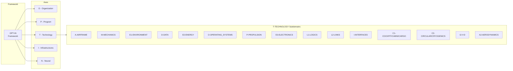
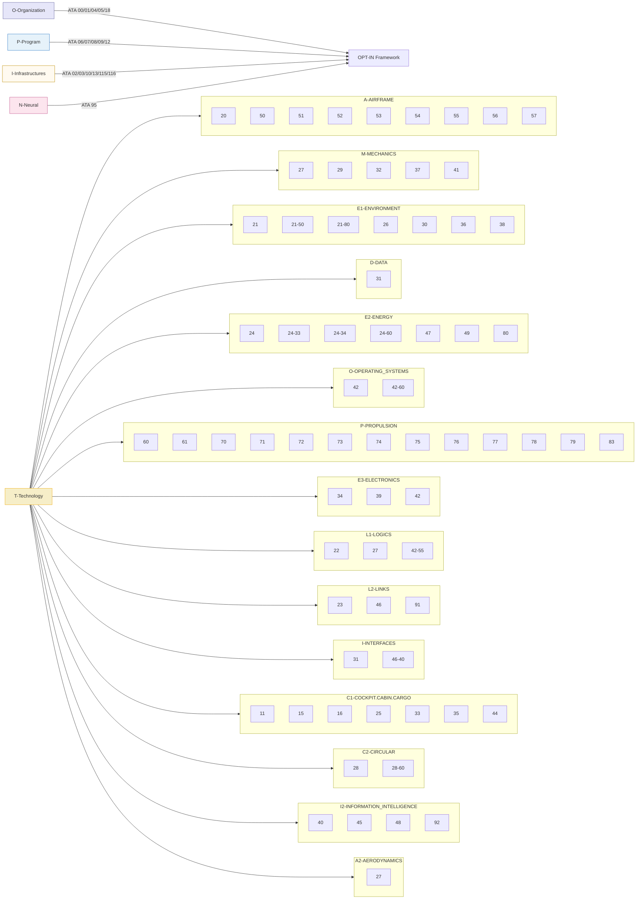

# OPT-IN
Amedeo Pelliccia's development and documentation methodology

**OPT-IN** is a structured framework for development and documentation used across aerospace systems projects, including AQUA OS and the AMPEL360 aircraft.

## Core Structure
OPT-IN is organized into five axes—**Organization, Program, Technology, Infrastructure, Neural**—each decomposed into subdomains that mirror ATA chapter logic for traceability and certification alignment.

-   **O (Organization):** Governance, compliance, airworthiness, and maintenance policies.
-   **P (Program):** Aircraft-level configuration control, servicing, and dimensional data.
-   **T (Technology):** The on-board systems tree organized by functional domains that map to ATA codes.
-   **I (Infrastructure):** Ground, airport, and supply-chain assets; flight simulators.
-   **N (Neural):** Data lineage, user traceability, and AI/ML for the digital passport.

## Methodological Principles
1.  **ATA-Anchored Documentation:** Every artifact is indexed by ATA chapter.section.subject (iSpec 2200 / S1000D compatible).
2.  **Cross-Referenced Traceability:** Logical, thermal, and energy interfaces are captured via secondary ATA references.
3.  **Provisional Subjects:** Emerging technologies live under provisional codes until standards review.
4.  **Bidirectional Linking:** Repositories and manuals share identifiers for synchronized commits and verifications.
5.  **Audit Readiness:** Every addition traces to a requirement and classification entry.

---

## Framework Overview



---

## Master Directory Structure

```
OPT-IN_FRAMEWORK/
├── O-ORGANIZATION/
│   ├── ATA_00-GENERAL
│   ├── ATA_01-MAINTENANCE_POLICY_INFORMATION
│   ├── ATA_04-AIRWORTHINESS_LIMITATIONS
│   ├── ATA_05-TIME_LIMITS_MAINTENANCE_CHECKS
│   └── ATA_18-VIBRATION_AND_NOISE_ANALYSIS
├── P-PROGRAM/
│   ├── ATA_06-DIMENSIONS_AND_AREAS
│   ├── ATA_07-LIFTING_AND_SHORING
│   ├── ATA_08-LEVELING_AND_WEIGHING
│   ├── ATA_09-TOWING_AND_TAXIING
│   └── ATA_12-SERVICING
├── T-TECHNOLOGY_AMPEDEOPELLICCIA-ON_BOARD_SYSTEMS/
│   ├── A-AIRFRAME/
│   ├── M-MECHANICS/
│   ├── E1-ENVIRONMENT/
│   ├── D-DATA/
│   ├── E2-ENERGY/
│   ├── O-OPERATING_SYSTEMS/
│   ├── P-PROPULSION/
│   ├── E3-ELECTRONICS/
│   ├── L1-LOGICS/
│   ├── L2-LINKS/
│   ├── I-INFORMATION_INTELLIGENCE_INTERFACES/
│   ├── C1-COCKPIT_CABIN_CARGO/
│   ├── C2-CIRCULAR_CRYOGENIC_SYSTEMS/
│   ├── I2-I+D/
│   └── A2-AERODYNAMICS/
├── I-INFRASTRUCTURES/
│   ├── ATA_02-OPERATIONS_INFORMATION
│   ├── ATA_03-SUPPORT_INFORMATION_GSE
│   ├── ATA_10-PARKING_MOORING_STORAGE_RTS
│   ├── ATA_13-HARDWARE_AND_GENERAL_TOOLS
│   ├── ATA_85-90-INFRASTRUCTURE_INTERFACE_STANDARDS
│   ├── ATA_115-FLIGHT_SIMULATOR_SYSTEMS
│   └── ATA_116-FLIGHT_SIMULATOR_CUING_SYSTEM
└── N-NEURAL_NETWORKS_USERS_TRACEABILITY/
    └── ATA_95-DIGITAL_PRODUCT_PASSPORT_AND_TRACEABILITY
```

---

## Hyperlinked Index

### O - ORGANIZATION
-   [`ATA 00 - GENERAL`](./O-ORGANIZATION/ATA_00-GENERAL/)
-   [`ATA 01 - MAINTENANCE POLICY INFORMATION`](./O-ORGANIZATION/ATA_01-MAINTENANCE_POLICY_INFORMATION/)
-   [`ATA 04 - AIRWORTHINESS LIMITATIONS`](./O-ORGANIZATION/ATA_04-AIRWORTHINESS_LIMITATIONS/)
-   [`ATA 05 - TIME LIMITS / MAINTENANCE CHECKS`](./O-ORGANIZATION/ATA_05-TIME_LIMITS_MAINTENANCE_CHECKS/)
-   [`ATA 18 - VIBRATION AND NOISE ANALYSIS`](./O-ORGANIZATION/ATA_18-VIBRATION_AND_NOISE_ANALYSIS/)

### P - PROGRAM
-   [`ATA 06 - DIMENSIONS AND AREAS`](./P-PROGRAM/ATA_06-DIMENSIONS_AND_AREAS/)
-   [`ATA 07 - LIFTING AND SHORING`](./P-PROGRAM/ATA_07-LIFTING_AND_SHORING/)
-   [`ATA 08 - LEVELING AND WEIGHING`](./P-PROGRAM/ATA_08-LEVELING_AND_WEIGHING/)
-   [`ATA 09 - TOWING AND TAXIING`](./P-PROGRAM/ATA_09-TOWING_AND_TAXIING/)
-   [`ATA 12 - SERVICING`](./P-PROGRAM/ATA_12-SERVICING/)

### T - TECHNOLOGY (ON BOARD SYSTEMS)

#### A - AIRFRAME
-   [`ATA 20 - STANDARD PRACTICES - AIRFRAME`](./T-TECHNOLOGY_AMPEDEOPELLICCIA-ON_BOARD_SYSTEMS/A-AIRFRAME/ATA_20-STANDARD_PRACTICES-AIRFRAME/)
-   [`ATA 50 - CARGO & ACCESSORY COMPARTMENTS`](./T-TECHNOLOGY_AMPEDEOPELLICCIA-ON_BOARD_SYSTEMS/A-AIRFRAME/ATA_50-CARGO_AND_ACCESSORY_COMPARTMENTS/)
-   [`ATA 51 - STANDARD PRACTICES AND STRUCTURES - GENERAL`](./T-TECHNOLOGY_AMPEDEOPELLICCIA-ON_BOARD_SYSTEMS/A-AIRFRAME/ATA_51-STANDARD_PRACTICES_AND_STRUCTURES-GENERAL/)
-   [`ATA 52 - DOORS`](./T-TECHNOLOGY_AMPEDEOPELLICCIA-ON_BOARD_SYSTEMS/A-AIRFRAME/ATA_52-DOORS/)
-   [`ATA 53 - FUSELAGE`](./T-TECHNOLOGY_AMPEDEOPELLICCIA-ON_BOARD_SYSTEMS/A-AIRFRAME/ATA_53-FUSELAGE/)
-   [`ATA 54 - NACELLES & PYLONS`](./T-TECHNOLOGY_AMPEDEOPELLICCIA-ON_BOARD_SYSTEMS/A-AIRFRAME/ATA_54-NACELLES_PYLONS/)
-   [`ATA 55 - STABILIZERS`](./T-TECHNOLOGY_AMPEDEOPELLICCIA-ON_BOARD_SYSTEMS/A-AIRFRAME/ATA_55-STABILIZERS/)
-   [`ATA 56 - WINDOWS`](./T-TECHNOLOGY_AMPEDEOPELLICCIA-ON_BOARD_SYSTEMS/A-AIRFRAME/ATA_56-WINDOWS/)
-   [`ATA 57 - WINGS`](./T-TECHNOLOGY_AMPEDEOPELLICCIA-ON_BOARD_SYSTEMS/A-AIRFRAME/ATA_57-WINGS/)

#### M - MECHANICS
-   [`ATA 27 - FLIGHT CONTROLS (ACTUATION SYSTEMS)`](./T-TECHNOLOGY_AMPEDEOPELLICCIA-ON_BOARD_SYSTEMS/M-MECHANICS/ATA_27-FLIGHT_CONTROLS_ACTUATION_SYSTEMS/)
-   [`ATA 29 - HYDRAULIC POWER`](./T-TECHNOLOGY_AMPEDEOPELLICCIA-ON_BOARD_SYSTEMS/M-MECHANICS/ATA_29-HYDRAULIC_POWER/)
-   [`ATA 32 - LANDING GEAR`](./T-TECHNOLOGY_AMPEDEOPELLICCIA-ON_BOARD_SYSTEMS/M-MECHANICS/ATA_32-LANDING_GEAR/)
-   [`ATA 37 - VACUUM / WASTE DISPOSAL`](./T-TECHNOLOGY_AMPEDEOPELLICCIA-ON_BOARD_SYSTEMS/M-MECHANICS/ATA_37-VACUUM_WASTE_DISPOSAL/)
-   [`ATA 41 - WATER BALLAST`](./T-TECHNOLOGY_AMPEDEOPELLICCIA-ON_BOARD_SYSTEMS/M-MECHANICS/ATA_41-WATER_BALLAST/)

#### E1 - ENVIRONMENT
-   [`ATA 21 - AIR CONDITIONING & PRESSURIZATION`](./T-TECHNOLOGY_AMPEDEOPELLICCIA-ON_BOARD_SYSTEMS/E1-ENVIRONMENT/ATA_21-AIR_CONDITIONING_AND_PRESSURIZATION/)
-   [`ATA 26 - FIRE PROTECTION`](./T-TECHNOLOGY_AMPEDEOPELLICCIA-ON_BOARD_SYSTEMS/E1-ENVIRONMENT/ATA_26-FIRE_PROTECTION/)
-   [`ATA 30 - ICE AND RAIN PROTECTION`](./T-TECHNOLOGY_AMPEDEOPELLICCIA-ON_BOARD_SYSTEMS/E1-ENVIRONMENT/ATA_30-ICE_AND_RAIN_PROTECTION/)
-   [`ATA 36 - PNEUMATIC`](./T-TECHNOLOGY_AMPEDEOPELLICCIA-ON_BOARD_SYSTEMS/E1-ENVIRONMENT/ATA_36-PNEUMATIC/)
-   [`ATA 38 - WATER/WASTE`](./T-TECHNOLOGY_AMPEDEOPELLICCIA-ON_BOARD_SYSTEMS/E1-ENVIRONMENT/ATA_38-WATER_WASTE/)

#### D - DATA
-   [`ATA 31 - RECORDING (FDR/CVR)`](./T-TECHNOLOGY_AMPEDEOPELLICCIA-ON_BOARD_SYSTEMS/D-DATA/ATA_31-INDICATING_RECORDING_SYSTEMS_RECORDING_FUNCTION-FDR_CVR/)

#### E2 - ENERGY
-   [`ATA 24 - ELECTRICAL POWER`](./T-TECHNOLOGY_AMPEDEOPELLICCIA-ON_BOARD_SYSTEMS/E2-ENERGY/ATA_24-ELECTRICAL_POWER/)
-   [`ATA 47 - INERTING SYSTEM`](./T-TECHNOLOGY_AMPEDEOPELLICCIA-ON_BOARD_SYSTEMS/E2-ENERGY/ATA_47-INERTING_SYSTEM/)
-   [`ATA 49 - AIRBORNE AUXILIARY POWER`](./T-TECHNOLOGY_AMPEDEOPELLICCIA-ON_BOARD_SYSTEMS/E2-ENERGY/ATA_49-AIRBORNE_AUXILIARY_POWER/)
-   [`ATA 80 - STARTING`](./T-TECHNOLOGY_AMPEDEOPELLICCIA-ON_BOARD_SYSTEMS/E2-ENERGY/ATA_80-STARTING/)

#### O - OPERATING SYSTEMS
-   [`ATA 42 - IMA (ARCHITECTURAL GOVERNANCE)`](./OPT-IN_FRAMEWORK/T-TECHNOLOGY_AMPEDEOPELLICCIA-ON_BOARD_SYSTEMS/O-OPERATING_SYSTEMS/ATA_42-INTEGRATED_MODULAR_AVIONICS_ARCHITECTURAL_GOVERNANCE_AND_STANDARDS/)
-   [`ATA 42-60-00 (Prov) - QUANTUM-INSPIRED SCHEDULER`](./OPT-IN_FRAMEWORK/T-TECHNOLOGY_AMPEDEOPELLICCIA-ON_BOARD_SYSTEMS/O-OPERATING_SYSTEMS/ATA_42-60-00_PROV-QUANTUM-INSPIRED_SCHEDULER_AND_RESOURCE_ORCHESTRATION/)

#### P - PROPULSION
-   `ATA 60` - STANDARD PRACTICES - PROP./ROTOR
-   `ATA 61` - PROPELLERS / PROPULSORS
-   `ATA 70` - STANDARD PRACTICES - ENGINE
-   `ATA 71` - POWER PLANT
-   `ATA 72` - ENGINE
-   `ATA 73` - ENGINE FUEL AND CONTROL
-   `ATA 74` - IGNITION
-   `ATA 75` - AIR
-   `ATA 76` - ENGINE CONTROLS
-   `ATA 78` - EXHAUST
-   `ATA 79` - OIL

#### E3 - ELECTRONICS
-   [`ATA 34 - NAVIGATION`](./T-TECHNOLOGY_AMPEDEOPELLICCIA-ON_BOARD_SYSTEMS/E3-ELECTRONICS/ATA_34-NAVIGATION/)
-   [`ATA 39 - ELECTRONIC PANELS & COMPONENTS`](./T-TECHNOLOGY_AMPEDEOPELLICCIA-ON_BOARD_SYSTEMS/E3-ELECTRONICS/ATA_39-ELECTRICAL-ELECTRONIC_PANELS_AND_MULTIPURPOSE_COMPONENTS/)
-   [`ATA 42 - IMA (HARDWARE MODULES)`](./T-TECHNOLOGY_AMPEDEOPELLICCIA-ON_BOARD_SYSTEMS/E3-ELECTRONICS/ATA_42-INTEGRATED_MODULAR_AVIONICS_HARDWARE_MODULES-CPM_IOM/)

#### L1 - LOGICS
-   [`ATA 22 - AUTOFLIGHT`](./T-TECHNOLOGY_AMPEDEOPELLICCIA-ON_BOARD_SYSTEMS/L1-LOGICS/ATA_22-AUTOFLIGHT/)
-   [`ATA 27 - FLIGHT CONTROLS (SOFTWARE)`](./T-TECHNOLOGY_AMPEDEOPELLICCIA-ON_BOARD_SYSTEMS/L1-LOGICS/ATA_27-FLIGHT_CONTROLS_CONTROL_LAW_COMPUTERS_SOFTWARE/)
-   [`ATA 42 - IMA (HOSTED APPLICATIONS)`](./T-TECHNOLOGY_AMPEDEOPELLICCIA-ON_BOARD_SYSTEMS/L1-LOGICS/ATA_42-INTEGRATED_MODULAR_AVIONICS_HOSTED_APPLICATION_PARTITIONS/)

#### L2 - LINKS
-   [`ATA 23 - COMMUNICATIONS`](./T-TECHNOLOGY_AMPEDEOPELLICCIA-ON_BOARD_SYSTEMS/L2-LINKS/ATA_23-COMMUNICATIONS/)
-   [`ATA 42 - IMA (NETWORK FABRIC)`](./T-TECHNOLOGY_AMPEDEOPELLICCIA-ON_BOARD_SYSTEMS/L2-LINKS/ATA_42-INTEGRATED_MODULAR_AVIONICS_NETWORK_FABRIC-AFDX/)
-   [`ATA 91 - CHARTS (FLIGHT OPERATIONS)`](./T-TECHNOLOGY_AMPEDEOPELLICCIA-ON_BOARD_SYSTEMS/L2-LINKS/ATA_91-CHARTS_FLIGHT_OPERATIONS/)

#### I - INFORMATION, INTELLIGENCE, INTERFACES
-   [`ATA 31 - INDICATING`](./T-TECHNOLOGY_AMPEDEOPELLICCIA-ON_BOARD_SYSTEMS/I-INFORMATION_INTELLIGENCE_INTERFACES/ATA_31-INDICATING_RECORDING_SYSTEMS_INDICATING_FUNCTION/)
-   [`ATA 42 - IMA (CORE OS SERVICES)`](./T-TECHNOLOGY_AMPEDEOPELLICCIA-ON_BOARD_SYSTEMS/I-INFORMATION_INTELLIGENCE_INTERFACES/ATA_42-INTEGRATED_MODULAR_AVIONICS_CORE_OS_SERVICES_APIS_AND_HEALTH_MONITORING/)
-   [`ATA 45 - ONBOARD MAINTENANCE SYSTEMS (OMS/CMS)`](./T-TECHNOLOGY_AMPEDEOPELLICCIA-ON_BOARD_SYSTEMS/I-INFORMATION_INTELLIGENCE_INTERFACES/ATA_45-ONBOARD_MAINTENANCE_SYSTEMS_OMS_CMS/)
-   [`ATA 46 - INFORMATION SYSTEMS (ACARS/DATALINK)`](./T-TECHNOLOGY_AMPEDEOPELLICCIA-ON_BOARD_SYSTEMS/I-INFORMATION_INTELLIGENCE_INTERFACES/ATA_46-INFORMATION_SYSTEMS_ACARS_DATALINK/)
-   `ATA 77` - ENGINE INDICATING
-   `ATA 93` (Reserved) - ONBOARD DATA LOAD AND CONFIGURATION

#### C1 - COCKPIT, CABIN, CARGO
-   `ATA 11` - PLACARDS AND MARKINGS
-   `ATA 15` - AIRCREW INFORMATION
-   `ATA 16` - CHANGE OF ROLE
-   `ATA 25` - EQUIPMENT / FURNISHINGS
-   `ATA 33` - LIGHTS
-   `ATA 35` - OXYGEN
-   `ATA 44` - CABIN SYSTEMS

#### C2 - CIRCULAR, CRYOGENIC SYSTEMS
-   [`ATA 28 - FUEL (SAF & CRYOGENIC H₂)`](./T-TECHNOLOGY_AMPEDEOPELLICCIA-ON_BOARD_SYSTEMS/C2-CIRCULAR_CRYOGENIC_SYSTEMS/ATA_28-FUEL_SAF_AND_CRYOGENIC_H2/)
-   `ATA 21-80-00` (Prov) - CO₂ Capture & Processing

#### I2 - I+D (Research & Development)
-   `ATA 40` (Reserved) - MULTISYSTEM (FOR AI INTEGRATION)
-   `ATA 42-55-00` (Prov) - Powertrain/Energy Orchestration
-   [`ATA 42-60-00 (Prov) - QUANTUM-INSPIRED SCHEDULER & RESOURCE ORCHESTRATION`](./OPT-IN_FRAMEWORK/T-TECHNOLOGY_AMPEDEOPELLICCIA-ON_BOARD_SYSTEMS/O-OPERATING_SYSTEMS/ATA_42-60-00_PROV-QUANTUM-INSPIRED_SCHEDULER_AND_RESOURCE_ORCHESTRATION/)
-   `ATA 48` (Reserved) - IN-FLIGHT MAINTENANCE
-   `ATA 92` (Prov) - MODEL BASED MAINTENANCE

#### A2 - AERODYNAMICS
-   [`ATA 27 - FLIGHT CONTROLS (AERODYNAMIC MANIPULATION)`](./T-TECHNOLOGY_AMPEDEOPELLICCIA-ON_BOARD_SYSTEMS/A2-AERODYNAMICS/ATA_27-FLIGHT_CONTROLS_SYSTEM_FOR_AERODYNAMIC_MANIPULATION/)

### I - INFRASTRUCTURES
-   [`ATA 02 - OPERATIONS INFORMATION`](./I-INFRASTRUCTURES/ATA_02-OPERATIONS_INFORMATION/)
-   [`ATA 03 - SUPPORT INFORMATION (GSE)`](./I-INFRASTRUCTURES/ATA_03-SUPPORT_INFORMATION_GSE/)
-   [`ATA 10 - PARKING, MOORING, STORAGE & RTS`](./I-INFRASTRUCTURES/ATA_10-PARKING_MOORING_STORAGE_RTS/)
-   [`ATA 13 - HARDWARE AND GENERAL TOOLS`](./I-INFRASTRUCTURES/ATA_13-HARDWARE_AND_GENERAL_TOOLS/)
-   [`ATA 85-90 - INFRASTRUCTURE INTERFACE STANDARDS`](./I-INFRASTRUCTURES/ATA_85-90-INFRASTRUCTURE_INTERFACE_STANDARDS/)
-   [`ATA 115 - FLIGHT SIMULATOR SYSTEMS`](./I-INFRASTRUCTURES/ATA_115-FLIGHT_SIMULATOR_SYSTEMS/)
-   [`ATA 116 - FLIGHT SIMULATOR CUING SYSTEM`](./I-INFRASTRUCTURES/ATA_116-FLIGHT_SIMULATOR_CUING_SYSTEM/)

### N - NEURAL NETWORKS, USERS, TRACEABILITY
-   [`ATA 95 - DIGITAL PRODUCT PASSPORT & TRACEABILITY`](./N-NEURAL_NETWORKS_USERS_TRACEABILITY/ATA_95-DIGITAL_PRODUCT_PASSPORT_AND_TRACEABILITY/)

---

## Mermaid overview (compact)




```
OPT-IN_FRAMEWORK/
├── O-ORGANIZATION/ 
│   ├── ATA_00-GENERAL
│   ├── ATA_01-MAINTENANCE_POLICY_INFORMATION
│   ├── ATA_04-AIRWORTHINESS_LIMITATIONS
│   ├── ATA_05-TIME_LIMITS_MAINTENANCE_CHECKS
│   └── ATA_18-VIBRATION_AND_NOISE_ANALYSIS
├── P-PROGRAM/
│   ├── ATA_06-DIMENSIONS_AND_AREAS
│   ├── ATA_07-LIFTING_AND_SHORING
│   ├── ATA_08-LEVELING_AND_WEIGHING
│   ├── ATA_09-TOWING_AND_TAXIING
│   └── ATA_12-SERVICING
├── T-TECHNOLOGY_AMPEDEOPELLICCIA-ON_BOARD_SYSTEMS/
│   ├── A-AIRFRAME/
│   │   ├── ATA_20-STANDARD_PRACTICES_-_AIRFRAME
│   │   ├── ATA_50-CARGO_AND_ACCESSORY_COMPARTMENTS
│   │   ├── ATA_51-STANDARD_PRACTICES_AND_STRUCTURES_-_GENERAL
│   │   ├── ATA_52-DOORS
│   │   ├── ATA_53-FUSELAGE
│   │   ├── ATA_54-NACELLES/PYLONS
│   │   ├── ATA_55-STABILIZERS
│   │   ├── ATA_56-WINDOWS
│   │   └── ATA_57-WINGS
│   ├── M-MECHANICS/
│   │   ├── ATA_27-FLIGHT_CONTROLS_(ACTUATION_SYSTEMS)
│   │   ├── ATA_29-HYDRAULIC_POWER
│   │   ├── ATA_32-LANDING_GEAR
│   │   ├── ATA_37-VACUUM_WASTE_DISPOSAL
│   │   └── ATA_41-WATER_BALLAST
│   ├── E1-ENVIRONMENT/
│   │   ├── ATA_21-AIR_CONDITIONING_AND_PRESSURIZATION
│   │   ├── ATA_26-FIRE_PROTECTION
│   │   ├── ATA_30-ICE_AND_RAIN_PROTECTION
│   │   ├── ATA_36-PNEUMATIC
│   │   └── ATA_38-WATER/WASTE
│   ├── D-DATA/
│   │   └── ATA_31-INDICATING_RECORDING_SYSTEMS_(RECORDING_FUNCTION_-_FDR/CVR)
│   ├── E2-ENERGY/
│   │   ├── ATA_24-ELECTRICAL_POWER
│   │   ├── ATA_47-INERTING_SYSTEM
│   │   ├── ATA_49-AIRBORNE_AUXILIARY_POWER
│   │   └── ATA_80-STARTING
│   ├── O-OPERATING_SYSTEMS/
│   │   ├── ATA_42-INTEGRATED_MODULAR_AVIONICS_(ARCHITECTURAL_GOVERNANCE_AND_STANDARDS)
│   │   └── ATA_42-60-00_(Prov)_QUANTUM-INSPIRED_SCHEDULER_AND_RESOURCE_ORCHESTRATION
│   ├── P-PROPULSION/
│   │   ├── ATA_60-STANDARD_PRACTICES_-_PROP./ROTOR
│   │   ├── ATA_61-PROPELLERS_PROPULSORS
│   │   ├── ATA_70-STANDARD_PRACTICES_-_ENGINE
│   │   ├── ATA_71-POWER_PLANT
│   │   ├── ATA_72-ENGINE
│   │   ├── ATA_73-ENGINE_FUEL_AND_CONTROL
│   │   ├── ATA_74-IGNITION
│   │   ├── ATA_75-AIR
│   │   ├── ATA_76-ENGINE_CONTROLS
│   │   ├── ATA_78-EXHAUST
│   │   └── ATA_79-OIL
│   ├── E3-ELECTRONICS/
│   │   ├── ATA_34-NAVIGATION
│   │   ├── ATA_39-ELECTRICAL_-_ELECTRONIC_PANELS_AND_MULTIPURPOSE_COMPONENTS
│   │   └── ATA_42-INTEGRATED_MODULAR_AVIONICS_(HARDWARE_MODULES_-_CPM/IOM)
│   ├── L1-LOGICS/
│   │   ├── ATA_22-AUTOFLIGHT
│   │   ├── ATA_27-FLIGHT_CONTROLS_(CONTROL_LAW_COMPUTERS/SOFTWARE)
│   │   └── ATA_42-INTEGRATED_MODULAR_AVIONICS_(HOSTED_APPLICATION_PARTITIONS)
│   ├── L2-LINKS/
│   │   ├── ATA_23-COMMUNICATIONS
│   │   ├── ATA_42-INTEGRATED_MODULAR_AVIONICS_(NETWORK_FABRIC_-_e.g.,_AFDX)
│   │   └── ATA_91-CHARTS_(FLIGHT_OPERATIONS)
│   ├── I-INFORMATION_INTELLIGENCE_INTERFACES/
│   │   ├── ATA_31-INDICATING_RECORDING_SYSTEMS_(INDICATING_FUNCTION)
│   │   ├── ATA_42-INTEGRATED_MODULAR_AVIONICS_(CORE_OS_SERVICES,_APIS_AND_HEALTH_MONITORING)
│   │   ├── ATA_45-ONBOARD_MAINTENANCE_SYSTEMS_(OMS/CMS)
│   │   ├── ATA_46-INFORMATION_SYSTEMS_(ACARS,_DATALINK)
│   │   ├── ATA_77-ENGINE_INDICATING
│   │   └── ATA 93 (Reserved): ONBOARD DATA LOAD AND CONFIGURATION
│   ├── C1-COCKPIT_CABIN_CARGO/
│   │   ├── ATA_11-PLACARDS_AND_MARKINGS
│   │   ├── ATA_15-AIRCREW_INFORMATION
│   │   ├── ATA_16-CHANGE_OF_ROLE
│   │   ├── ATA_25-EQUIPMENT_FURNISHINGS
│   │   ├── ATA_33-LIGHTS
│   │   ├── ATA_35-OXYGEN
│   │   └── ATA_44-CABIN_SYSTEMS
│   ├── C2-CIRCULAR_CRYOGENIC_SYSTEMS/
│   │   ├── ATA_28-FUEL_(SAF_AND_CRYOGENIC_H₂)
│   │   └── ATA 21-80-00 (Prov): CO₂ Capture & Processing
│   ├── I2-I+D/
│   │   ├── ATA_40-MULTISYSTEM_(RESERVED_FOR_AI_INTEGRATION)
│   │   ├── ATA 42-55-00 (Prov): Powertrain/Energy Orchestration Framework
│   │   ├── ATA 42-60-00 (Prov): Quantum-Inspired Scheduler & Resource Orchestration
│   │   ├── ATA 48 (Reserved): IN-FLIGHT MAINTENANCE (AI-ENABLED)
│   │   └── ATA 92 (Prov): MODEL BASED MAINTENANCE
│   └── A2-AERODYNAMICS/
│       └── ATA_27-FLIGHT_CONTROLS_(SYSTEM_FOR_AERODYNAMIC_MANIPULATION)
├── I-INFRASTRUCTURES/
│   ├── ATA_02-OPERATIONS_INFORMATION
│   ├── ATA_03-SUPPORT_INFORMATION_GSE
│   ├── ATA_10-PARKING_MOORING_STORAGE_RTS
│   ├── ATA_13-HARDWARE_AND_GENERAL_TOOLS
│   ├── ATA_85-90-INFRASTRUCTURE_INTERFACE_STANDARDS
│   ├── ATA_115-FLIGHT_SIMULATOR_SYSTEMS
│   └── ATA_116-FLIGHT_SIMULATOR_CUING_SYSTEM
└── N-NEURAL_NETWORKS_USERS_TRACEABILITY/
    └── ATA_95-DIGITAL_PRODUCT_PASSPORT_AND_TRACEABILITY
```

---

